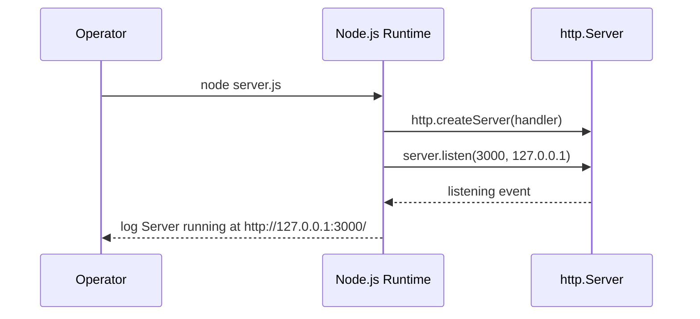
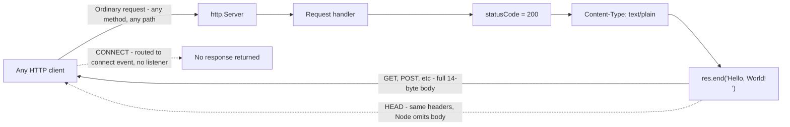

# hello_world

> A minimal, dependency-free Node.js HTTP "Hello, World!" server.

`hello_world` is a single-file Node.js HTTP server built entirely on the Node.js
built-in `http` module. It binds to `127.0.0.1:3000` and answers the ordinary HTTP
requests delivered to its request handler — any such method, on any path — with
`200 OK` and the plain-text body `Hello, World!\n`. Two methods differ at the wire
level: `HEAD` receives the same status and headers but no body, and `CONNECT` is not
delivered to the handler at all (see [Protocol-level nuances](#protocol-level-nuances)).
There are no third-party dependencies, no build step, and no external runtime
configuration mechanism, environment override, or app-specific config file — the entire
runtime is one source file, `server.js`.
_(Source: server.js:1-20, 29, 34, 60-67, 77-79; package.json:1-11; package-lock.json:1-13)_

---

## Table of Contents

- [Overview](#overview)
- [Prerequisites](#prerequisites)
- [Setup / Installation](#setup--installation)
- [Running the Server](#running-the-server)
- [API Documentation](#api-documentation)
- [Deployment Guide](#deployment-guide)
- [Code Explanation](#code-explanation)
- [Project Structure](#project-structure)
- [Known Caveats / Limitations](#known-caveats--limitations)
- [License](#license)

---

## Overview

`hello_world` is an intentionally minimal Node.js "Hello, World!" HTTP fixture. Its
whole implementation is the single file `server.js`, which uses only the Node.js
standard-library `http` module and therefore ships with **zero third-party
dependencies**. _(Source: server.js:1-20; package.json:1-11; package-lock.json:1-13)_

It is useful as a generic fixed-response smoke-test target or as a teaching example of
the raw Node.js `http` API. It is **not** a container image and defines **no** dedicated
health-check route or container/orchestration integration — it simply returns the same
fixed response to every ordinary request. The module **exports nothing** — it is not
meant to be `require`-d as a library; loading the file simply creates and starts the
server as a side effect. _(Source: server.js:5-17, 60-67)_

The runtime is organized around four small features (identifiers reused throughout this
document for consistency):

| ID | Feature | Description | Source |
|------|-----------------------------|--------------------------------------------------------------------------------|-----------------------------------------|
| F-001 | HTTP Server / Listener | Creates an `http.Server` and binds it to `127.0.0.1:3000`. | server.js:60, 77-79 |
| F-002 | Request Handler | A single catch-all callback: every ordinary request delivered to it (any method, any path) gets `200` + `text/plain` + `Hello, World!\n`; `HEAD` sends no body and `CONNECT` is never delivered (see nuances). | server.js:39-54, 60-67 |
| F-003 | Startup Logger | Logs `Server running at http://127.0.0.1:3000/` once the server is listening. | server.js:77-79 |
| F-004 | Package Manifest & Lockfile | `package.json` + `package-lock.json` declaring zero dependencies. | package.json:1-11; package-lock.json:1-13 |

---

## Prerequisites

- **Node.js** — any currently supported Node.js release. The server uses only the
  long-stable standard-library `http` module _(Source: server.js:21)_, so no newer
  language or runtime features are required; consult the official Node.js releases page
  (<https://nodejs.org>) for the release lines still supported at the time you install.
  This project was validated locally on **Node.js v22.23.1 on 2026-07-23**
  _(Source: verified at runtime via `node --version`)_.
- **npm** — typically installed alongside Node.js. npm is **not required to run the
  server** (`node server.js` is enough). The project declares **no dependency packages**
  _(Source: package.json:1-11; package-lock.json:1-13)_, so there are no project
  dependencies to install (see [Setup / Installation](#setup--installation)).
- **No pinned version** — the project does **not** declare an `engines` field in
  `package.json` _(Source: package.json:1-11)_ and the repository tracks no `.nvmrc` file
  _(Source: repository file listing; see [Project Structure](#project-structure))_, so no
  specific Node.js version is enforced.

Verify your toolchain:

```bash
node --version
npm --version
```

---

## Setup / Installation

Clone the repository and change into it. Replace `<repository-url>` with your own clone
URL and `<repository-directory>` with the resulting directory name (whatever your Git
host and clone produce); if you already have a checkout, skip this step and start from the
project directory.

```bash
# Clone the repository (substitute your own URL and directory name)
git clone <repository-url>
cd <repository-directory>
```

**No dependency installation is required.** The project declares **no dependency
packages** — `package.json` contains no `dependencies` or `devDependencies` section
_(Source: package.json:1-11)_ and `package-lock.json` (lockfile version 3) locks only the
empty-string root package _(Source: package-lock.json:1-13)_ — so there is nothing to
install. Running `npm install` is optional; because no dependencies are declared it
installs no packages (npm may still read and process `package.json`/`package-lock.json`).
npm is not needed to run the server.

**There is no build step.** The source in `server.js` runs as-is under Node.js
_(Source: server.js:1-79)_.

---

## Running the Server

Start the server directly with Node.js:

```bash
node server.js
```

> **Use `node server.js`, not `npm start`.** There is **no `start` script** in
> `package.json` _(Source: package.json:6-8)_, and the manifest's `main` field points at
> `index.js` _(Source: package.json:5)_, which **does not exist** in this repository
> _(Source: repository file listing; see [Project Structure](#project-structure))_. Run
> the file by name.

Once the server is listening, it prints exactly the following line to stdout
_(Source: server.js:77-79; verified at runtime)_:

```text
Server running at http://127.0.0.1:3000/
```

The process runs in the foreground; press `Ctrl+C` to stop it.

### Startup sequence

The control flow when the process launches:



Startup sequence derived from `server.js`. _(Source: server.js:21, 60, 77-79)_

---

## API Documentation

The server exposes a **single catch-all endpoint**. It performs **no routing** and does
**not** inspect the request method or path: every ordinary request delivered to the
request handler — any method, on any path — receives the identical response.
_(Source: server.js:39-44, 60-67)_ Two methods differ at the wire level and are covered
under [Protocol-level nuances](#protocol-level-nuances) below: `HEAD` (no response body)
and `CONNECT` (not delivered to the handler). There is **no authentication** and **no
external runtime configuration mechanism, environment override, or app-specific config
file**; the behavior is fully deterministic. _(Source: server.js:39-54)_

### Endpoint contract

This contract applies to ordinary HTTP requests delivered to the server's `request`
handler. `HEAD` and `CONNECT` behave differently at the wire level — see
[Protocol-level nuances](#protocol-level-nuances).

| Aspect | Value |
|----------------|--------------------------------------------------------|
| Method | Any method delivered to the `request` handler (`GET`, `POST`, `PUT`, `DELETE`, `OPTIONS`, `PATCH`, …); `HEAD` and `CONNECT` are exceptions (see nuances below) |
| Path | ANY (`/`, `/anything/else`, `/foo`, …) |
| Status | `200 OK` |
| `Content-Type` | `text/plain` |
| Body | `Hello, World!\n` (14 bytes) for methods that carry a body; for `HEAD`, the same status/headers are sent with an empty body |

Contract verified against the running server and `server.js`. _(Source: server.js:39-54, 60-67; verified at runtime for GET, POST, DELETE, OPTIONS, HEAD, and CONNECT)_

### Example

Request:

```bash
curl -i http://127.0.0.1:3000/
```

Response:

```text
HTTP/1.1 200 OK
Content-Type: text/plain
Date: <request timestamp>
Connection: keep-alive
Keep-Alive: timeout=5
Content-Length: 14

Hello, World!
```

The **same** response is returned for any path and for any ordinary method delivered to
the request handler. For example, both of the following return the identical `200` /
`text/plain` / `Hello, World!\n` response
_(Source: verified at runtime; server.js:39-44, 60-67)_:

```bash
curl -i -X POST http://127.0.0.1:3000/anything/else
curl -i -X DELETE http://127.0.0.1:3000/foo
```

`HEAD` and `CONNECT` are the two exceptions to this fixed-body guarantee — see
[Protocol-level nuances](#protocol-level-nuances).

The application itself sets only the status code and the `Content-Type` header
_(Source: server.js:62-64)_. The `Date`, `Connection`, `Keep-Alive`, and `Content-Length`
headers are **not** set anywhere in `server.js`; they were emitted by the Node.js `http`
runtime in the verified `curl -i` response shown above
_(Source: verified at runtime; server.js:60-67 sets no such headers)_.

### Request / response flow

The catch-all handler, visualized:



Flow derived from `server.js`; the `HEAD` and `CONNECT` branches were confirmed at
runtime. _(Source: server.js:39-54, 60-67; verified at runtime)_

### Protocol-level nuances

Two HTTP methods differ at the wire level. This is **standard Node.js behavior, not
application logic** _(Source: server.js:36-59)_:

- **`HEAD`** — the handler still runs and sets the same `200` / `text/plain` headers, but
  Node omits the body from a `HEAD` response (a `HEAD` response must not carry a body), so
  the client receives **zero body bytes**.
  _(Source: server.js:48-50; verified at runtime — `size_download=0`)_
- **`CONNECT`** — Node dispatches `CONNECT` requests to the server's separate `connect`
  event rather than to the `request` handler. No `connect` listener is registered, so the
  handler never runs for `CONNECT` and the client receives **no response**.
  _(Source: server.js:51-54)_

---

## Deployment Guide

Run the server with:

```bash
node server.js
```

**Binding is loopback-only.** The server binds to the loopback address `127.0.0.1` on port
`3000` _(Source: server.js:29, 34, 77-79)_, so it is reachable **only from the local
machine**. To accept connections from other hosts, change the `hostname` constant to
`0.0.0.0` (all interfaces) or a specific interface address _(Source: server.js:29)_.
Exposing a service publicly commonly also involves fronting it with a reverse proxy for
TLS termination and routing; the choice of proxy and its configuration are outside this
repository and are neither provided nor verified here.

**Changing the host / port.** Host and port are hardcoded module constants
_(Source: server.js:29, 34)_, and the source reads no environment variable or config file
for them — the entire runtime is `server.js`, which contains no such lookup
_(Source: server.js:1-79)_. To change either value, edit the corresponding constant in
`server.js` directly:

| Constant | Value | Source | To change |
|------------|---------------|----------------|-------------------------------------------------------|
| `hostname` | `'127.0.0.1'` | server.js:29 | Edit the constant (e.g. `'0.0.0.0'` to expose externally) |
| `port` | `3000` | server.js:34 | Edit the constant |

**Process management.** The process runs in the foreground and does not daemonize itself
_(Source: server.js:77-79)_. For production-style uptime, run it under a process
supervisor so it restarts on crash or reboot. Any general-purpose process manager or
service supervisor works; such tools are **not** part of this repository, are not declared
as dependencies, and must be installed and configured separately. As one example, with
`pm2` (a third-party tool you install yourself):

```bash
pm2 start server.js --name hello_world
```

**Fail-fast (no error handling).** `server.js` registers no `error` event handler on the
server and performs no graceful shutdown — the file contains no `.on('error', …)` or
signal handling _(Source: server.js:1-79)_. By Node.js's default behavior, a server
`'error'` event with no listener is thrown as an uncaught exception; a bind failure such
as `EADDRINUSE` when port `3000` is already in use therefore terminates the process.
Ensure the port is free before starting. See
[Known Caveats / Limitations](#known-caveats--limitations).

---

## Code Explanation

The entire runtime is `server.js`. Every executable element carries a JSDoc block; the
walkthrough below cross-references those annotations. Line numbers refer to the current
`server.js` (with JSDoc included).

**1. Import the `http` module** — _Source: server.js:21_

```js
const http = require('http');
```

Loads Node's built-in `http` module using CommonJS `require`. No third-party package is
involved.

**2. Configuration constants** — _Source: server.js:29, 34_

```js
const hostname = '127.0.0.1';
const port = 3000;
```

`hostname` is the loopback bind address and `port` is the TCP listen port. Both are
annotated with `@constant` JSDoc _(Source: server.js:23-34)_. There is no override
mechanism — see the [Deployment Guide](#deployment-guide) for how to change them.

**3. Create the server with a catch-all handler** — _Source: server.js:60-67_

```js
const server = http.createServer((req, res) => {
  res.statusCode = 200;
  res.setHeader('Content-Type', 'text/plain');
  res.end('Hello, World!\n');
});
```

`http.createServer` registers the request handler. For every ordinary request delivered
to it, the handler does not inspect `req` at all — no method or path routing — and sets
status `200`, the `text/plain` content type, and ends the response with the fixed 14-byte
payload `Hello, World!\n` _(Source: server.js:60-67)_. Two methods are handled specially
by Node itself, not by this code: `HEAD` produces the same status/headers with the body
omitted, and `CONNECT` is routed to the `connect` event and never reaches this handler
_(Source: server.js:39-54)_ — see [Protocol-level nuances](#protocol-level-nuances). Its
`@param` tags document the `http.IncomingMessage` and `http.ServerResponse` types
_(Source: server.js:56-57)_.

**4. Start listening and log** — _Source: server.js:77-79_

```js
server.listen(port, hostname, () => {
  console.log(`Server running at http://${hostname}:${port}/`);
});
```

`server.listen` binds to `hostname:port`; once the `listening` event fires, the callback
logs the startup URL. Because `hostname` and `port` are interpolated into the message, the
logged URL always matches the actual binding.

---

## Project Structure

The repository contains exactly four files and no subdirectories:

| File | Role | Source |
|--------------------|-------------------------------------------------------------------|-------------------------|
| `server.js` | The HTTP server and de-facto entrypoint (F-001–F-003); the entire runtime. | server.js:1-79 |
| `package.json` | npm manifest — name, version, license, and scripts (F-004). | package.json:1-11 |
| `package-lock.json` | npm lockfile (version 3) confirming zero dependencies (F-004). | package-lock.json:1-13 |
| `README.md` | This document. | — |

---

## Known Caveats / Limitations

These are **documented, not fixed** — they reflect the repository exactly as-is:

1. **Manifest / entrypoint mismatch.** `package.json` sets `main` to `index.js`
   _(Source: package.json:5)_, but the repository tracks only `server.js`, `package.json`,
   `package-lock.json`, and `README.md` — there is **no `index.js`**
   _(Source: repository file listing; see [Project Structure](#project-structure))_. A
   consumer that honored `main` (for example, `require('hello_world')`) would therefore
   fail to resolve its entry point; start the server with `node server.js` instead.
2. **Failing placeholder test script.** `npm test` runs
   `echo "Error: no test specified" && exit 1` _(Source: package.json:6-8)_, which **exits
   with code 1**. There are no real tests, and the `scripts` block defines no `start`
   script _(Source: package.json:6-8)_.
3. **No error handling / no graceful shutdown.** `server.js` installs no `error` event
   listener and no `SIGTERM`/`SIGINT` handler — no such code appears anywhere in the file
   _(Source: server.js:1-79)_. By Node.js's default behavior an unhandled server `'error'`
   (such as `EADDRINUSE`) is thrown and terminates the process; there is no graceful-
   shutdown path.
4. **Loopback-only binding.** The server binds `127.0.0.1` _(Source: server.js:29)_ and is
   unreachable from other hosts until the `hostname` constant is changed — see the
   [Deployment Guide](#deployment-guide).

---

## License

MIT — as declared in the `license` field of `package.json` _(Source: package.json:10)_.
There is no standalone `LICENSE` file in the repository
_(Source: repository file listing; see [Project Structure](#project-structure))_.
