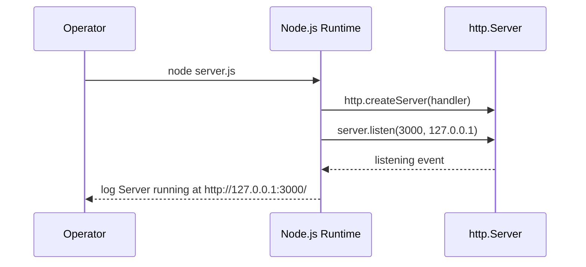

# hello_world

> A minimal, dependency-free Node.js HTTP "Hello, World!" server.

`hello_world` is a single-file Node.js HTTP server built entirely on the Node.js
built-in `http` module. It binds to `127.0.0.1:3000` and answers **every** request
with `200 OK` and the plain-text body `Hello, World!\n`. There are no third-party
dependencies, no build step, and no configuration files — the entire runtime is one
source file, `server.js`. _(Source: server.js:1-20; package-lock.json:1-13)_

---

## Table of Contents

- [Overview](#overview)
- [Prerequisites](#prerequisites)
- [Setup / Installation](#setup--installation)
- [Running the Server](#running-the-server)
- [API Documentation](#api-documentation)
- [Deployment Guide](#deployment-guide)
- [Code Explanation](#code-explanation)
- [Project Structure](#project-structure)
- [Known Caveats / Limitations](#known-caveats--limitations)
- [License](#license)

---

## Overview

`hello_world` is an intentionally minimal Node.js "Hello, World!" HTTP fixture. Its
whole implementation is the single file `server.js`, which uses only the Node.js
standard-library `http` module and therefore ships with **zero third-party
dependencies**. _(Source: server.js:1-20; package.json:1-11; package-lock.json:1-13)_

It is useful as a smoke-test target, a container/health-check endpoint, or a teaching
example of the raw Node.js `http` API. The module **exports nothing** — it is not meant
to be `require`-d as a library; loading the file simply creates and starts the server
as a side effect. _(Source: server.js:15-17)_

The runtime is organized around four small features (identifiers reused throughout this
document for consistency):

| ID | Feature | Description | Source |
|------|-----------------------------|--------------------------------------------------------------------------------|-----------------------------------------|
| F-001 | HTTP Server / Listener | Creates an `http.Server` and binds it to `127.0.0.1:3000`. | server.js:60, 77-79 |
| F-002 | Request Handler | A single catch-all callback that answers every request with `200` + `text/plain` + `Hello, World!\n`. | server.js:60-67 |
| F-003 | Startup Logger | Logs `Server running at http://127.0.0.1:3000/` once the server is listening. | server.js:77-79 |
| F-004 | Package Manifest & Lockfile | `package.json` + `package-lock.json` declaring zero dependencies. | package.json:1-11; package-lock.json:1-13 |

---

## Prerequisites

- **Node.js** — any modern LTS release works; **18.x, 20.x, or 22.x** is recommended.
  The server uses only the long-stable standard-library `http` module
  _(Source: server.js:21)_, so no newer language or runtime features are required.
  (Verified on Node.js v22.)
- **npm** — bundled with Node.js. It is used only to read the manifest; there is nothing
  to download (see [Setup / Installation](#setup--installation)).
- **No pinned version** — the project does **not** declare an `engines` field in
  `package.json` _(Source: package.json:1-11)_ and there is no `.nvmrc` file in the
  repository, so no specific Node.js version is enforced.

Verify your toolchain:

```bash
node --version
npm --version
```

---

## Setup / Installation

```bash
# 1. Clone the repository
git clone <repository-url>
cd <repository-directory>

# 2. Install dependencies (this is a NO-OP — there are none)
npm install
```

`npm install` completes without fetching anything because the project declares **zero
dependencies**: `package.json` contains no `dependencies` or `devDependencies` section
_(Source: package.json:1-11)_, and `package-lock.json` (lockfile version 3) locks only
the empty-string root package with no installed packages _(Source: package-lock.json:1-13)_.

**There is no build step.** The source in `server.js` runs as-is under Node.js
_(Source: server.js:1-79)_.

---

## Running the Server

Start the server directly with Node.js:

```bash
node server.js
```

> **Use `node server.js`, not `npm start`.** There is **no `start` script** in
> `package.json` _(Source: package.json:6-8)_, and the manifest's `main` field points at
> `index.js`, which **does not exist** in this repository _(Source: package.json:5)_. Run
> the file by name.

Once the server is listening, it prints exactly the following line to stdout
_(Source: server.js:77-79; verified at runtime)_:

```text
Server running at http://127.0.0.1:3000/
```

The process runs in the foreground; press `Ctrl+C` to stop it.

### Startup sequence

The control flow when the process launches:



Startup sequence derived from `server.js`. _(Source: server.js:21, 60, 77-79)_

---

## API Documentation

The server exposes a **single catch-all endpoint**. It performs **no routing** and does
**not** inspect the request method or path — every request receives the identical response.
_(Source: server.js:60-67)_ There is **no authentication and no configuration**; the
behavior is fully deterministic.

### Endpoint contract

| Aspect | Value |
|----------------|--------------------------------------------------------|
| Method | ANY (`GET`, `POST`, `PUT`, `DELETE`, `OPTIONS`, `PATCH`, …) |
| Path | ANY (`/`, `/anything/else`, `/foo`, …) |
| Status | `200 OK` |
| `Content-Type` | `text/plain` |
| Body | `Hello, World!\n` (14 bytes) |

Contract verified against the running server and `server.js`. _(Source: server.js:60-67; verified at runtime for GET, POST, DELETE, OPTIONS)_

### Example

Request:

```bash
curl -i http://127.0.0.1:3000/
```

Response:

```text
HTTP/1.1 200 OK
Content-Type: text/plain
Date: <request timestamp>
Connection: keep-alive
Keep-Alive: timeout=5
Content-Length: 14

Hello, World!
```

The **same** response is returned for any method and any path. For example, both of the
following return the identical `200` / `text/plain` / `Hello, World!\n` response
_(Source: verified at runtime; server.js:60-67)_:

```bash
curl -i -X POST http://127.0.0.1:3000/anything/else
curl -i -X DELETE http://127.0.0.1:3000/foo
```

The application itself sets only the status code and the `Content-Type` header
_(Source: server.js:62-64)_; the `Date`, `Connection`, `Keep-Alive`, and `Content-Length`
headers are added automatically by the Node.js `http` runtime.

### Request / response flow

The catch-all handler, visualized:


Flow derived from `server.js`. _(Source: server.js:60-67)_

### Protocol-level nuances

Two HTTP methods differ at the wire level. This is **standard Node.js behavior, not
application logic** _(Source: server.js:36-59)_:

- **`HEAD`** — the handler still runs and sets the same `200` / `text/plain` headers, but
  Node omits the body from a `HEAD` response (a `HEAD` response must not carry a body), so
  the client receives **zero body bytes**.
  _(Source: server.js:48-50; verified at runtime — `size_download=0`)_
- **`CONNECT`** — Node dispatches `CONNECT` requests to the server's separate `connect`
  event rather than to the `request` handler. No `connect` listener is registered, so the
  handler never runs for `CONNECT` and the client receives **no response**.
  _(Source: server.js:51-54)_

---

## Deployment Guide

Run the server with:

```bash
node server.js
```

**Binding is loopback-only.** The server binds to the loopback address `127.0.0.1` on port
`3000` _(Source: server.js:29, 34, 77-79)_, so it is reachable **only from the local
machine**. To accept connections from other hosts, change the `hostname` constant to
`0.0.0.0` (all interfaces) or a specific interface address _(Source: server.js:29)_, and
typically place it behind a reverse proxy (for example, nginx) for TLS termination and
routing.

**Changing the host / port.** Host and port are hardcoded module constants — there is **no
environment-variable or config-file override**. To change either value, edit the
corresponding constant in `server.js` directly:

| Constant | Value | Source | To change |
|------------|---------------|----------------|-------------------------------------------------------|
| `hostname` | `'127.0.0.1'` | server.js:29 | Edit the constant (e.g. `'0.0.0.0'` to expose externally) |
| `port` | `3000` | server.js:34 | Edit the constant |

**Process management.** The process runs in the foreground and does not daemonize itself
_(Source: server.js:77-79)_. For production-style uptime, run it under a process manager
such as `pm2` or a `systemd` service so it restarts on crash or reboot, for example:

```bash
pm2 start server.js --name hello_world
```

**Fail-fast (no error handling).** The server registers no error handlers and performs no
graceful shutdown _(Source: server.js:77-79)_. A bind failure — for example `EADDRINUSE`
when port `3000` is already in use — is **fatal**: the process throws and exits. Ensure the
port is free before starting. See [Known Caveats / Limitations](#known-caveats--limitations).

---

## Code Explanation

The entire runtime is `server.js`. Every executable element carries a JSDoc block; the
walkthrough below cross-references those annotations. Line numbers refer to the current
`server.js` (with JSDoc included).

**1. Import the `http` module** — _Source: server.js:21_

```js
const http = require('http');
```

Loads Node's built-in `http` module using CommonJS `require`. No third-party package is
involved.

**2. Configuration constants** — _Source: server.js:29, 34_

```js
const hostname = '127.0.0.1';
const port = 3000;
```

`hostname` is the loopback bind address and `port` is the TCP listen port. Both are
annotated with `@constant` JSDoc _(Source: server.js:23-34)_. There is no override
mechanism — see the [Deployment Guide](#deployment-guide) for how to change them.

**3. Create the server with a catch-all handler** — _Source: server.js:60-67_

```js
const server = http.createServer((req, res) => {
  res.statusCode = 200;
  res.setHeader('Content-Type', 'text/plain');
  res.end('Hello, World!\n');
});
```

`http.createServer` registers the request handler. The handler does not inspect `req` at
all — no method or path routing — and always sets status `200`, the `text/plain` content
type, and ends the response with the fixed 14-byte payload `Hello, World!\n`. Its `@param`
tags document the `http.IncomingMessage` and `http.ServerResponse` types
_(Source: server.js:56-57)_.

**4. Start listening and log** — _Source: server.js:77-79_

```js
server.listen(port, hostname, () => {
  console.log(`Server running at http://${hostname}:${port}/`);
});
```

`server.listen` binds to `hostname:port`; once the `listening` event fires, the callback
logs the startup URL. Because `hostname` and `port` are interpolated into the message, the
logged URL always matches the actual binding.

---

## Project Structure

The repository contains exactly four files and no subdirectories:

| File | Role | Source |
|--------------------|-------------------------------------------------------------------|-------------------------|
| `server.js` | The HTTP server and de-facto entrypoint (F-001–F-003); the entire runtime. | server.js:1-79 |
| `package.json` | npm manifest — name, version, license, and scripts (F-004). | package.json:1-11 |
| `package-lock.json` | npm lockfile (version 3) confirming zero dependencies (F-004). | package-lock.json:1-13 |
| `README.md` | This document. | — |

---

## Known Caveats / Limitations

These are **documented, not fixed** — they reflect the repository exactly as-is:

1. **Manifest / entrypoint mismatch.** `package.json` sets `main` to `index.js`
   _(Source: package.json:5)_, but **no `index.js` exists** in the repository. Anything
   that honors `main` (for example, `require('hello_world')`) would fail; start the server
   with `node server.js` instead.
2. **Failing placeholder test script.** `npm test` runs
   `echo "Error: no test specified" && exit 1` _(Source: package.json:6-8)_, which **exits
   with code 1**. There are no real tests, and there is no `start` script.
3. **No error handling / no graceful shutdown.** The server installs no error listeners
   _(Source: server.js:77-79)_; a bind error such as `EADDRINUSE` is fatal and the process
   exits. There is no `SIGTERM`/`SIGINT` handling for graceful shutdown.
4. **Loopback-only binding.** The server binds `127.0.0.1` _(Source: server.js:29)_ and is
   unreachable from other hosts until the `hostname` constant is changed — see the
   [Deployment Guide](#deployment-guide).

---

## License

MIT — as declared in the `license` field of `package.json` _(Source: package.json:10)_.
There is no standalone `LICENSE` file in the repository.
