# Technical Specification

# 1. Introduction

## 1.1 Executive Summary

**Project Overview**

The repository — titled **`hao-backprop-test`** in `README.md` — contains a single, self-contained Node.js HTTP server. According to `README.md`, the project is a "test project for backprop integration" and carries an explicit **"Do not touch!"** directive, identifying it as a controlled, frozen reference fixture rather than an evolving product. The runtime logic in `server.js` starts an HTTP server bound to `127.0.0.1:3000` and returns the fixed plain-text body `Hello, World!` with HTTP status `200` for every incoming request. The npm manifest `package.json` publishes this code under the package name `hello_world`, version `1.0.0`, under the MIT license.

This Technical Specification documents the repository in its entirety. The codebase is intentionally minimal: it comprises exactly four files at the repository root — `server.js`, `package.json`, `package-lock.json`, and `README.md` — and contains no subdirectories, no application framework, and no third-party dependencies.

**Core Business Problem Being Solved**

The repository does not implement a business application; its stated purpose in `README.md` is to serve as a test project for "backprop integration." The problem it addresses is therefore the need for a **minimal, deterministic, dependency-free HTTP endpoint** that can act as a stable, predictable target during integration testing. Two properties evidenced directly in the code make it suitable for this role:

- **Determinism:** The request handler in `server.js` ignores the request object entirely and always emits the same status code, header, and body, so its behavior is identical regardless of HTTP method, path, or payload.
- **Reproducibility:** `package-lock.json` (lockfile version 3) locks zero external or transitive dependencies, so the fixture installs and runs identically across environments with no version drift or setup variability.

**Key Stakeholders and Users**

The repository surfaces a small, explicit set of stakeholders. There is no evidence in the codebase of end-user personas, customer segments, or organizational roles beyond those listed below.

| Stakeholder / User | Evidence in Repository | Role |
| --- | --- | --- |
| `hxu` | `author` field in `package.json` | Author / maintainer of the package |
| Integration consumers | "test project for backprop integration" in `README.md` | Parties that run the server as an integration test target |
| Repository custodians | "Do not touch!" in `README.md` | Audience instructed to keep the fixture unchanged |

**Expected Business Impact and Value Proposition**

Because the repository is a test fixture rather than a revenue- or user-facing system, its value proposition is expressed through engineering characteristics that are directly observable in the code and manifests rather than through commercial metrics. The `README.md` and manifests define no financial targets, service-level agreements, or growth objectives, and none are inferred here.

| Value Attribute | Grounding Evidence | Benefit |
| --- | --- | --- |
| Zero-dependency footprint | `package-lock.json` locks no packages; `package.json` declares no dependencies | No supply-chain surface; fast, repeatable install |
| Deterministic response | `server.js` returns fixed `200` / `text/plain` / `Hello, World!` for all requests | Predictable, easily-asserted test behavior |
| Minimal surface area | Four root files; single `http` entrypoint (`server.js`) | Low maintenance and cognitive overhead |
| Stability by directive | "Do not touch!" note in `README.md` | Fixture remains a fixed baseline over time |

## 1.2 System Overview

This section describes the system's context, its high-level capabilities and components, and the criteria by which its correct operation can be judged. All statements are grounded in the four files that constitute the repository: `server.js`, `package.json`, `package-lock.json`, and `README.md`.

### 1.2.1 Project Context

**Business Context and Market Positioning**

The system is an internal engineering artifact, not a market-facing product. `README.md` describes it verbatim as a "test project for backprop integration" and instructs readers "Do not touch!". There are no marketing, pricing, licensing-tier, or customer-segmentation artifacts anywhere in the repository, and the manifests describe only a generic `hello_world` package (`package.json`). The system's positioning is therefore that of a **fixed, minimal integration test fixture**: a known-good HTTP endpoint whose behavior is trivial and constant so that the surrounding integration ("backprop," per `README.md`) can be exercised against a stable target.

**Current System Limitations**

There is no evidence in the repository of a predecessor system being replaced or upgraded; the project stands alone. The limitations below are inherent, deliberate properties of the implementation as observed in the code, not defects:

| Limitation | Evidence | Consequence |
| --- | --- | --- |
| Loopback-only reachability | `hostname = '127.0.0.1'` in `server.js` | Not reachable from other hosts; local use only |
| Hardcoded host and port | `server.js` sets `127.0.0.1` and `3000` in module scope | No environment/config override |
| Single, fixed response | Request callback in `server.js` ignores `req` | No routing, content negotiation, or dynamic output |
| Manifest/entrypoint mismatch | `main` is `index.js` in `package.json`, but only `server.js` exists | `index.js` is absent; the runnable entry is `server.js` |
| No start script | `package.json` defines only a `test` script | Must be launched with `node server.js`, not `npm start` |

**Integration with the Existing Enterprise Landscape**

The system's only integration surface is a single HTTP endpoint. `server.js` binds an `http.Server` to `127.0.0.1:3000` and exposes exactly one behavior over HTTP. `package.json` and `package-lock.json` confirm there are no client libraries, database drivers, authentication modules, or messaging integrations — the dependency set is empty. Consequently, the system integrates with an external landscape only insofar as another local process (the "backprop integration" referenced in `README.md`) issues HTTP requests to `http://127.0.0.1:3000/`.

### 1.2.2 High-Level Description

**Primary System Capabilities**

The system provides three observable capabilities, all implemented in `server.js`:

1. **HTTP listener startup** — it creates an `http.Server` and begins listening on `127.0.0.1:3000`.
2. **Fixed request handling** — for every inbound request, it sets status `200`, sets the `Content-Type` header to `text/plain`, and writes the body `Hello, World!` followed by a newline.
3. **Startup logging** — once listening, it logs `Server running at http://127.0.0.1:3000/` to standard output via `console.log`.

**Major System Components**

The repository has no subdirectories; each "component" is a single root-level file with a distinct responsibility.

| Component | Type | Responsibility |
| --- | --- | --- |
| `server.js` | Runtime source | The entire application: creates, configures, and starts the HTTP server |
| `package.json` | npm manifest | Declares package identity (`hello_world` 1.0.0), license, author, and scripts |
| `package-lock.json` | npm lockfile (v3) | Pins the dependency graph — which is empty |
| `README.md` | Documentation | States the project's purpose and the "Do not touch!" directive |

**Core Technical Approach**

The implementation relies exclusively on the Node.js standard library. `server.js` loads the built-in `http` module through a CommonJS `require('http')` call and uses `http.createServer` with an event-driven request callback; no web framework, router, or external package is involved. Configuration is static — the host and port are defined as module-scoped constants — and the server self-starts as a side effect of evaluating the module (the `server.listen(...)` call executes at load time). The following diagram traces the startup sequence and the per-request lifecycle as implemented in `server.js`.

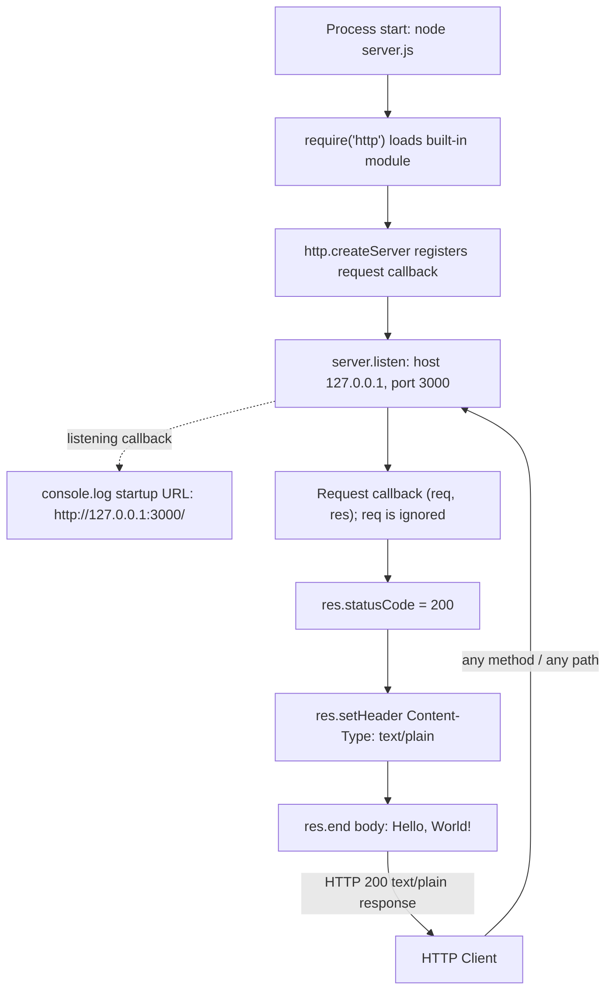
```mermaid
flowchart TD
    Startup["Process start: node server.js"] --> Require["require('http') loads built-in module"]
    Require --> Create["http.createServer registers request callback"]
    Create --> Listen["server.listen: host 127.0.0.1, port 3000"]
    Listen -.->|"listening callback"| Log["console.log startup URL: http://127.0.0.1:3000/"]
    Client["HTTP Client"] -->|"any method / any path"| Listen
    Listen --> Handler["Request callback (req, res); req is ignored"]
    Handler --> SetStatus["res.statusCode = 200"]
    SetStatus --> SetHeader["res.setHeader Content-Type: text/plain"]
    SetHeader --> EndRes["res.end body: Hello, World!"]
    EndRes -->|"HTTP 200 text/plain response"| Client
```

### 1.2.3 Success Criteria

**Measurable Objectives**

The measurable objectives are functional and derive directly from the behavior coded in `server.js`. When the process is started, the server should bind to `127.0.0.1:3000` without error, log the startup URL, and return an HTTP `200` response with `Content-Type: text/plain` and the body `Hello, World!` for any request it receives.

**Critical Success Factors**

- **Zero-dependency install:** confirmed by `package-lock.json` locking no packages, so the fixture runs without external network fetches or version resolution.
- **Deterministic handler:** the request callback in `server.js` disregards request input, guaranteeing an identical response every time.
- **Correct binding:** the `127.0.0.1` / `3000` binding in `server.js` must be free for the listener to start successfully.

**Key Performance Indicators (KPIs)**

The repository defines **no formal KPIs, service-level agreements, latency/throughput targets, or monitoring metrics**, and the sole `test` script in `package.json` is an intentionally failing placeholder (`echo "Error: no test specified" && exit 1`). In the absence of declared KPIs, the table below lists the repository-observable success signals that can be used to verify correct operation; these are functional verification checks derived from the code, not formally declared performance targets.

| Observable Signal | Source | Expected Result |
| --- | --- | --- |
| Startup log line | `console.log` in `server.js` | `Server running at http://127.0.0.1:3000/` is printed |
| Response status | `res.statusCode = 200` in `server.js` | Every request receives HTTP `200` |
| Response content type | `res.setHeader` in `server.js` | `Content-Type: text/plain` |
| Response body | `res.end('Hello, World!\n')` in `server.js` | Body equals `Hello, World!` plus a trailing newline |

## 1.3 Scope

This section defines what the repository does and does not deliver. Scope is bounded strictly by what is present in the four repository files; capabilities absent from the code are treated as out of scope rather than assumed.

### 1.3.1 In-Scope

**Core Features and Functionalities**

The must-have capabilities are exactly those implemented in `server.js`. The primary user workflow consists of two steps: (1) an operator starts the process with `node server.js`, and (2) a client sends an HTTP request to `http://127.0.0.1:3000/` and receives the fixed response.

| Capability | Description | Evidence |
| --- | --- | --- |
| HTTP server startup | Create and start an HTTP listener on `127.0.0.1:3000` | `http.createServer` + `server.listen` in `server.js` |
| Fixed request handling | Return `200`, `Content-Type: text/plain`, body `Hello, World!` for any request | Request callback in `server.js` |
| Startup logging | Print the running URL once listening | `console.log` in `server.js` |

The only essential integration is the local HTTP interface itself; the only technical requirement is a Node.js runtime providing the built-in `http` module, since `package.json` and `package-lock.json` declare no external dependencies.

**Implementation Boundaries**

| Boundary Dimension | In-Scope Definition | Evidence |
| --- | --- | --- |
| System boundary | A single-process, single-file Node.js HTTP server | `server.js` is the sole runtime file |
| User groups | Local operators / the local integration process ("backprop") | `README.md`; loopback binding in `server.js` |
| Geographic / market coverage | Localhost only; loopback interface, not network-exposed | `hostname = '127.0.0.1'` in `server.js` |
| Data domains | None; a single static string with no persistence | `res.end('Hello, World!\n')` in `server.js` |

### 1.3.2 Out-of-Scope

The following areas are explicitly out of scope because there is no supporting code, configuration, or dependency for them anywhere in the repository. Their absence is deliberate given the "Do not touch!" directive in `README.md`.

| Category | Excluded Item | Evidence of Absence |
| --- | --- | --- |
| Application features | Routing, multiple endpoints, dynamic content, request parsing | Request callback in `server.js` ignores `req` |
| Security | HTTPS/TLS, authentication, authorization | No such code or dependencies in `server.js` / manifests |
| Resilience | Error handling, graceful shutdown, health checks | No error listeners or signal handlers in `server.js` |
| Configuration | Environment variables, config files, CLI flags | Host and port hardcoded in `server.js` |
| Data & integrations | Databases, external APIs, caches, message queues, identity providers | Empty dependency graph in `package-lock.json` |
| Quality tooling | Automated test suite, linting, CI | `test` script is a failing placeholder in `package.json` |

**Future Phase Considerations**

The repository states no roadmap, backlog, or planned enhancements. `README.md` contains only the purpose statement and the "Do not touch!" instruction, which signals that the fixture is intended to remain unchanged rather than to evolve through future phases.

**Integration Points Not Covered**

No outbound or inbound integrations beyond the single loopback HTTP endpoint are covered. Specifically excluded are any connections to databases, third-party services, authentication providers, or messaging systems, none of which appear in `package.json` or `package-lock.json`.

**Unsupported Use Cases**

- **Remote or production access:** the server binds to `127.0.0.1` in `server.js` and cannot serve non-local clients.
- **`npm start` launch:** no `start` script exists in `package.json`; the server runs only via `node server.js`.
- **Running the declared `main` entry:** `package.json` names `index.js` as `main`, but that file does not exist; execution relies on `server.js`.
- **Dynamic or content-specific responses:** the handler returns the same body regardless of request method, path, headers, or payload.

## 1.4 References

The following repository artifacts were examined and cited as evidence for this section. No external or web sources were required.

**Files Examined**

- `server.js` - Established the entire runtime behavior: use of the built-in `http` module, the hardcoded `127.0.0.1` host and `3000` port, the fixed `200` / `text/plain` / `Hello, World!` response for every request, the `server.listen` call, and the startup `console.log`.
- `package.json` - Established package identity (`hello_world` 1.0.0), description, `author` (`hxu`), MIT license, the `main` field pointing to the nonexistent `index.js`, and the failing placeholder `test` script with no `start` script or dependencies.
- `package-lock.json` - Confirmed lockfile version 3 and an empty dependency graph (only the root package record), grounding the zero-dependency claims.
- `README.md` - Established the project title `hao-backprop-test`, its stated purpose as a "test project for backprop integration," and the "Do not touch!" directive.

**Folders Examined**

- `` (repository root) - Confirmed the repository contains exactly four first-order files and no subdirectories.

# 2. Product Requirements

## 2.1 Feature Catalog

This catalog decomposes the `hao-backprop-test` repository into discrete, testable features derived strictly from the four repository files. Three features (F-001, F-002, F-003) are runtime behaviors implemented in `server.js`; the fourth (F-004) is the packaging and identity contract expressed by `package.json` and `package-lock.json`. No other features exist in the repository: `README.md` (line 2) frames the project as a "test project for backprop integration" carrying an explicit "Do not touch!" directive, so this catalog documents a **frozen, completed fixture** in its current state rather than a roadmap of planned work. Because the code is implemented and directed to remain unchanged, every feature below carries the status **Completed** and, given the trivial standard-library implementation, a uniformly **Low** complexity.

The four features and their headline attributes are summarized below; the sub-sections that follow provide full metadata, description, and dependency detail for each.

| Feature ID | Feature Name | Category | Priority |
| --- | --- | --- | --- |
| F-001 | HTTP Server Startup & Listener Binding | Core Runtime / Networking | Critical |
| F-002 | Fixed HTTP Response Handling | Core Runtime / Request Handling | Critical |
| F-003 | Server Startup Logging | Observability / Logging | Medium |
| F-004 | Zero-Dependency Package Definition & Identity | Packaging & Distribution | High |

> **Assumption / Constraint (applies to the whole catalog):** The repository declares no roadmap, versioning of individual requirements is inherited from the single package version `1.0.0` (`package.json` line 3), and the "Do not touch!" directive means these features describe the fixture as-built. No commercial metrics, SLAs, or KPIs are declared anywhere in the repository, so "Business Value" and "User Benefits" below are expressed in terms of the fixture's stated engineering purpose (a deterministic integration-test target) rather than invented market value.

### 2.1.1 F-001: HTTP Server Startup & Listener Binding

**Feature Metadata**

| Attribute | Value |
| --- | --- |
| Unique ID | F-001 |
| Feature Name | HTTP Server Startup & Listener Binding |
| Feature Category | Core Runtime / Networking |
| Priority Level | Critical |
| Status | Completed |

**Description**

- **Overview:** Creates an HTTP server instance using the Node.js built-in `http` module and binds it to the loopback host `127.0.0.1` on TCP port `3000`, then begins listening for connections. The server self-starts as a side effect of evaluating `server.js` — `server.listen(...)` executes at module load time (`server.js` lines 12–14).
- **Business Value:** Provides the always-on, fixed-address endpoint (`http://127.0.0.1:3000/`) that the external "backprop" integration connects to. A constant, hardcoded address removes any need for service discovery or configuration by the consumer.
- **User Benefits:** A local operator starts the target with a single command (`node server.js`), and the integration consumer receives a stable, predictable URL that does not vary between runs.
- **Technical Context:** Implemented with the standard library only — `require('http')` (`server.js` line 1), module-scoped constants `hostname` and `port` (`server.js` lines 3–4), `http.createServer` (`server.js` line 6), and `server.listen` (`server.js` line 12). There is no web framework, router, or configuration layer; host and port are compile-time constants with no environment-variable override.

**Dependencies**

| Dependency Type | Detail |
| --- | --- |
| Prerequisite Features | None — F-001 is the foundational runtime feature |
| System Dependencies | A Node.js runtime providing the built-in `http` module |
| External Dependencies | None — zero third-party packages (`package-lock.json` lines 6–12) |
| Integration Requirements | TCP port `3000` on interface `127.0.0.1` must be free for the listener to bind |

### 2.1.2 F-002: Fixed HTTP Response Handling

**Feature Metadata**

| Attribute | Value |
| --- | --- |
| Unique ID | F-002 |
| Feature Name | Fixed HTTP Response Handling (Deterministic Response) |
| Feature Category | Core Runtime / Request Handling |
| Priority Level | Critical |
| Status | Completed |

**Description**

- **Overview:** For every inbound request, the registered request callback sets HTTP status `200`, sets the `Content-Type` header to `text/plain`, and writes the fixed body `Hello, World!\n`. The request object (`req`) is accepted but never read, so the response is identical regardless of HTTP method, path, headers, or payload (`server.js` lines 6–10).
- **Business Value:** Determinism is the core purpose of the fixture. An identical, easily-asserted response for any request eliminates test flakiness and gives the backprop integration a constant target to validate against.
- **User Benefits:** The consumer can assert against one known response body/status/content-type without crafting specialized requests; behavior is reproducible across every invocation.
- **Technical Context:** The handler is the anonymous callback passed to `http.createServer` (`server.js` line 6); it uses the Node `ServerResponse` API — `res.statusCode` (line 7), `res.setHeader` (line 8), and `res.end` (line 9). There is no routing, content negotiation, request parsing, or dynamic templating.

**Dependencies**

| Dependency Type | Detail |
| --- | --- |
| Prerequisite Features | F-001 — the handler is registered on the server created and bound by F-001 |
| System Dependencies | Node.js built-in `http` module `ServerResponse` API |
| External Dependencies | None |
| Integration Requirements | Reachable only through the loopback endpoint established by F-001 |

### 2.1.3 F-003: Server Startup Logging

**Feature Metadata**

| Attribute | Value |
| --- | --- |
| Unique ID | F-003 |
| Feature Name | Server Startup Logging |
| Feature Category | Observability / Logging |
| Priority Level | Medium |
| Status | Completed |

**Description**

- **Overview:** Once the server is listening, a `console.log` call inside the `server.listen` callback prints the running URL `Server running at http://127.0.0.1:3000/` to standard output (`server.js` lines 12–13).
- **Business Value:** Provides an operator-visible readiness signal that confirms the fixture has started and advertises the exact address on which it is reachable.
- **User Benefits:** The operator receives immediate, human-readable confirmation of readiness and the precise URL, without needing external monitoring.
- **Technical Context:** Implemented via a template literal that interpolates the `hostname` and `port` constants (`server.js` line 13). Logging is the only observability mechanism in the repository — there is no structured logging, log level, metrics, or health endpoint.

**Dependencies**

| Dependency Type | Detail |
| --- | --- |
| Prerequisite Features | F-001 — the log statement executes inside the listen callback of the bound server |
| System Dependencies | Node.js `console` / standard-output stream |
| External Dependencies | None |
| Integration Requirements | None — output is a local stdout side effect |

### 2.1.4 F-004: Zero-Dependency Package Definition & Identity

**Feature Metadata**

| Attribute | Value |
| --- | --- |
| Unique ID | F-004 |
| Feature Name | Zero-Dependency Package Definition & Identity |
| Feature Category | Packaging & Distribution |
| Priority Level | High |
| Status | Completed |

**Description**

- **Overview:** `package.json` declares the npm package identity — name `hello_world`, version `1.0.0`, description "Hello world in Node.js", author `hxu`, and the MIT license — while `package-lock.json` (lockfile version 3) locks the dependency graph to the single root package with **zero** external or transitive dependencies. The manifest's sole script is a failing `test` placeholder, its `main` field points at a nonexistent `index.js`, and it declares no `start` script (`package.json` lines 2–10; `package-lock.json` lines 2–12).
- **Business Value:** A locked, zero-dependency install guarantees the fixture behaves identically across environments and over time, with no supply-chain surface and no version drift — directly supporting its role as a stable integration baseline.
- **User Benefits:** No install steps, network fetches, or dependency resolution are required to obtain a runnable fixture; setup is instantaneous and reproducible.
- **Technical Context:** The package is identified in both `package.json` (lines 2–4, 9–10) and `package-lock.json` (lines 2–3, 8–10). There is no `dependencies`/`devDependencies` key and no `engines` field (Node.js version is unpinned). The `main`→`index.js` mismatch and the absence of a `start` script mean the runtime is launched directly via `node server.js`, decoupled from these manifest fields.

**Dependencies**

| Dependency Type | Detail |
| --- | --- |
| Prerequisite Features | None — packaging is independent of the runtime features |
| System Dependencies | npm / Node package tooling to read the manifest and lockfile |
| External Dependencies | None — the locked graph contains only the root package |
| Integration Requirements | None functional; note that `main` and script fields do not point to the actual runtime file (`server.js`) |

## 2.2 Functional Requirements

This sub-section expands each feature from the catalog into testable functional requirements. Requirement IDs follow the `F-XXX-RQ-YYY` convention, so every requirement traces unambiguously to its parent feature. Nine requirements are defined in total. All requirements are baselined at **version 1.0.0**, inherited from the single package version (`package.json` line 3), and are **frozen** per the "Do not touch!" directive in `README.md`. Because the implementation performs no computation on request input and declares no service-level targets, every acceptance criterion is expressed as a deterministic, directly-observable condition, and no repository-declared performance criteria exist to cite.

Each feature below is documented with four grouped tables: **Requirement Details**, **Acceptance Criteria**, **Technical Specifications**, and **Validation Rules**.

### 2.2.1 F-001 — HTTP Server Startup & Listener Binding

**Requirement Details**

| Requirement ID | Description | Priority | Complexity |
| --- | --- | --- | --- |
| F-001-RQ-001 | Create an HTTP server instance using the Node.js built-in `http` module | Must-Have | Low |
| F-001-RQ-002 | Bind and listen for connections on host `127.0.0.1`, port `3000` | Must-Have | Low |

**Acceptance Criteria**

| Requirement ID | Acceptance Criteria |
| --- | --- |
| F-001-RQ-001 | `require('http')` is used and `http.createServer(...)` returns a server object (`server.js` lines 1, 6); no third-party HTTP framework is present |
| F-001-RQ-002 | `server.listen(port, hostname, ...)` is invoked with `port = 3000` and `hostname = '127.0.0.1'` (`server.js` lines 3–4, 12); a TCP connection to `127.0.0.1:3000` is accepted after startup |

**Technical Specifications**

| Aspect | Specification |
| --- | --- |
| Input Parameters | None from configuration — `hostname` (`127.0.0.1`) and `port` (`3000`) are hardcoded module-scoped constants (`server.js` lines 3–4); at runtime the listener accepts inbound TCP/HTTP connections |
| Output/Response | A bound, listening `http.Server`; readiness is surfaced through F-003 |
| Performance Criteria | None declared in the repository (no latency, throughput, or connection-count targets) |
| Data Requirements | None — no persistence or configuration data; only in-code constants |

**Validation Rules**

| Category | Rule |
| --- | --- |
| Business Rules | Endpoint address is fixed at `127.0.0.1:3000` (loopback only); the server self-starts on module evaluation |
| Data Validation | None — no inputs are parsed or validated |
| Security Requirements | Loopback binding confines reachability to the local host; no TLS and no authentication are present (plain HTTP) |
| Compliance Requirements | None declared; the code is MIT-licensed (`package.json` line 10) |

### 2.2.2 F-002 — Fixed HTTP Response Handling

**Requirement Details**

| Requirement ID | Description | Priority | Complexity |
| --- | --- | --- | --- |
| F-002-RQ-001 | Return HTTP status `200` for every inbound request | Must-Have | Low |
| F-002-RQ-002 | Set the `Content-Type` response header to `text/plain` | Must-Have | Low |
| F-002-RQ-003 | Return the fixed body `Hello, World!\n` independent of request attributes | Must-Have | Low |

**Acceptance Criteria**

| Requirement ID | Acceptance Criteria |
| --- | --- |
| F-002-RQ-001 | Any request, regardless of method or path, receives status `200` (`server.js` line 7) |
| F-002-RQ-002 | Every response carries the header `Content-Type: text/plain` (`server.js` line 8) |
| F-002-RQ-003 | Response body equals `Hello, World!` plus a trailing newline for any method/path/header/payload; the `req` argument is never referenced (`server.js` lines 6, 9) |

**Technical Specifications**

| Aspect | Specification |
| --- | --- |
| Input Parameters | The `req` (`IncomingMessage`) is received but ignored (`server.js` line 6); no query string, body, or header parsing occurs |
| Output/Response | HTTP `200`; header `Content-Type: text/plain`; body `Hello, World!\n` (`server.js` lines 7–9) |
| Performance Criteria | None declared; the response is effectively constant-time because no input is processed |
| Data Requirements | A single static string literal; no data store and no request/response state |

**Validation Rules**

| Category | Rule |
| --- | --- |
| Business Rules | The response is deterministic and identical for all requests; no request attribute alters the output |
| Data Validation | None — request inputs are neither read, validated, nor sanitized |
| Security Requirements | No authentication/authorization; the served content is a static, non-sensitive string over plain HTTP on loopback |
| Compliance Requirements | None declared |

### 2.2.3 F-003 — Server Startup Logging

**Requirement Details**

| Requirement ID | Description | Priority | Complexity |
| --- | --- | --- | --- |
| F-003-RQ-001 | Log the running URL to standard output once the server is listening | Should-Have | Low |

**Acceptance Criteria**

| Requirement ID | Acceptance Criteria |
| --- | --- |
| F-003-RQ-001 | On a successful `listen`, standard output contains the line `Server running at http://127.0.0.1:3000/` exactly once, emitted from within the listen callback (`server.js` lines 12–13) |

**Technical Specifications**

| Aspect | Specification |
| --- | --- |
| Input Parameters | None — the message interpolates the `hostname` and `port` constants via a template literal (`server.js` line 13) |
| Output/Response | A single line written to standard output through `console.log` |
| Performance Criteria | None declared |
| Data Requirements | None — the message text is derived entirely from in-code constants |

**Validation Rules**

| Category | Rule |
| --- | --- |
| Business Rules | The log line is emitted only inside the listen callback, i.e. only after a successful bind |
| Data Validation | None |
| Security Requirements | The message contains only the non-sensitive loopback URL; no secrets or request data are logged |
| Compliance Requirements | None declared |

### 2.2.4 F-004 — Zero-Dependency Package Definition & Identity

**Requirement Details**

| Requirement ID | Description | Priority | Complexity |
| --- | --- | --- | --- |
| F-004-RQ-001 | Declare package identity and metadata (name, version, description, author, license) | Should-Have | Low |
| F-004-RQ-002 | Lock the dependency graph to zero external/transitive dependencies | Must-Have | Low |
| F-004-RQ-003 | Declare npm scripts and entrypoint metadata as-built | Could-Have | Low |

**Acceptance Criteria**

| Requirement ID | Acceptance Criteria |
| --- | --- |
| F-004-RQ-001 | `package.json` declares `name = hello_world`, `version = 1.0.0`, a description, `author = hxu`, and `license = MIT` (`package.json` lines 2–4, 9–10); `package-lock.json` mirrors name/version/license (`package-lock.json` lines 2–3, 8–10) |
| F-004-RQ-002 | `package.json` declares no `dependencies`/`devDependencies` keys, and the `package-lock.json` `packages` map contains only the empty-string root record (`package-lock.json` lines 6–12); an install resolves zero external packages |
| F-004-RQ-003 | `scripts.test` equals `echo "Error: no test specified" && exit 1`, no `start` script is present, and `main` is `index.js` (a file absent from the repository) (`package.json` lines 5–8) |

**Technical Specifications**

| Aspect | Specification |
| --- | --- |
| Input Parameters | None — static JSON manifests consumed by npm/Node tooling |
| Output/Response | Package identity metadata and a locked, empty dependency graph resolved at install time |
| Performance Criteria | None declared (a zero-dependency install is inherently fast, but no target is stated) |
| Data Requirements | Two static JSON documents (`package.json`, `package-lock.json`); no runtime data |

**Validation Rules**

| Category | Rule |
| --- | --- |
| Business Rules | Package identity is fixed at `hello_world` `1.0.0` (MIT); the lockfile must reflect zero dependencies |
| Data Validation | Both manifests must be well-formed, npm-parseable JSON (verified valid as read) |
| Security Requirements | A zero-dependency graph presents no third-party supply-chain surface |
| Compliance Requirements | The MIT license is declared in both manifests (`package.json` line 10; `package-lock.json` line 10) |

## 2.3 Feature Relationships

This sub-section documents only the relationships that are directly evident in the source code and manifests. Because the entire runtime lives in a single file (`server.js`) and the packaging concern lives in two manifests, the relationship graph is small and unambiguous. No inter-feature relationships beyond those shown here exist in the repository.

### 2.3.1 Feature Dependency Map

The three runtime features share a single `http.Server` instance, which makes F-001 the foundation on which F-002 and F-003 depend: F-002's request callback is the function passed to `http.createServer` (`server.js` line 6), and F-003's log statement executes inside the `server.listen` callback (`server.js` lines 12–13). F-004 (packaging) has no functional dependency on the runtime features; its only relationship is structural — the npm package encloses the `server.js` source, and its `main` field mis-points to a nonexistent `index.js`.

| Feature | Depends On | Nature of Dependency | Evidence |
| --- | --- | --- | --- |
| F-001 | — | Foundational; no prerequisites | `server.js` lines 1, 6, 12 |
| F-002 | F-001 | Handler registered on the server created by F-001 | `server.js` line 6 |
| F-003 | F-001 | Log emitted inside F-001's listen callback | `server.js` lines 12–13 |
| F-004 | — | Independent packaging concern (structural enclosure only) | `package.json`; `package-lock.json` |

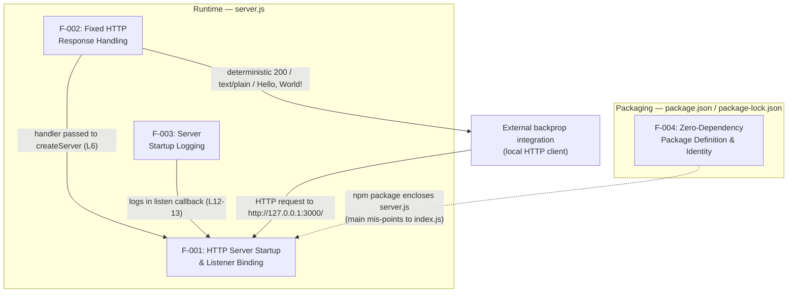
```mermaid
flowchart TD
    Consumer["External backprop integration<br/>(local HTTP client)"]

    subgraph Runtime["Runtime — server.js"]
        F001["F-001: HTTP Server Startup<br/>& Listener Binding"]
        F002["F-002: Fixed HTTP<br/>Response Handling"]
        F003["F-003: Server<br/>Startup Logging"]
        F002 -->|"handler passed to createServer (L6)"| F001
        F003 -->|"logs in listen callback (L12-13)"| F001
    end

    subgraph Packaging["Packaging — package.json / package-lock.json"]
        F004["F-004: Zero-Dependency<br/>Package Definition & Identity"]
    end

    Consumer -->|"HTTP request to http://127.0.0.1:3000/"| F001
    F002 -->|"deterministic 200 / text/plain / Hello, World!"| Consumer
    F004 -.->|"npm package encloses server.js<br/>(main mis-points to index.js)"| F001
```

The end-to-end startup sequence and per-request lifecycle that this map summarizes are depicted in the process flowchart in Section **1.2.2 High-Level Description**.

### 2.3.2 Integration Points

The system exposes exactly one integration point, and it is inbound only.

| Integration Point | Direction | Description | Evidence |
| --- | --- | --- | --- |
| `http://127.0.0.1:3000/` | Inbound | The sole HTTP endpoint; the external "backprop" process connects here and receives the deterministic response (F-002) | `server.js` lines 3–4, 12; `README.md` line 2 |

There are **no outbound integrations**: `package.json` and `package-lock.json` declare no database drivers, HTTP clients, message-queue libraries, or identity-provider SDKs, so the fixture makes no external calls. The endpoint is bound to the loopback interface, so integration is confined to processes running on the same host.

### 2.3.3 Shared Components

The runtime features are not merely dependent — they physically share the same in-process objects, all defined in `server.js`.

| Shared Component | Shared By | Role | Evidence |
| --- | --- | --- | --- |
| `http.Server` instance | F-001, F-002, F-003 | Created by F-001, carries F-002's request callback, and fires F-003's listen callback | `server.js` lines 6, 12 |
| Built-in `http` module | F-001, F-002 | Provides `createServer` and the `ServerResponse` API | `server.js` line 1 |
| `hostname` / `port` constants | F-001, F-003 | Used to bind the listener (F-001) and to compose the startup log message (F-003) | `server.js` lines 3–4, 12–13 |
| `res` (`ServerResponse`) | F-002 | Target of status/header/body writes for every request | `server.js` lines 7–9 |

### 2.3.4 Common Services

The repository contains no application-level shared services (no database, cache, authentication service, configuration service, or logging framework). The only common services are those supplied by the runtime and tooling.

| Common Service | Consumed By | Notes |
| --- | --- | --- |
| Node.js runtime (event loop, built-in `http`, `console`) | F-001, F-002, F-003 | The single execution substrate for all runtime behavior; no external service layer exists |
| npm / Node package tooling | F-004 | Reads the manifest and lockfile to resolve the (empty) dependency graph |

## 2.4 Implementation Considerations

This sub-section records the technical constraints, performance, scalability, security, and maintenance considerations for each feature. All items are grounded in observed code or in the verifiable **absence** of code (e.g., the lack of an `error` listener). The repository declares no performance targets, so "Performance Requirements" describe the observed characteristics rather than stated SLAs. Several considerations are shared across the three runtime features because they all execute in the single `server.js` process.

### 2.4.1 F-001 — HTTP Server Startup & Listener Binding

| Consideration | Detail |
| --- | --- |
| Technical Constraints | Binds to the loopback host `127.0.0.1` (`server.js` line 3), so it is unreachable from other hosts; `hostname` and `port` are hardcoded constants with no environment/config override (`server.js` lines 3–4); the server self-starts on module evaluation with no explicit start function; there is **no `error` listener**, so a bind failure (e.g. port `3000` already in use) surfaces as an unhandled exception |
| Performance Requirements | None declared; startup is a single `createServer` + `listen` with no tuning of backlog or keep-alive |
| Scalability Considerations | Single process on a single Node.js event loop; no clustering or worker threads; the fixed loopback host/port prevents running multiple instances or horizontal scaling on the same host without editing the source |
| Security Implications | Loopback-only binding deliberately confines exposure to the local host; traffic is plain HTTP (no TLS) and there is no authentication |
| Maintenance Requirements | Must be launched via `node server.js` (no `start` script; `main` mis-points to `index.js`); zero dependencies mean no patch burden; changing the address requires editing the in-code constants; the fixture is frozen per "Do not touch!" |

### 2.4.2 F-002 — Fixed HTTP Response Handling

| Consideration | Detail |
| --- | --- |
| Technical Constraints | Serves one static response with no routing, method/path handling, or content negotiation; the request object is ignored (`server.js` line 6), so no other content can be served without a code change |
| Performance Requirements | None declared; the handler performs no input processing and does no I/O beyond writing the fixed body, so response cost is effectively constant per request |
| Scalability Considerations | The handler holds no shared or mutable state, so it introduces no concurrency bottleneck of its own, but it inherits the single-process constraint of F-001 |
| Security Implications | Because request input is never parsed, there is no request-driven parsing/injection surface; the response body is a static, non-sensitive string served over plain HTTP with no authentication |
| Maintenance Requirements | The status, header, and body are literals (`server.js` lines 7–9); altering the response requires editing those lines; the fixture is frozen |

### 2.4.3 F-003 — Server Startup Logging

| Consideration | Detail |
| --- | --- |
| Technical Constraints | A single unstructured `console.log` to standard output with no log levels, timestamps, or structured format; the line is emitted only on a successful `listen` (`server.js` lines 12–13), not on failure |
| Performance Requirements | None declared; a single one-time write at startup with negligible cost and no per-request logging |
| Scalability Considerations | Not applicable — a one-time startup side effect that does not affect request throughput |
| Security Implications | Logs only the non-sensitive loopback URL; no secrets, credentials, or request data are written |
| Maintenance Requirements | The message is a template literal bound to the `hostname`/`port` constants (`server.js` line 13); changing the advertised URL requires editing those constants or the log line |

### 2.4.4 F-004 — Zero-Dependency Package Definition & Identity

| Consideration | Detail |
| --- | --- |
| Technical Constraints | `main` points to a nonexistent `index.js`; there is no `start` script; there is no `engines` field, so the Node.js version is unpinned; the sole `test` script is a failing placeholder (`package.json` lines 5–8), so there is no automated test coverage |
| Performance Requirements | None declared; a zero-dependency install avoids network fetches and version resolution, but no install-time target is stated |
| Scalability Considerations | Not a runtime concern; the locked, empty dependency graph keeps installs reproducible and free of version drift as the fixture is used across many environments |
| Security Implications | Zero third-party dependencies present no supply-chain vulnerability surface; the MIT license (`package.json` line 10; `package-lock.json` line 10) is permissive |
| Maintenance Requirements | The manifests are the single point of change for identity and version; the `main`/`scripts` discrepancies are documented constraints to preserve rather than "fix" given the "Do not touch!" directive; keeping dependencies at zero maintains reproducibility |

## 2.5 Traceability Matrix, Assumptions & Constraints

This sub-section closes the loop between features, requirements, and source evidence, and records the assumptions and constraints under which the requirements hold. Every requirement traces to a specific file and line, and every requirement is verifiable by a concrete, deterministic check.

### 2.5.1 Requirements Traceability Matrix

The following matrix maps each functional requirement to its parent feature, its source-code evidence, and the method by which it can be verified.

| Requirement ID | Feature | Source Evidence | Verification Method |
| --- | --- | --- | --- |
| F-001-RQ-001 | F-001 | `server.js` lines 1, 6 | Inspect code for `require('http')` and `http.createServer`; confirm no third-party HTTP library |
| F-001-RQ-002 | F-001 | `server.js` lines 3–4, 12 | After start, a TCP/HTTP connection to `127.0.0.1:3000` is accepted |
| F-002-RQ-001 | F-002 | `server.js` line 7 | Any HTTP request returns status `200` |
| F-002-RQ-002 | F-002 | `server.js` line 8 | Response header `Content-Type` equals `text/plain` |
| F-002-RQ-003 | F-002 | `server.js` lines 6, 9 | Response body equals `Hello, World!\n` across varied methods/paths |
| F-003-RQ-001 | F-003 | `server.js` lines 12–13 | Standard output contains `Server running at http://127.0.0.1:3000/` after listen |
| F-004-RQ-001 | F-004 | `package.json` lines 2–4, 9–10; `package-lock.json` lines 2–3, 8–10 | Inspect manifests for name/version/description/author/license |
| F-004-RQ-002 | F-004 | `package.json` (no dependency keys); `package-lock.json` lines 6–12 | Install resolves zero packages; lockfile `packages` map has only the root record |
| F-004-RQ-003 | F-004 | `package.json` lines 5–8 | Inspect `scripts`, `main`, and absence of `start` |

The next matrix cross-references each feature to the document sub-sections that describe it, providing forward and backward traceability across this specification.

| Feature | Catalog | Requirements | Considerations |
| --- | --- | --- | --- |
| F-001 | 2.1.1 | 2.2.1 | 2.4.1 |
| F-002 | 2.1.2 | 2.2.2 | 2.4.2 |
| F-003 | 2.1.3 | 2.2.3 | 2.4.3 |
| F-004 | 2.1.4 | 2.2.4 | 2.4.4 |

The system-level context and the startup/request process flow for F-001–F-003 are documented in Section **1.2 System Overview** (in-scope capabilities appear in Section **1.3.1 In-Scope**); the deliberate exclusions that bound these requirements are enumerated in Section **1.3.2 Out-of-Scope**.

### 2.5.2 Assumptions

- A Node.js runtime providing the built-in `http` module is available on the host; the version is **not pinned** because `package.json` declares no `engines` field.
- The loopback interface `127.0.0.1` and TCP port `3000` are free when the process starts — no bind-failure handling exists in `server.js`.
- The consuming "backprop" integration runs on the **same host**, because the endpoint is bound to the loopback interface (`server.js` line 3).
- The runtime is launched via `node server.js` — not `npm start` (undefined) and not the declared `main` `index.js` (absent).
- The purpose statement and "Do not touch!" directive in `README.md` (lines 1–2) mean the fixture is intended to remain unchanged, so these requirements describe the current, frozen state rather than a target end-state.

### 2.5.3 Constraints

- **Networking:** Loopback-only, hardcoded host and port with no environment/config override (`server.js` lines 3–4).
- **Behavior:** A single static response — no routing, dynamic content, or request parsing (`server.js` lines 6–9).
- **Security posture:** Plain HTTP only; no TLS, authentication, or authorization anywhere in the repository.
- **Resilience:** No error handling, graceful shutdown, or health checks (verified absent in `server.js`).
- **Quality tooling:** No automated tests (the `test` script is a failing placeholder, `package.json` lines 6–8); no CI or linting is present.
- **Reproducibility:** Zero dependencies must be preserved (`package-lock.json` lines 6–12) to keep installs deterministic.
- **Manifest discrepancies (documented, not to be "fixed"):** `main` references a nonexistent `index.js`, and there is no `start` script (`package.json` lines 5–8).
- **Requirement versioning:** All requirements inherit the single package version `1.0.0` (`package.json` line 3); the repository maintains no per-requirement version history, and the "Do not touch!" directive freezes the baseline.

## 2.6 References

The features, requirements, relationships, and considerations in this section were derived entirely from direct inspection of the four repository files. No external or web sources were required.

**Files Examined**

- `server.js` - Established all three runtime features: the built-in `http` module (line 1), the hardcoded `127.0.0.1` host and `3000` port (lines 3–4), server creation with an unused `req` argument (line 6), the fixed `200` / `text/plain` / `Hello, World!\n` response (lines 7–9), the `server.listen` binding (line 12), and the startup `console.log` (line 13); also grounded the verified absence of routing, error handling, graceful shutdown, and configuration.
- `package.json` - Established F-004 identity metadata (`hello_world`, `1.0.0`, description, `author` `hxu`, MIT license), the sole failing `test` script, the absence of a `start` script, the `main`→`index.js` discrepancy, and the absence of any `dependencies`, `devDependencies`, or `engines` fields.
- `package-lock.json` - Confirmed lockfile version 3 and an empty dependency graph (root-only `packages` record), grounding the zero-dependency and reproducibility requirements.
- `README.md` - Established the project title `hao-backprop-test`, its stated purpose as a "test project for backprop integration," and the "Do not touch!" directive that fixes the fixture's frozen, completed status.

**Folders Examined**

- `` (repository root) - Confirmed the repository contains exactly four first-order files and no subdirectories, bounding the complete feature surface documented here.

**Cross-Referenced Specification Sections**

- Section **1.2 System Overview** - Source of the system-level capability list and the startup/per-request process flowchart referenced from 2.3.1.
- Section **1.3 Scope** - Source of the in-scope capability set (1.3.1) and the deliberate exclusions (1.3.2) that bound these requirements.

# 3. Technology Stack

## 3.1 Programming Languages

The technology stack of this repository is deliberately and verifiably minimal. Every statement in this section is grounded in the four tracked files that constitute the entire repository — `server.js`, `package.json`, `package-lock.json`, and `README.md` — plus direct inspection of the checkout, which confirmed the absence of any build, container, CI, or infrastructure artifacts. Consistent with Section 1.2, the system is a fixed, single-file Node.js "hello world" HTTP server maintained as an integration test fixture; `README.md` states it is a "test project for backprop integration. Do not touch!"

Because the repository intentionally carries zero third-party dependencies and no additional tooling, most conventional technology-stack categories evaluate to "not present." Those categories are still documented below (Sections 3.2–3.6) with the supporting evidence for their absence, so the specification faithfully reflects the deliberate design of the fixture rather than assuming any broader default stack.

The following table summarizes the complete, observed technology footprint. Version identifiers are drawn directly from the manifests; where a component's version is not pinned by the repository, this is stated explicitly rather than inferred from the surrounding environment.

| Layer | Technology | Version / Identifier | Evidence |
|-------|-----------|----------------------|----------|
| Language | JavaScript (CommonJS module system) | ES2015+ syntax used | `server.js` |
| Runtime platform | Node.js (built-in `http` module) | Unpinned — no `engines` field | `server.js` line 1; `package.json` |
| Web framework | None | — | `package.json` (no dependencies) |
| Package manager | npm | lockfile format v3 (npm v7+) | `package-lock.json` line 4 |
| Third-party dependencies | None | 0 packages | `package-lock.json` lines 6–12 |
| Version control / hosting | Git / GitHub | Single commit | repository `.git` |
| License | MIT | — | `package.json` line 10 |

The stack is best understood as a small set of layers in which a single JavaScript source file sits directly on the Node.js runtime and its standard library, surrounded only by npm packaging metadata and Git version control. The diagram below depicts these layers and the direction of their dependencies.

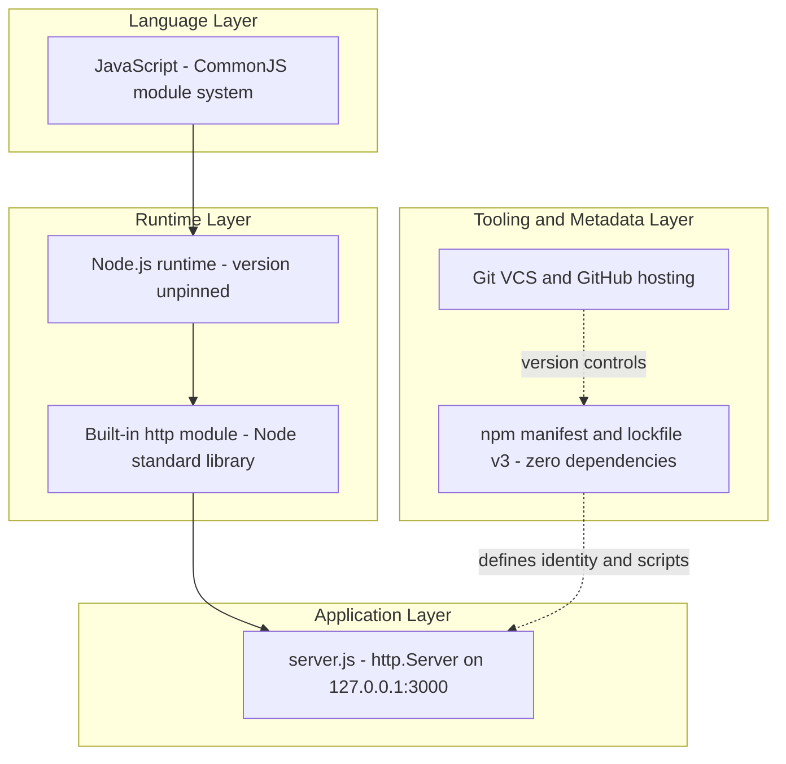
```mermaid
flowchart TD
    subgraph LanguageLayer["Language Layer"]
        JS["JavaScript - CommonJS module system"]
    end
    subgraph RuntimeLayer["Runtime Layer"]
        NodeJS["Node.js runtime - version unpinned"]
        HttpMod["Built-in http module - Node standard library"]
    end
    subgraph AppLayer["Application Layer"]
        Server["server.js - http.Server on 127.0.0.1:3000"]
    end
    subgraph ToolingLayer["Tooling and Metadata Layer"]
        Npm["npm manifest and lockfile v3 - zero dependencies"]
        Git["Git VCS and GitHub hosting"]
    end
    JS --> NodeJS
    NodeJS --> HttpMod
    HttpMod --> Server
    Npm -.->|"defines identity and scripts"| Server
    Git -.->|"version controls"| Npm
```

### 3.1.1 Primary Language: JavaScript (CommonJS)

The system is implemented in a single programming language, JavaScript, authored against the CommonJS module system. The sole runtime source file, `server.js`, opens with `const http = require('http');` (line 1), which is the CommonJS `require` idiom rather than an ECMAScript `import` statement. This is consistent with `package.json`, which does not declare `"type": "module"`, so the `.js` file is interpreted as a CommonJS module by default.

The source exercises ECMAScript 2015 (ES6) or later language features, which establishes the minimum language level the executing runtime must support:

- `const` block-scoped declarations for the module, hostname, and port bindings (`server.js` lines 1, 3, 4, 6);
- arrow-function callbacks for both the request handler `(req, res) => { ... }` (line 6) and the listen callback `() => { ... }` (line 12); and
- a template literal used to compose the startup log message (line 13).

**Selection criteria and justification.** JavaScript on Node.js is the natural fit for this fixture's stated purpose — providing a known-good, deterministic HTTP endpoint for downstream "backprop" integration testing (`README.md`; Section 1.2). Node.js supplies a complete HTTP server through its standard library, so a fixed "Hello, World!" responder can be written in a handful of lines with no installation step. This directly supports the zero-dependency install objective documented in Section 1.2.3 and the reproducibility constraint in Section 2.5. A single-file JavaScript implementation also keeps the fixture trivially auditable, which aligns with the "Do not touch!" directive that freezes its behavior.

**Absent languages (scope boundary).** No other programming language is present anywhere in the repository. Direct inspection confirmed there is no TypeScript (no `tsconfig.json` and no `.ts` sources), no Python, and no JVM, Go, or other language manifests (`requirements.txt`, `pyproject.toml`, `pom.xml`, `build.gradle`, and `go.mod` are all absent). There is likewise no transpilation or compilation step: `package.json` declares no build script and no bundler or compiler configuration exists. Readers should therefore treat this as a strictly single-language system, notwithstanding any broader multi-language defaults that do not apply here.

### 3.1.2 Runtime Platform: Node.js

JavaScript in this repository executes on the Node.js runtime. Node.js is required because `server.js` depends on the Node-specific built-in `http` module (line 1) and on the Node global `console` (line 13); these APIs are provided by the Node.js platform rather than by the JavaScript language itself.

**Version and constraints.** The repository does not pin a Node.js version. `package.json` contains no `engines` field (confirmed by direct inspection), so the required runtime version is an environmental assumption rather than a repository-enforced constraint, as also noted in Section 2.5. The only firm requirement derivable from the code is that the runtime be recent enough to (a) provide the built-in `http` module — true of every Node.js release — and (b) support the ES2015+ syntax described in Section 3.1.1. This specification deliberately does not present any specific Node.js version as a repository requirement, because none is declared in the tracked files.

**Launch dependency.** Because `package.json` declares no `start` script and its `main` field points to a nonexistent `index.js`, the service is started directly with `node server.js`; the server self-starts on module evaluation by calling `server.listen(port, hostname, ...)` (`server.js` line 12). These launch characteristics are covered in more depth under Section 3.6.

## 3.2 Frameworks & Libraries

This system uses no application framework and no third-party libraries. The only library it consumes is the Node.js built-in `http` module, which is part of the Node standard library shipped with the runtime — not an installable package. This finding is corroborated by Section 1.2, which describes the core technical approach as relying exclusively on the Node.js standard library.

**Core frameworks.** There is no web application framework in use. `server.js` constructs its HTTP server by calling `http.createServer(...)` directly (line 6) rather than delegating to Express, Fastify, Koa, Hapi, or any comparable framework. The absence is confirmed structurally: `package.json` declares neither a `dependencies` nor a `devDependencies` key, and `package-lock.json` (lockfileVersion 3) locks zero packages beyond the project's own root record. With an empty dependency graph, no framework can be present.

**Supporting libraries.** The single library dependency is the Node.js core `http` module, loaded via `const http = require('http')` (`server.js` line 1). From this module the code uses:

- `http.createServer(callback)` to instantiate the server and register the request handler (line 6);
- the `ServerResponse` object passed to that handler, on which it sets `res.statusCode`, calls `res.setHeader('Content-Type', 'text/plain')`, and calls `res.end('Hello, World!\n')` (lines 7–9); and
- `server.listen(port, hostname, callback)` to bind the listener and emit the startup log (lines 12–13).

The table below enumerates every framework/library category and its observed status.

| Category | Technology | Version | Source | Notes |
|----------|-----------|---------|--------|-------|
| Web application framework | None | — | — | No Express/Fastify/Koa/etc.; `http.createServer` used directly |
| HTTP server library | Node.js built-in `http` | Bundled with the Node runtime (unpinned) | `server.js` line 1 | Standard library, not an npm dependency |
| Templating / view engine | None | — | — | Response body is a static string literal |
| Test framework | None | — | `package.json` line 7 | Sole `test` script is a failing placeholder |
| Build / transpile / bundler | None | — | — | No bundler, compiler, or task-runner config present |

**Compatibility requirements.** The `http` APIs used here — `createServer`, `setHeader`, `statusCode`, `end`, and `listen` — are long-stable and available across all modern Node.js releases; no version-gated or experimental API is invoked. Consequently, the fixture imposes no library-version compatibility constraint of its own beyond the presence of the standard `http` module. The server relies on Node's default HTTP behavior, which serves HTTP/1.1.

**Justification.** Building solely on the standard library is the design choice that makes the fixture deterministic and reproducible. It satisfies the zero-dependency install and correct-binding success factors from Section 1.2.3, eliminates the third-party supply-chain surface discussed in Section 2.4.4, and keeps the artifact frozen and auditable in line with the "Do not touch!" directive. Introducing a web framework would add external dependencies and non-deterministic version resolution, directly conflicting with those goals; the standard-library approach therefore represents an intentional and well-matched decision for this fixture's narrow purpose.

## 3.3 Open Source Dependencies

This project has zero open-source or third-party runtime dependencies, and zero development dependencies. It is an npm-managed package whose dependency graph is empty by design.

**Third-party libraries identified.** None. `package.json` declares no `dependencies` and no `devDependencies` keys (verified by direct inspection). Correspondingly, `package-lock.json` — which uses `lockfileVersion` 3 — contains only the empty-string root record for the project itself under its `packages` map (lines 6–12) and locks no external or transitive packages. This mirrors requirement F-004-RQ-002 in Section 2.5, which records that the lockfile pins zero external dependencies for a reproducible install.

**Package registry.** As a standard npm project, the implied registry is the public npm registry (registry.npmjs.org). However, that registry is never actually exercised for dependency resolution: running an install against this manifest resolves zero packages, so no artifacts are fetched from any registry.

**Versions.** The only versioned artifact is the project's own package identity, `hello_world` version `1.0.0`, which appears consistently in both `package.json` (lines 2–3) and `package-lock.json` (lines 2–3). The lockfile itself declares `lockfileVersion: 3` (`package-lock.json` line 4); this is the npm lockfile format used by npm version 7 and later, which indicates the lockfile was produced or maintained by npm v7+ tooling.

**License.** The project is MIT-licensed, as declared in both `package.json` (line 10) and the lockfile's root package record (`package-lock.json` line 10). Because there are no dependencies, there are no transitive license obligations to reconcile.

| Aspect | Value | Evidence |
|--------|-------|----------|
| Runtime dependencies | 0 | `package.json` (no `dependencies` key) |
| Development dependencies | 0 | `package.json` (no `devDependencies` key) |
| Locked packages | 0 (root record only) | `package-lock.json` lines 6–12 |
| Lockfile format | `lockfileVersion` 3 (npm v7+) | `package-lock.json` line 4 |
| Package registry | Public npm registry (not exercised) | npm project convention |
| Project identity | `hello_world` 1.0.0 | `package.json` lines 2–3 |
| Project license | MIT | `package.json` line 10 |

**Security implications.** A completely empty dependency graph is a deliberate security-positive property of this fixture: it presents no third-party supply-chain attack surface, has no vulnerable transitive packages to patch, and keeps installs fully deterministic. This is consistent with the maintenance and security posture recorded for feature F-004 in Section 2.4.4. Preserving the zero-dependency state is itself a documented constraint (Section 2.5) reinforced by the repository's "Do not touch!" directive.

## 3.4 Third-Party Services

This system integrates with no external or third-party services of any kind. It neither calls outbound services nor depends on hosted platforms for authentication, monitoring, or infrastructure. Each service category enumerated by this specification is documented below with the evidence establishing its absence.

**External APIs and integrations.** None. `server.js` contains no outbound HTTP client, SDK, `fetch`, or socket-initiating code; it only creates a local inbound HTTP listener (line 6) and responds with a fixed string (line 9). The one integration point in the whole system is the inbound loopback endpoint `http://127.0.0.1:3000/`, which the external "backprop" process consumes locally on the same host — an inbound contract rather than an outbound third-party integration (Section 1.2; Section 2.5).

**Authentication services.** None. There is no authentication or authorization logic anywhere in `server.js`, and no identity-provider integration (for example Auth0, OAuth, OpenID Connect, or JWT handling). The endpoint is unauthenticated by design, as recorded in the security considerations for feature F-001 in Section 2.4 and the constraints in Section 2.5. No credential-bearing dependency exists because the dependency graph is empty (Section 3.3).

**Monitoring and observability tools.** None. The only telemetry the system emits is a single unstructured `console.log` line written to stdout when the server begins listening (`server.js` lines 12–13). There is no metrics exporter, distributed tracing, error-reporting client, or application-performance-monitoring agent, consistent with the F-003 startup-logging analysis in Section 2.4.

**Cloud services.** None. There are no cloud-provider SDKs (AWS, Google Cloud, or Azure), no service configuration files, and no environment-variable-driven service wiring; `server.js` reads no configuration at all and hardcodes its host and port (lines 3–4). The server also binds to the loopback address `127.0.0.1` (line 3), so it is not reachable from outside the host and is not deployed behind any cloud networking layer.

| Service category | Present? | Evidence |
|------------------|----------|----------|
| External APIs / outbound integrations | No | `server.js` has no outbound client or SDK |
| Authentication / identity provider | No | No auth code; unauthenticated endpoint (Section 2.4) |
| Monitoring / tracing / APM | No | Only a single `console.log` startup line (lines 12–13) |
| Cloud provider services | No | No SDKs or config; loopback-only binding (line 3) |
| Messaging / queues / streaming | No | Empty dependency graph (Section 3.3) |

The absence of these services is intentional for an isolated, deterministic test fixture. Any third-party services listed in a generic default technology stack are therefore not applicable to this repository and are not documented as present.

## 3.5 Databases & Storage

This system uses no database and no persistent storage. It is fully stateless: every response is a compile-time string literal, and no data is read from or written to any store. This aligns with the F-002 analysis in Section 2.4, which records that the request handler maintains no shared or mutable state.

**Primary and secondary databases.** None. There is no relational or NoSQL database in use, no database driver or ORM, and no connection string or database configuration anywhere in the repository. The absence is confirmed by the empty dependency graph (Section 3.3) — no client library such as a SQL, MongoDB, or key-value driver is installed — and by `server.js`, which produces its entire response from the literal `'Hello, World!\n'` (line 9).

**Data persistence strategies.** None. The handler holds no in-memory state across requests and performs no persistence: the `req` object is ignored (`server.js` line 6) and nothing is written to disk or to any external store. Because the response is fixed and identical for every request, the system is deterministic and requires no data layer.

**Caching solutions.** None. There is no in-process cache, no external cache such as Redis or Memcached, and no HTTP caching behavior configured. The only response header set is `Content-Type: text/plain` (`server.js` line 8); no `Cache-Control`, `ETag`, or similar caching header is emitted.

**Storage services.** None. The system performs no filesystem writes and integrates with no object or blob storage service. It reads no files at runtime and produces no artifacts beyond its stdout startup log.

| Storage concern | Present? | Evidence |
|-----------------|----------|----------|
| Relational / NoSQL database | No | No driver or connection config; empty dependency graph |
| ORM / data-access layer | No | `server.js` uses no data layer; body is a literal (line 9) |
| Cache (in-memory / Redis / Memcached) | No | No cache code and no caching headers |
| Object / file / blob storage | No | No filesystem or storage-service I/O |
| Session / state store | No | Stateless handler; `req` ignored (line 6) |

The stateless, storage-free design is intentional for a deterministic fixture and is a documented constraint in Section 2.5. Any databases or storage services from a generic default stack are not applicable here and are not documented as present.

## 3.6 Development & Deployment

The development and deployment footprint is as minimal as the runtime footprint. The repository relies on the Node.js runtime, the npm package manager, and Git/GitHub for version control. It defines no build system, no containerization, and no CI/CD pipeline. These absences were confirmed by direct inspection of the checkout and are consistent with the constraints in Section 2.5, which records that no CI, linting, or automated tests are present.

### 3.6.1 Development Tools

- **Language runtime.** Node.js is required to execute `server.js`; it provides the built-in `http` module used at line 1. The runtime version is not pinned by the repository (no `engines` field in `package.json`), as discussed in Section 3.1.2.
- **Package manager.** npm is the package manager, evidenced by the paired `package.json` manifest and `package-lock.json` lockfile. The lockfile's `lockfileVersion: 3` (`package-lock.json` line 4) indicates npm v7+ tooling. No alternative package manager (such as Yarn or pnpm) is configured — there is no `yarn.lock` or `pnpm-lock.yaml`.
- **Version control and hosting.** The project is tracked in Git and hosted on GitHub. The repository history contains a single commit ("Add files via upload"), which indicates the files were uploaded rather than developed incrementally in place. (For security, the Git remote's embedded access credential is not reproduced in this document; hosting is referred to generically as GitHub.)
- **Editor / lint / format configuration.** None. There is no `.editorconfig`, `.eslintrc`, `.prettierrc`, or equivalent — no code-style or linting tooling is configured.
- **Testing.** No functional test tooling exists. The sole `test` script in `package.json` is an intentionally failing placeholder — `echo "Error: no test specified" && exit 1` (line 7) — as also recorded for feature F-004 in Sections 2.4 and 2.5.

### 3.6.2 Build System, Containerization, and CI/CD

- **Build system.** None. `server.js` runs as authored, with no transpilation, bundling, or compilation step. `package.json` declares no `build` script, and there is no `Makefile`, bundler configuration, or task-runner configuration in the repository.
- **Containerization.** None. Direct inspection confirmed there is no `Dockerfile`, `docker-compose.yml`/`docker-compose.yaml`, or `.dockerignore`. The service is not packaged as a container image.
- **Infrastructure as Code.** None. There are no Terraform, CloudFormation, Pulumi, or comparable IaC definitions anywhere in the repository.
- **CI/CD.** None. There is no `.github/workflows` directory, no GitLab CI configuration, and no `Jenkinsfile`. No automated build, test, or deployment pipeline is defined for this repository.

### 3.6.3 Runtime Launch and Component Integration

The service is launched directly with `node server.js`. It cannot be started with `npm start` because no `start` script is defined, and its `package.json` `main` field points to a nonexistent `index.js`; the runnable entry point is `server.js` itself, which self-starts on module evaluation by calling `server.listen(3000, '127.0.0.1', ...)` (lines 12–14). Because the listener binds to the loopback interface, the documented deployment expectation (Section 2.5) is that the consuming "backprop" client runs on the same host.

The following diagram shows how the technology-stack components interact during development and at run time: the operator launches the Node.js runtime, which loads the core `http` module to open the loopback listener; the npm manifest and lockfile define the package's identity and (empty) dependency set; and Git/GitHub tracks the tracked files.

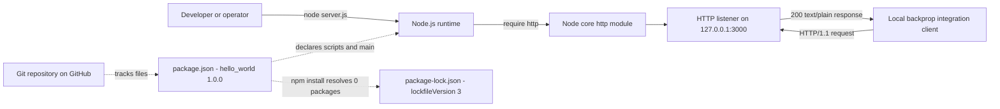
```mermaid
flowchart LR
    Dev["Developer or operator"] -->|"node server.js"| NodeRuntime["Node.js runtime"]
    NodeRuntime -->|"require http"| CoreHttp["Node core http module"]
    CoreHttp --> Listener["HTTP listener on 127.0.0.1:3000"]
    Manifest["package.json - hello_world 1.0.0"] -.->|"npm install resolves 0 packages"| Lockfile["package-lock.json - lockfileVersion 3"]
    Manifest -.->|"declares scripts and main"| NodeRuntime
    GitRepo["Git repository on GitHub"] -.->|"tracks files"| Manifest
    Client["Local backprop integration client"] -->|"HTTP/1.1 request"| Listener
    Listener -->|"200 text/plain response"| Client
```

### 3.6.4 Security Considerations of the Stack

The development and deployment choices carry a small, well-bounded security profile that is worth stating explicitly:

- **Local-only exposure.** The listener binds to `127.0.0.1` (`server.js` line 3), so the service is not reachable from other hosts; there is no network-facing exposure to harden. Traffic is served as plain HTTP with no TLS, which is acceptable only because the endpoint is loopback-only and unauthenticated by design (Section 2.4).
- **No secrets in application source.** `server.js`, `package.json`, and `package-lock.json` contain no credentials, tokens, or connection strings; the application reads no configuration or environment variables. Any credentials associated with source hosting are a repository-management concern and are intentionally kept out of the tracked application files.
- **No supply-chain surface.** With zero dependencies (Section 3.3), there is no third-party code to audit or patch and no build pipeline that could introduce untrusted artifacts.

| Concern | Tool / Approach | Version | Status | Evidence |
|---------|-----------------|---------|--------|----------|
| Runtime | Node.js | Unpinned (no `engines`) | Required | `server.js` line 1; `package.json` |
| Package manager | npm | lockfile v3 (npm v7+) | Used (0 packages) | `package-lock.json` line 4 |
| Version control / hosting | Git / GitHub | Single commit | Present | repository `.git` |
| Build system | None | — | Not present | `package.json` (no build script) |
| Containerization | None (no Docker) | — | Not present | no `Dockerfile`/compose |
| Infrastructure as Code | None | — | Not present | no Terraform/CFN/Pulumi |
| CI/CD | None | — | Not present | no `.github/workflows`/CI config |
| Automated tests | None (failing placeholder) | — | Not present | `package.json` line 7 |
| Launch command | `node server.js` | — | Required | `server.js`; `package.json` |

## 3.7 References

The following repository files, folders, cross-referenced specification sections, and external facts were used as evidence for this section.

**Repository files examined**

- `server.js` — established the primary language (JavaScript, CommonJS), the sole library dependency (Node.js built-in `http` module), the loopback host/port binding (`127.0.0.1:3000`), the fixed HTTP 200 / `text/plain` / `Hello, World!\n` response, the startup `console.log`, and the absence of frameworks, external services, persistence, and error handling.
- `package.json` — established package identity (`hello_world` 1.0.0), MIT license, author, description, the `main` field pointing at a nonexistent `index.js`, the failing-placeholder `test` script, and the absence of `engines`, `dependencies`, `devDependencies`, `start`, and `build` entries.
- `package-lock.json` — established `lockfileVersion` 3 (npm v7+), the empty dependency graph (root record only), and the MIT license.
- `README.md` — established the project's purpose as a "test project for backprop integration" and the "Do not touch!" (frozen fixture) directive.

**Repository folder examined**

- `` (repository root) — established that the entire repository comprises exactly four tracked files with no subfolders.

**Repository checkout inspection (terminal)**

- Repository checkout at `/tmp/blitzy/Sk-16-July/main_0d6e40/` — confirmed the absence of `Dockerfile`, `docker-compose` files, `.github/workflows` and other CI configuration, `tsconfig.json`, lint/format configuration, Infrastructure-as-Code definitions, `index.js`, and any additional language manifests; confirmed Git version control with a single commit and GitHub hosting (embedded credential deliberately not reproduced); confirmed the Node.js version is unpinned.

**Cross-referenced Technical Specification sections**

- Section 1.2 System Overview — corroborated the standard-library-only technical approach, observable capabilities, and success criteria (zero-dependency install, deterministic handler, correct binding).
- Section 2.4 Implementation Considerations — corroborated per-feature technical constraints and the security/maintenance posture (unauthenticated loopback endpoint, no third-party supply-chain surface, failing placeholder test).
- Section 2.5 Traceability Matrix, Assumptions & Constraints — corroborated the assumptions (unpinned Node runtime, launch via `node server.js`, same-host consumer) and constraints (no CI/linting/tests, zero dependencies to be preserved, plain HTTP only).

**External sources**

- [web] npm lockfile documentation (mapping of `lockfileVersion` 3 to npm v7 and later) — the web search tool returned no results in this environment; the version mapping is stated from established npm documentation knowledge and phrased conservatively as "npm v7 and later."

# 4. Process Flowchart

## 4.1 System Workflows

The `hao-backprop-test` system is a single-process, single-endpoint Node.js HTTP fixture implemented entirely in `server.js`; `package.json` and `package-lock.json` confirm it carries zero third-party dependencies. Its process flows are therefore few, synchronous, and fully deterministic. This section documents the two workflows that actually exist in the code — the **server startup / listener-binding workflow** and the **HTTP request–response workflow** — and explicitly records the absence of the additional workflow classes named in the section prompt (multi-system data flows, outbound API calls, event/message processing, and batch sequences), none of which are present in the repository.

Every process step below is traced to the feature and requirement identifiers established in the Product Requirements section: **F-001** HTTP Server Startup & Listener Binding, **F-002** Fixed HTTP Response Handling, and **F-003** Server Startup Logging (see sections 2.1 and 2.2). The workflows are consistent with the startup/request lifecycle diagram already presented in section 1.2.2.

### 4.1.1 Core Business Processes

**Business process context.** Per `README.md`, the repository is a "test project for backprop integration." Its single business purpose is to present a stable, known-good HTTP target that an external "backprop" process can call and assert against. There is exactly one end-to-end journey — *an operator starts the server, and a client receives a fixed response* — with no user accounts, sessions, carts, orders, or multi-step transactions of any kind.

**High-level system workflow.** The diagram below uses swim lanes (subgraphs) to separate the three participants — the operator's shell, the Node.js process defined by `server.js`, and the calling HTTP client — and shows the single decision point in the entire system (whether the TCP bind succeeds).

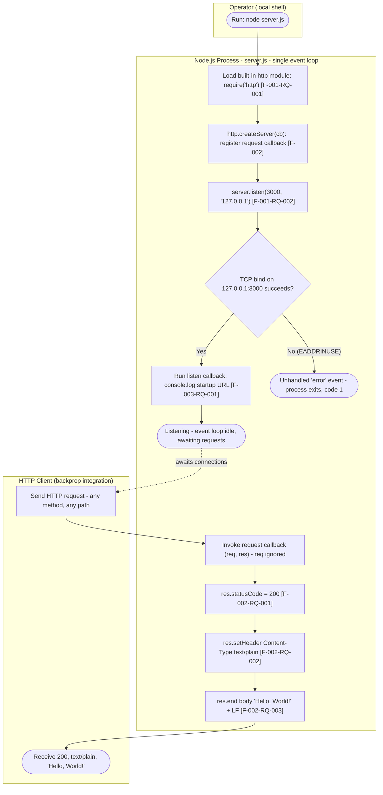
```mermaid
flowchart TB
    subgraph OPER["Operator (local shell)"]
        direction TB
        A1(["Run: node server.js"])
    end
    subgraph PROC["Node.js Process - server.js - single event loop"]
        direction TB
        B1["Load built-in http module: require('http') [F-001-RQ-001]"]
        B2["http.createServer(cb): register request callback [F-002]"]
        B3["server.listen(3000, '127.0.0.1') [F-001-RQ-002]"]
        B4{"TCP bind on 127.0.0.1:3000 succeeds?"}
        B5["Run listen callback: console.log startup URL [F-003-RQ-001]"]
        B6(["Listening - event loop idle, awaiting requests"])
        B7(["Unhandled 'error' event - process exits, code 1"])
        B8["Invoke request callback (req, res) - req ignored"]
        B9["res.statusCode = 200 [F-002-RQ-001]"]
        B10["res.setHeader Content-Type text/plain [F-002-RQ-002]"]
        B11["res.end body 'Hello, World!' + LF [F-002-RQ-003]"]
    end
    subgraph CLI["HTTP Client (backprop integration)"]
        direction TB
        C1["Send HTTP request - any method, any path"]
        C2(["Receive 200, text/plain, 'Hello, World!'"])
    end

    A1 --> B1
    B1 --> B2
    B2 --> B3
    B3 --> B4
    B4 -->|"Yes"| B5
    B5 --> B6
    B4 -->|"No (EADDRINUSE)"| B7
    B6 -.->|"awaits connections"| C1
    C1 --> B8
    B8 --> B9
    B9 --> B10
    B10 --> B11
    B11 --> C2
```

**System interactions and user touchpoints.** There is one human touchpoint (the operator launching the process and reading the startup log) and one machine touchpoint (the client's HTTP call). The table maps each to its mechanism and code evidence.

| Touchpoint | Actor | Mechanism | Evidence |
| --- | --- | --- | --- |
| Start the process | Operator | `node server.js` shell command | `package.json` declares no `start` script and `main` mis-points to `index.js`, so the process is launched directly |
| Readiness signal | Operator | Single stdout log line | `server.js` L12–13 `console.log` (F-003) — verified: `Server running at http://127.0.0.1:3000/` |
| HTTP request | Client (backprop) | TCP/HTTP to `127.0.0.1:3000` | `server.js` L12 `server.listen` (F-001) |
| HTTP response | Client (backprop) | HTTP `200`, `text/plain`, `Hello, World!\n` | `server.js` L7–9 (F-002) — verified at runtime |

**Detailed process flow — Server startup & listener binding (F-001, F-003).** Startup is a side effect of evaluating the module: `server.listen(...)` executes at load time (`server.js` L12). The only branch is the bind result; a failure has no handler and terminates the process (detailed in section 4.3.2).

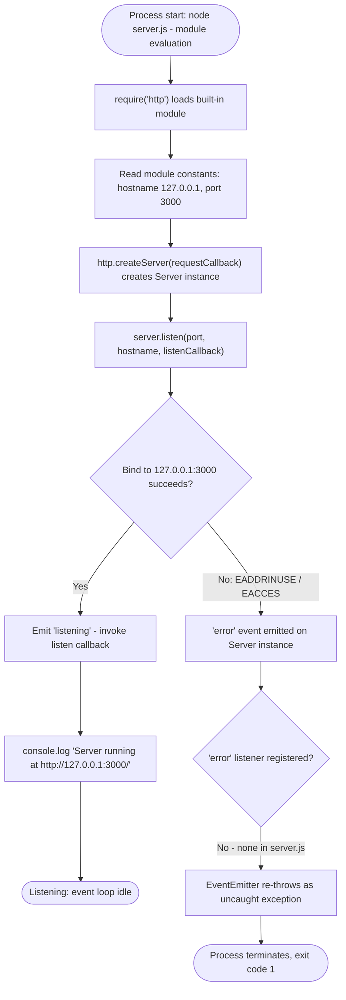
```mermaid
flowchart TD
    S0(["Process start: node server.js - module evaluation"]) --> S1["require('http') loads built-in module"]
    S1 --> S2["Read module constants: hostname 127.0.0.1, port 3000"]
    S2 --> S3["http.createServer(requestCallback) creates Server instance"]
    S3 --> S4["server.listen(port, hostname, listenCallback)"]
    S4 --> S5{"Bind to 127.0.0.1:3000 succeeds?"}
    S5 -->|"Yes"| S6["Emit 'listening' - invoke listen callback"]
    S6 --> S7["console.log 'Server running at http://127.0.0.1:3000/'"]
    S7 --> S8(["Listening: event loop idle"])
    S5 -->|"No: EADDRINUSE / EACCES"| S9["'error' event emitted on Server instance"]
    S9 --> S10{"'error' listener registered?"}
    S10 -->|"No - none in server.js"| S11["EventEmitter re-throws as uncaught exception"]
    S11 --> S12(["Process terminates, exit code 1"])
```

**Detailed process flow — HTTP request–response cycle (F-002).** For every inbound request the registered callback ignores `req` entirely and writes a constant response. Runtime testing confirmed that `GET /`, `POST /some/random/path`, and `DELETE /foo?bar=baz` all return the identical `200` / `text/plain` / `Hello, World!` response. There are **no decision diamonds in this path** because no request attribute is examined.

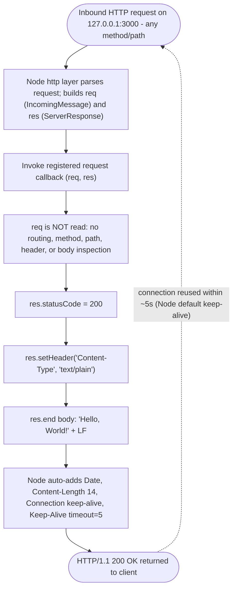
```mermaid
flowchart TD
    R0(["Inbound HTTP request on 127.0.0.1:3000 - any method/path"]) --> R1["Node http layer parses request; builds req (IncomingMessage) and res (ServerResponse)"]
    R1 --> R2["Invoke registered request callback (req, res)"]
    R2 --> R3["req is NOT read: no routing, method, path, header, or body inspection"]
    R3 --> R4["res.statusCode = 200"]
    R4 --> R5["res.setHeader('Content-Type', 'text/plain')"]
    R5 --> R6["res.end body: 'Hello, World!' + LF"]
    R6 --> R7["Node auto-adds Date, Content-Length 14, Connection keep-alive, Keep-Alive timeout=5"]
    R7 --> R8(["HTTP/1.1 200 OK returned to client"])
    R8 -.->|"connection reused within ~5s (Node default keep-alive)"| R0
```

**Decision points.** The system contains exactly **one** decision point — the startup bind success/failure test (`S5` above) — and **none** in the request path. **Error-handling paths** are limited to the unhandled startup `error` event and are detailed in section 4.3.2. **Timing/SLA considerations** are addressed in section 4.2.1; the repository declares no latency or throughput targets.

### 4.1.2 Integration Workflows

The system's only integration surface is a single loopback HTTP endpoint (`http://127.0.0.1:3000/`), as established in sections 1.2 and 3.4. It integrates with no databases, message brokers, caches, or third-party services — `package-lock.json` locks zero dependencies and `server.js` performs no outbound calls. The "integration" is therefore a direct, synchronous request/response between a local HTTP client (the backprop process) and the Node.js server.

**Integration sequence diagram.** Participants act as swim lanes; the diagram covers both the startup handshake and a representative request exchange.

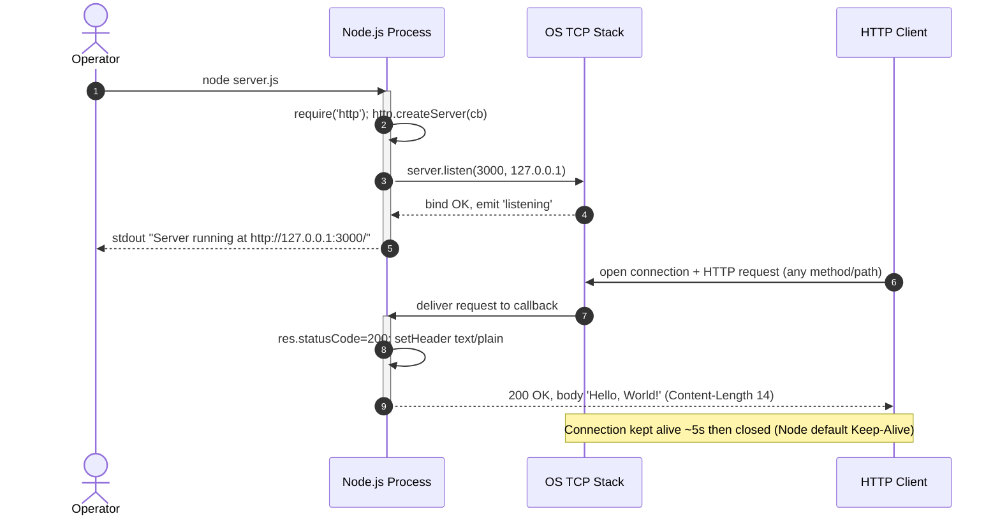
```mermaid
sequenceDiagram
    autonumber
    actor Op as Operator
    participant Proc as Node.js Process
    participant TCP as OS TCP Stack
    participant Client as HTTP Client

    Op->>Proc: node server.js
    activate Proc
    Proc->>Proc: require('http')#59; http.createServer(cb)
    Proc->>TCP: server.listen(3000, 127.0.0.1)
    TCP-->>Proc: bind OK, emit 'listening'
    Proc-->>Op: stdout "Server running at http://127.0.0.1:3000/"
    deactivate Proc

    Client->>TCP: open connection + HTTP request (any method/path)
    TCP->>Proc: deliver request to callback
    activate Proc
    Proc->>Proc: res.statusCode=200#59; setHeader text/plain
    Proc-->>Client: 200 OK, body 'Hello, World!' (Content-Length 14)
    deactivate Proc
    Note over TCP,Client: Connection kept alive ~5s then closed (Node default Keep-Alive)
```

**Data flow between systems.** Exactly one data payload crosses the system boundary: the constant string `Hello, World!\n` (14 bytes, confirmed `Content-Length: 14`) flowing outbound from the process to the client. No request-side data (method, path, query string, headers, or body) flows into any processing logic — the handler discards `req` — so there is no inbound data-transformation pipeline and no data enrichment, mapping, or persistence step.

**API interactions.** The server exposes one implicit endpoint that matches any HTTP method and any path (there is no router and no path table in `server.js`), and it invokes no outbound APIs. This absence of routing was verified at runtime: three different method/path combinations produced byte-identical responses.

**Event processing flows.** The runtime is event-driven at the Node.js layer: the `http.Server` object emits `listening`, `request`, and `error` events. `server.js` reacts to `request` (via the `http.createServer` callback, F-002) and to `listening` (via the `server.listen` callback, F-003), but registers no handler for `error`. There is no application-level event bus, message queue, or publish/subscribe mechanism — the only "events" are the built-in HTTP server lifecycle events.

**Batch processing sequences.** None exist. The repository defines no scheduled jobs, cron entries, worker processes, or batch scripts; the sole `package.json` script (`test`) is an intentionally failing placeholder (`echo "Error: no test specified" && exit 1`), and there is no `start` or `build` script.

## 4.2 Flowchart Requirements and Validation Rules

This section defines the standard flowchart components used throughout Section 4 and catalogs the validation, authorization, and compliance checkpoints present in — and notably absent from — the request lifecycle. All statements are grounded in `server.js` and the Validation Rules tables of section 2.2; where a control class is absent, that absence is itself the documented finding.

### 4.2.1 Workflow Component Standards and Timing Considerations

**Component notation legend.** The diagrams in Section 4 use a consistent Mermaid notation. The table maps each required flowchart element to its notation and to how it actually appears (or does not appear) in this system.

| Flowchart component | Notation used in Section 4 | Presence in `hao-backprop-test` |
| --- | --- | --- |
| Start / end point | Stadium node `([ ... ])` | Present: process start, "listening" state, response returned, process exit |
| Process step | Rectangle `[ ... ]` | Present: `require`, `createServer`, `listen`, `setHeader`, `end`, `console.log` |
| Decision diamond | Diamond `{ ... }` | Exactly one: startup bind success/failure (`server.js` L12) |
| System boundary | Subgraph swim lane | Operator shell, Node.js process, OS TCP stack, HTTP client |
| User touchpoint | Operator-lane nodes | `node server.js` launch; stdout readiness log (`server.js` L13) |
| Error state / recovery path | Node on the failure branch | Startup `error` → uncaught exception → exit code 1; **no recovery path exists** |
| Timing / SLA annotation | Edge label or note | Only the Node default Keep-Alive (~5s); no application SLA |

**Timing and SLA considerations.** The repository declares **no** application-level SLAs, latency budgets, throughput targets, request timeouts, or KPIs — a conclusion reinforced by sections 1.2.3, 2.2, and 2.4, which record the absence of any performance criteria. The only timing behaviors that can be observed are Node.js runtime defaults, not values configured by `server.js`:

| Timing behavior | Value | Source | Configured by app? |
| --- | --- | --- | --- |
| Persistent-connection idle timeout | `Keep-Alive: timeout=5` (~5 seconds) | Observed in response headers at runtime | No — Node.js HTTP/1.1 default |
| Startup bind | Synchronous during module evaluation | `server.js` L12 executes at load time | N/A |
| Per-request processing | Effectively constant-time (no input processing, no I/O beyond the fixed write) | `server.js` L6–9; see 2.4.2 | N/A |
| Request timeout / graceful-shutdown timeout | None | No timeout config and no SIGTERM/SIGINT handler in `server.js` | No |

Because the handler performs no input parsing and no downstream I/O, there is no timing-driven branch, no retry backoff window, and no deadline enforcement anywhere in the flow.

### 4.2.2 Validation Rules, Authorization, and Compliance Checkpoints

The validation posture is derived directly from the Validation Rules tables in section 2.2. In summary, the request path applies **no** data validation, **no** authentication/authorization, and **no** regulatory compliance checks; the only access control is the network-level confinement produced by binding to the loopback interface.

**Control-gate view of the request path.** The diagram depicts the checkpoints a request conceptually passes through. In this system every gate is a pass-through no-op, because `server.js` implements none of them and ignores `req` entirely.

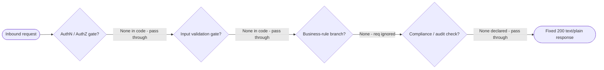
```mermaid
flowchart LR
    In(["Inbound request"]) --> G1{"AuthN / AuthZ gate?"}
    G1 -->|"None in code - pass through"| G2{"Input validation gate?"}
    G2 -->|"None in code - pass through"| G3{"Business-rule branch?"}
    G3 -->|"None - req ignored"| G4{"Compliance / audit check?"}
    G4 -->|"None declared - pass through"| Out(["Fixed 200 text/plain response"])
```

**Business and validation rules by step.** The following rules are the complete set expressed by the code, mapped to their category and evidence.

| Workflow step | Rule | Category | Evidence |
| --- | --- | --- | --- |
| Listener binding (F-001) | Endpoint address is fixed at `127.0.0.1:3000` (loopback only); the server self-starts on module evaluation | Business rule | `server.js` L3–4, L12 |
| Request handling (F-002) | The response is deterministic and identical for all requests; no request attribute alters the output | Business rule | `server.js` L6–9 |
| Request handling (F-002) | Request inputs are neither read, validated, nor sanitized | Data validation | `server.js` L6 (`req` unused) |
| Access control (F-001/F-002) | No authentication or authorization; reachability is confined to the local host by the loopback bind; traffic is plain HTTP with no TLS | Authorization / security | `server.js` L3; sections 2.2.1–2.2.2 |
| Startup logging (F-003) | The log line is emitted only inside the listen callback — i.e., only after a successful bind | Business rule | `server.js` L12–13 |
| Licensing | No regulatory or industry compliance controls are declared; the code is MIT-licensed | Compliance | `package.json` L10; `package-lock.json` |

**Data validation requirements.** None. The handler never accesses the request method, URL, query string, headers, or body, so there is no schema validation, type coercion, sanitization, or size limiting in application code.

**Authorization checkpoints.** None. There is no session, token, API key, or role check. The sole access restriction is architectural: binding to `127.0.0.1` prevents off-host connections. This is a deployment/network confinement, not an authorization decision, and it applies uniformly to every request.

**Regulatory compliance checks.** None are declared or implemented. There is no audit logging (the only log is the one-time startup line, F-003), no PII handling, and no consent, retention, or encryption control. The repository's only formal legal artifact is the MIT license declared in both manifests.

## 4.3 Technical Implementation Flows

This section documents the state-management and error-handling implementation flows. The findings are consistent with section 2.4 (Implementation Considerations), which grounds several items in the verifiable *absence* of code (for example, the missing `error` listener).

### 4.3.1 State Management

The application is **stateless**. The request callback in `server.js` (L6–9) holds no mutable or shared variables between requests; it reads no state in and writes no state out beyond the fixed response body. This is why the response is identical for every request and why the handler introduces no concurrency bottleneck of its own (see 2.4.2).

| State / persistence concern | Status in this system | Evidence |
| --- | --- | --- |
| State transitions | Only at the **process** level (created → listening → handling → terminated); documented as a state machine in section 4.4. No application/session/request state exists | `server.js` L6–14 |
| Data persistence points | None — no database, file write, session store, or on-disk state; the only "stored" value is the in-code string literal | `package-lock.json` locks zero deps; `server.js` performs no I/O beyond the response write |
| Caching requirements | None — the response is a static literal, so there is no cache layer, cache key, or invalidation logic; no `Cache-Control`/`ETag` header is emitted (verified in runtime response headers) | `server.js` L7–9; runtime header inspection |
| Transaction boundaries | None — each request is a single, independent, self-contained response write with no multi-step atomic operation, no rollback, and no distributed transaction | `server.js` L6–9 |

Because there is no persistence and no shared state, there are no data-consistency, locking, or isolation concerns to model. The only durable runtime artifact is the OS-level listening socket held by the process while it runs.

### 4.3.2 Error Handling and Recovery

Error handling is **minimal and implicit**. `server.js` contains no `try/catch`, registers no `error` event listener on the `http.Server`, and installs no process-level `uncaughtException`/`unhandledRejection` handler or signal handler. Error behavior therefore falls back entirely to Node.js defaults. The flowchart below models both the startup-time and request-time error paths.

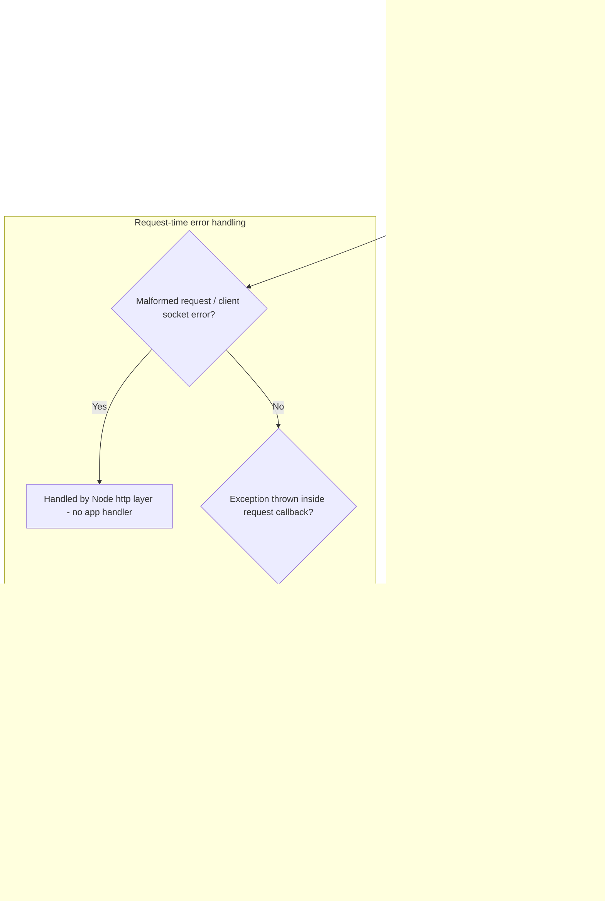
```mermaid
flowchart TD
    subgraph STARTUP["Startup-time error handling"]
        direction TB
        T1{"listen() bind error? EADDRINUSE / EACCES"}
        T2["'error' event emitted on Server instance"]
        T3{"'error' listener present in server.js?"}
        T4["No listener - EventEmitter re-throws"]
        T5(["Uncaught exception - stderr stack trace - exit code 1"])
        T6["Manual recovery: operator frees port / fixes env, re-runs node server.js"]
    end
    subgraph RUNTIME["Request-time error handling"]
        direction TB
        U1{"Malformed request / client socket error?"}
        U2["Handled by Node http layer - no app handler"]
        U3{"Exception thrown inside request callback?"}
        U4["Not possible - callback has no failing/throwing operation"]
        U5(["Normal 200 text/plain response"])
    end

    T1 -->|"Yes"| T2
    T2 --> T3
    T3 -->|"No"| T4
    T4 --> T5
    T5 -.->|"manual, no auto-restart"| T6
    T1 -->|"No"| U1
    U1 -->|"Yes"| U2
    U1 -->|"No"| U3
    U3 -->|"No (by construction)"| U4
    U4 --> U5
```

**Verified startup-failure behavior.** Starting a second instance while port 3000 was already bound produced an unhandled `error` event and terminated the process with exit code `1`; the emitted error was `Error: listen EADDRINUSE: address already in use 127.0.0.1:3000`. This confirms the "no `error` listener" path documented in section 2.4.1: the event is re-thrown by Node's `EventEmitter` as an uncaught exception.

**Error-handling capabilities by category.**

| Capability | Status | Behavior / evidence |
| --- | --- | --- |
| Retry mechanisms | None | No retry, backoff, or re-attempt logic exists in `server.js` |
| Fallback processes | None | There is no alternate response, degraded mode, or secondary path — only the single fixed response |
| Error notification flows | None | A startup error writes a Node stack trace to **stderr** and exits; there is no alerting, monitoring, or notification integration (no third-party services per section 3.4) |
| Recovery procedures | Manual only | Recovery requires an operator to free port `3000` (or correct the environment) and re-run `node server.js`; there is no supervisor, auto-restart, or process manager configured in the repository |
| Startup bind failure | Uncaught exception → exit code 1 | Verified at runtime (EADDRINUSE) |
| Request-time application error | Not reachable | The callback performs no parsing and no I/O that can fail, so no application-level exception path exists; transport-level errors are absorbed by Node's HTTP layer |

**Recovery summary.** The fixture has no self-healing behavior. Its resilience model is "fail fast and restart manually": a bind failure stops the process immediately and loudly (non-zero exit + stderr trace), and normal request processing cannot fail in application code because it neither reads input nor performs fallible operations.

## 4.4 State Transition Diagrams

As established in section 4.3.1, the application holds no request- or session-level state; the only meaningful state machines in the system operate at the **process level** and the **connection level**. Both are modeled below.

**Process / server lifecycle.** The process moves through initialization, server creation, binding, and a steady listening state that alternates with per-request handling until the process terminates. Note there is **no graceful-shutdown (draining) state**: `server.js` registers no `SIGINT`/`SIGTERM` handler, so termination — whether from an unhandled bind error or an external signal — is abrupt.

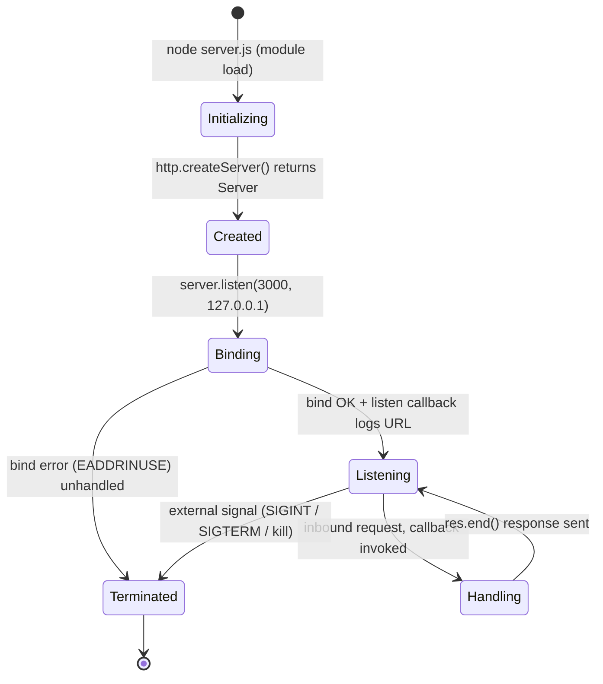
```mermaid
stateDiagram-v2
    [*] --> Initializing: node server.js (module load)
    Initializing --> Created: http.createServer() returns Server
    Created --> Binding: server.listen(3000, 127.0.0.1)
    Binding --> Listening: bind OK + listen callback logs URL
    Binding --> Terminated: bind error (EADDRINUSE) unhandled
    Listening --> Handling: inbound request, callback invoked
    Handling --> Listening: res.end() response sent
    Listening --> Terminated: external signal (SIGINT / SIGTERM / kill)
    Terminated --> [*]
```

| State | Entered when | Evidence | Exits to |
| --- | --- | --- | --- |
| Initializing | Node begins evaluating the module | `server.js` L1 `require('http')` | Created |
| Created | `http.createServer(cb)` returns a `Server` | `server.js` L6 | Binding |
| Binding | `server.listen(port, hostname, cb)` is invoked | `server.js` L12 | Listening (success) or Terminated (bind error) |
| Listening | Bind succeeds; listen callback logs the URL; event loop idles | `server.js` L12–13; verified startup log | Handling (on request) or Terminated (on signal) |
| Handling | A request arrives and the callback sets status/header/body | `server.js` L6–9 | Listening (after `res.end`) |
| Terminated | Unhandled bind error, or an external signal/kill | Verified EADDRINUSE exit code 1; section 2.4.1 | `[*]` |

The `Listening ↔ Handling` loop repeats for every request; because handling performs no blocking I/O and holds no state, the process returns to `Listening` immediately after `res.end()`.

**Connection lifecycle (keep-alive).** Runtime inspection showed responses carrying `Connection: keep-alive` and `Keep-Alive: timeout=5`, both of which are Node.js HTTP/1.1 defaults rather than values set by `server.js`. The connection therefore has its own small state machine: a persistent socket may serve several sequential requests before closing on idle timeout.

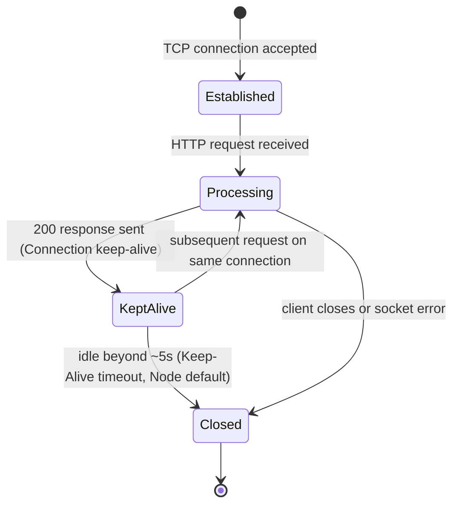
```mermaid
stateDiagram-v2
    [*] --> Established: TCP connection accepted
    Established --> Processing: HTTP request received
    Processing --> KeptAlive: 200 response sent (Connection keep-alive)
    KeptAlive --> Processing: subsequent request on same connection
    KeptAlive --> Closed: idle beyond ~5s (Keep-Alive timeout, Node default)
    Processing --> Closed: client closes or socket error
    Closed --> [*]
```

Both diagrams are entirely governed by the Node.js runtime and the fixed logic in `server.js`; there are no application-defined states, no persisted state store, and no state that survives process termination.

## 4.5 References

The following repository artifacts, runtime observations, and cross-referenced specification sections were used as evidence for Section 4.

**Repository files examined**

- `server.js` — established the complete runtime workflow: `http` module load, hardcoded `127.0.0.1:3000` binding, `http.createServer` request callback (status 200, `text/plain`, `Hello, World!\n`, `req` ignored), `server.listen` with startup logging, and the absence of routing, an `error` listener, `try/catch`, and shutdown/signal handlers.
- `package.json` — established the launch mechanism (no `start` script; `main` points to a nonexistent `index.js`), the failing placeholder `test` script (no batch/scheduled jobs), the MIT license, and the absence of a dependency set.
- `package-lock.json` — established the zero-dependency graph (lockfile v3), confirming no databases, caches, message brokers, or third-party integrations participate in any workflow.
- `README.md` — established the system's business context as a "test project for backprop integration" and the "Do not touch!" frozen-fixture directive.

**Repository folders examined**

- `/` (repository root) — confirmed the entire system is four first-order files with no subdirectories, bounding the scope of all workflows documented here.

**Runtime verification (direct execution, Node.js v22.23.1)**

- Startup — confirmed the stdout log line `Server running at http://127.0.0.1:3000/` (F-003).
- Request handling — `GET /`, `POST /some/random/path`, and `DELETE /foo?bar=baz` all returned identical `HTTP/1.1 200 OK`, `Content-Type: text/plain`, `Content-Length: 14`, body `Hello, World!`, confirming the request path has no decision points.
- Auto-added headers — observed `Date`, `Content-Length`, `Connection: keep-alive`, and `Keep-Alive: timeout=5` (Node.js defaults, not application code), informing the timing and connection-state findings.
- Error path — reproduced `Error: listen EADDRINUSE: address already in use 127.0.0.1:3000` as an unhandled `error` event terminating the process with exit code `1`, confirming the startup error flow in section 4.3.2.

**Cross-referenced Technical Specification sections**

- `1.2 System Overview` — reused the startup/request lifecycle framing and the loopback-only, no-KPI/SLA context.
- `2.1 Feature Catalog` — sourced the feature identifiers F-001 (startup/binding), F-002 (fixed response), F-003 (startup logging) referenced throughout the diagrams.
- `2.2 Functional Requirements` — sourced the requirement IDs (F-XXX-RQ-YYY) and the Validation Rules used in section 4.2.2.
- `2.4 Implementation Considerations` — corroborated the documented absence of an `error` listener, the stateless handler, and the manual-recovery posture.
- `3.4 Third-Party Services` — corroborated the absence of external integrations underpinning section 4.1.2.

**Web sources**

- None. No external web research was required or used for this section; all findings are grounded in the repository and direct runtime observation.

# 5. System Architecture

## 5.1 High-Level Architecture

The `hao-backprop-test` system is a single-process, single-file Node.js HTTP fixture whose entire runtime resides in `server.js` (15 lines), supported only by npm packaging metadata (`package.json`, `package-lock.json`) and a two-line `README.md`. This section documents the architecture strictly as implemented. Consistent with Sections 1.2, 3.1–3.2, and 4.1–4.4, the system carries zero third-party dependencies and integrates with no databases, caches, message brokers, or external services; its purpose, per `README.md`, is to be a "test project for backprop integration" — a fixed, deterministic HTTP target.

### 5.1.1 System Overview

**Overall architecture style and rationale**

The system follows a **minimal single-process monolith** style: one JavaScript module, executing on the Node.js runtime, builds an HTTP/1.1 listener directly on the standard-library `http` module (`server.js` L1, L6) and answers every request from a single inline callback. There is no layering, no service decomposition, no web framework, no configuration layer, and no companion process — all behavior lives in one file. This style is a deliberate consequence of the fixture's stated purpose: a deterministic, zero-dependency, trivially auditable endpoint that behaves identically on every run. The design therefore optimizes for **reproducibility, auditability, and simplicity** rather than extensibility, throughput, or configurability, which aligns with the "Do not touch!" directive that freezes the artifact.

The diagram below shows the system context — the operator who launches the process, the local backprop client that calls it, and the logical components that live inside the Node.js process.

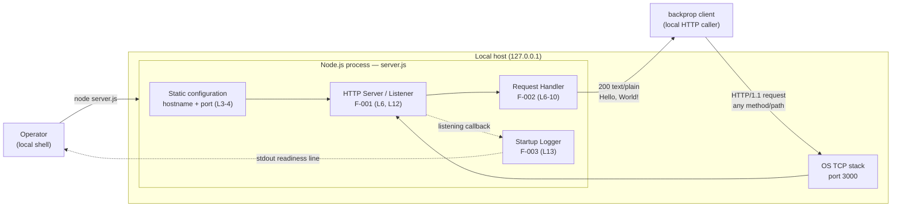
```mermaid
flowchart LR
    Operator["Operator<br/>(local shell)"]
    Client["backprop client<br/>(local HTTP caller)"]
    subgraph Host["Local host (127.0.0.1)"]
        direction TB
        TCP["OS TCP stack<br/>port 3000"]
        subgraph Proc["Node.js process — server.js"]
            direction TB
            Config["Static configuration<br/>hostname + port (L3-4)"]
            Listener["HTTP Server / Listener<br/>F-001 (L6, L12)"]
            Handler["Request Handler<br/>F-002 (L6-10)"]
            Logger["Startup Logger<br/>F-003 (L13)"]
        end
    end
    Operator -->|"node server.js"| Proc
    Config --> Listener
    Listener --> Handler
    Listener -.->|"listening callback"| Logger
    Logger -.->|"stdout readiness line"| Operator
    Client -->|"HTTP/1.1 request<br/>any method/path"| TCP
    TCP --> Listener
    Handler -->|"200 text/plain<br/>Hello, World!"| Client
```

**Key architectural principles and patterns**

- **Standard-library-only / zero dependency:** the sole library is Node's built-in `http` module (`server.js` L1); `package-lock.json` locks no external packages, eliminating supply-chain surface and version drift.
- **Event-driven, single-threaded processing:** the server reacts to Node `http.Server` lifecycle events (`request`, `listening`) on one event loop; no threads, workers, or clustering are configured.
- **Stateless, deterministic request handling:** the handler ignores `req` and returns a constant response, so no request holds or mutates shared state (Section 4.3.1).
- **Static (compile-time) configuration:** `hostname` and `port` are module-scoped constants (`server.js` L3–4) with no environment-variable or CLI override.
- **Self-starting on module evaluation:** `server.listen(...)` executes at load time (`server.js` L12), so importing/evaluating the module is equivalent to starting the service.
- **Fail-fast with no recovery:** there is no error handling or graceful shutdown; a bind failure terminates the process (Sections 4.3.2, 4.4).

**System boundaries and major interfaces**

- **Inbound interface (primary):** a single loopback HTTP endpoint, `http://127.0.0.1:3000/`, served over HTTP/1.1 and matching any method and any path (`server.js` L3–4, L12). The loopback bind means the endpoint is not reachable from other hosts.
- **Operator interface:** the process is launched with `node server.js` (no `start` script exists), and readiness is signaled by a single stdout line (`server.js` L13).
- **Outbound interface:** none — the process performs no database access, no outbound HTTP/API calls, and no filesystem writes.
- **Trust boundary:** the host OS TCP stack mediates the socket; there is no authentication, authorization, or TLS boundary of any kind.

### 5.1.2 Core Components

Although the runtime lives in a single file, it is composed of distinct logical components, each traceable to a feature defined in Section 2.1. The four-column table lists each component's responsibility, dependencies, and integration points; component-specific critical considerations follow as bullets.

| Component | Primary Responsibility | Key Dependencies | Integration Points |
| --- | --- | --- | --- |
| Node.js runtime & built-in `http` module | Provide the JavaScript event loop and HTTP/1.1 server implementation that host all application logic | Host OS process and TCP stack | Substrate for every component; parses inbound requests and serializes outbound responses |
| HTTP Server / Listener (F-001) | Instantiate `http.Server` and bind it to `127.0.0.1:3000`, accepting inbound connections (`server.js` L6, L12) | `http` module; free TCP port 3000; static configuration | Loopback TCP socket (inbound); dispatches each request to the Request Handler |
| Request Handler (F-002) | Return a fixed `200` / `text/plain` / `Hello, World!\n` response for every request, ignoring `req` (`server.js` L6–10) | `ServerResponse` API; registration on the Server instance | Receives any HTTP method/path; emits the single HTTP response |
| Startup Logger (F-003) | Emit a one-line readiness message to stdout after a successful bind (`server.js` L13) | Node `console`; runs inside the listen callback | Standard output stream (operator console) |
| Static Configuration | Supply immutable `hostname` and `port` constants (`server.js` L3–4) | None — module-scoped literals | Consumed by the Listener (bind) and Logger (URL message) |
| Package Manifest & Lockfile (F-004) | Declare package identity (`hello_world` 1.0.0, MIT) and lock a zero-dependency graph (`package.json`, `package-lock.json`) | npm tooling | npm install/audit tooling; no runtime coupling to `server.js` |

Critical considerations, per component:

- **Node.js runtime & `http` module:** the version is unpinned (no `engines` field in `package.json`), so keep-alive defaults (`Keep-Alive: timeout=5`) and auto-added headers (`Date`, `Content-Length`, `Connection`) are supplied by the host runtime, not by application code.
- **HTTP Server / Listener:** runs on a single event loop; the loopback bind makes it unreachable from other hosts; a bind failure such as `EADDRINUSE` is fatal because no `error` listener is registered (Section 4.3.2).
- **Request Handler:** stateless and deterministic; it performs no routing, parsing, or validation and therefore cannot fail by construction (Section 4.3.2).
- **Startup Logger:** the only observability mechanism in the system; unstructured stdout with no log levels, timestamps, or rotation.
- **Static Configuration:** no runtime override — changing host or port requires editing `server.js`.
- **Package Manifest & Lockfile:** `main` points to a nonexistent `index.js` and no `start` script is declared, so the runtime is launched with `node server.js`; the sole `test` script is an intentionally failing placeholder.

### 5.1.3 Data Flow Description

**Primary data flows between components.** Two flows exist. (1) A one-time **startup (control) flow**: evaluating the module loads the `http` module (L1), reads the `hostname`/`port` constants (L3–4), creates the server (L6), and calls `server.listen` (L12); on a successful bind, the listen callback writes the readiness line to stdout (L13). (2) A per-request **request/response flow**: a client opens a loopback TCP connection and sends an HTTP request; Node's `http` layer parses it into `req`/`res` objects and invokes the handler; the handler ignores `req` and sets status `200`, the `text/plain` content type, and ends the response with the constant body (L7–9); Node then serializes the response and appends `Date`, `Content-Length: 14`, and keep-alive headers. This mirrors the lifecycle diagrams in Sections 1.2.2 and 4.1.

**Integration patterns and protocols.** The only integration pattern is **synchronous, client-initiated HTTP/1.1 request/response** over a loopback TCP socket. There is no asynchronous messaging, publish/subscribe, streaming, or outbound call of any kind (Sections 3.4, 4.1.2). Persistent connections are reused for approximately five seconds (Node's default `Keep-Alive: timeout=5`) before idle closure, then re-established on the next request.

**Data transformation points.** There is effectively a single, trivial transformation: the in-code string literal `Hello, World!\n` is serialized by Node into a 14-byte HTTP response body. There is no inbound transformation — request method, path, query string, headers, and body are never read, so no parsing, mapping, validation, or enrichment pipeline exists (Section 4.1.2).

**Key data stores and caches.** None. The system has no database, file store, session store, or cache; the only "persisted" value is the response string literal embedded in `server.js`, and the only durable runtime artifact is the OS-level listening socket held while the process runs (Sections 3.5, 4.3.1). No `Cache-Control` or `ETag` headers are emitted, so responses are not cacheable by intermediaries under explicit directives.

### 5.1.4 External Integration Points

The system's only integration surface is the single loopback HTTP endpoint together with the operator's local process-launch and stdout touchpoints. It integrates with **no external systems** — no databases, message brokers, third-party APIs, authentication providers, or cloud services (Sections 3.4, 3.5, 4.1.2). The four-column table summarizes the integration points that do exist.

| Integration Point | Integration Type | Data Exchange Pattern | Protocol / Format |
| --- | --- | --- | --- |
| backprop client → server endpoint | Inbound HTTP endpoint on `127.0.0.1:3000` | Synchronous, client-initiated request/response | HTTP/1.1; response body `text/plain` `Hello, World!\n` (14 bytes) |
| Operator → process launch | Local process control | One-shot manual invocation | Shell command `node server.js` |
| Server → operator (readiness) | Local observability | One-way, emitted once after successful bind | Plain-text line on stdout |

**SLA requirements.** None are declared anywhere in the repository. Consistent with Sections 1.2.3, 2.1, and 4.2.1, there are no latency, throughput, availability, or uptime targets, and no monitoring or alerting integration exists to measure them. The only repository-observable success signals are functional — a correct startup log line and a `200` / `text/plain` / `Hello, World!` response for any request — rather than quantitative performance SLAs.

## 5.2 Component Details

This section details each major component identified in Section 5.1.2. Because the entire runtime is 15 lines in `server.js`, the "components" are logical responsibilities within that single module (plus the packaging pair), each mapped to a feature from Section 2.1. For every component, purpose, technologies, interfaces, data persistence, and scaling are addressed; behavioral diagrams follow in Section 5.2.5.

### 5.2.1 HTTP Server / Listener (F-001)

- **Purpose and responsibilities:** Create the `http.Server` instance, bind it to the loopback address `127.0.0.1` on port `3000`, accept inbound TCP connections, and route each connection's request to the Request Handler. Startup is a side effect of module evaluation, so this component is what makes the process a running service (`server.js` L6, L12).
- **Technologies and frameworks:** Node.js built-in `http` module only (`http.createServer`, `server.listen`), invoked through CommonJS (`require`, `server.js` L1). No web framework, router, or TLS layer is used (Section 3.2).
- **Key interfaces and APIs:** `http.createServer(callback)` returns the `Server` (L6); `server.listen(port, hostname, listenCallback)` performs the bind (L12). It consumes the `hostname`/`port` constants and emits Node's `http.Server` lifecycle events — `listening` (handled via the listen callback) and `error` (unhandled). The externally visible interface is the single HTTP/1.1 endpoint on `127.0.0.1:3000`.
- **Data persistence requirements:** None. The only durable runtime artifact is the OS-level listening socket held while the process runs; nothing is written to a database, file, or cache (Section 4.3.1).
- **Scaling considerations:** A single Node.js process on one event loop. The repository configures no `cluster` module, worker threads, process manager, reverse proxy, or load balancer, so scaling is vertical and single-instance only. Because the handler performs no blocking I/O, one event loop can in principle service many concurrent connections, but no horizontal-scaling or multi-core mechanism exists (Section 2.4.2), and the loopback bind confines reach to a single host.

### 5.2.2 Request Handler (F-002)

- **Purpose and responsibilities:** Produce the fixed, deterministic response — status `200`, `Content-Type: text/plain`, body `Hello, World!\n` — for every inbound request, regardless of method, path, headers, or payload. The `req` object is accepted but never read (`server.js` L6–10).
- **Technologies and frameworks:** Node's `ServerResponse` API (`res.statusCode`, `res.setHeader`, `res.end`), implemented as an anonymous arrow-function callback (ES2015+). No templating, serialization library, or content-negotiation logic is involved.
- **Key interfaces and APIs:** The callback `(req, res) => { ... }` registered with `http.createServer` (L6); it sets `res.statusCode = 200` (L7), `res.setHeader('Content-Type', 'text/plain')` (L8), and `res.end('Hello, World!\n')` (L9). It presents an implicit endpoint that matches any method and any path — verified at runtime with `GET /`, `POST /some/random/path`, and `DELETE /foo?bar=baz` all returning byte-identical responses (Section 4.1.2).
- **Data persistence requirements:** None. The handler is stateless: it reads no state in and writes no state out beyond the fixed response body, so there is no shared mutable state, cache, or store (Section 4.3.1).
- **Scaling considerations:** Statelessness and the absence of blocking operations mean invocations are independent and introduce no lock contention or backpressure of their own. The handler adds no per-request scaling bottleneck; scaling is therefore governed entirely by the single-process Listener described in 5.2.1.

### 5.2.3 Startup Logger (F-003)

- **Purpose and responsibilities:** Emit a single human-readable readiness signal to standard output once the server is listening, advertising the exact URL on which the fixture is reachable (`server.js` L13).
- **Technologies and frameworks:** The Node global `console.log`, formatting the message with an ES2015 template literal that interpolates the `hostname`/`port` constants.
- **Key interfaces and APIs:** The `server.listen` callback `() => { console.log(...) }` (L12–13), which writes the line `Server running at http://127.0.0.1:3000/` to `process.stdout`. It exposes no programmatic interface.
- **Data persistence requirements:** None. Output is an ephemeral stdout side effect; there is no log file, structured log record, or rotation (Section 2.1.3).
- **Scaling considerations:** The log fires exactly once at startup and is not on the request path, so it imposes no runtime overhead and has no scaling impact. There is no structured, leveled, or centralized logging to scale.

### 5.2.4 Package Manifest & Lockfile (F-004)

- **Purpose and responsibilities:** Declare the npm package identity (`hello_world`, version `1.0.0`, description, author `hxu`, MIT license) and lock a zero-dependency graph so installs are reproducible (`package.json`; `package-lock.json`).
- **Technologies and frameworks:** The npm manifest format (`package.json`) and lockfile version 3 (`package-lock.json`, produced by npm v7+). These are build/packaging artifacts, not runtime code.
- **Key interfaces and APIs:** Consumed by the npm CLI (`install`, `audit`, `ci`); relevant fields are `name`, `version`, `description`, `main`, `scripts`, `author`, and `license`, plus the lockfile's `packages` map. Notably, `main` points to a nonexistent `index.js` and no `start` script exists, so these fields do not drive the actual runtime (which is launched with `node server.js`), and the sole `test` script is a failing placeholder.
- **Data persistence requirements:** None at runtime; these are static, version-controlled files. The lockfile "persists" only the (empty) dependency graph.
- **Scaling considerations:** A locked, zero-dependency graph makes install effectively constant-time and network-free with no version drift, so the fixture replicates trivially and deterministically across environments (Section 3.3). There is no build or transpile step to scale.

### 5.2.5 Component Interaction and Behavioral Diagrams

**Component interaction diagram.** The following flowchart shows how the logical components are wired at module-evaluation time and during a request. Solid arrows are direct calls/dispatches; dotted arrows are one-time startup effects.

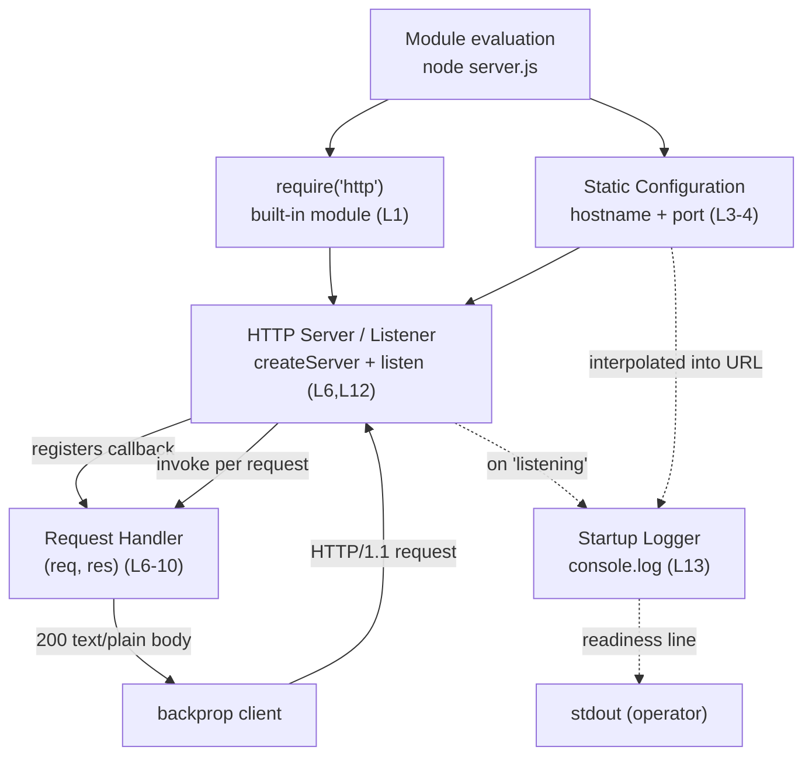
```mermaid
flowchart TD
    Boot["Module evaluation<br/>node server.js"] --> Req["require('http')<br/>built-in module (L1)"]
    Boot --> Cfg["Static Configuration<br/>hostname + port (L3-4)"]
    Req --> Srv["HTTP Server / Listener<br/>createServer + listen (L6,L12)"]
    Cfg --> Srv
    Srv -->|"registers callback"| Hnd["Request Handler<br/>(req, res) (L6-10)"]
    Srv -.->|"on 'listening'"| Log["Startup Logger<br/>console.log (L13)"]
    Cfg -.->|"interpolated into URL"| Log
    Cli["backprop client"] -->|"HTTP/1.1 request"| Srv
    Srv -->|"invoke per request"| Hnd
    Hnd -->|"200 text/plain body"| Cli
    Log -.->|"readiness line"| Out["stdout (operator)"]
```

**Sequence diagram — key flows (startup then representative request).** This traces the two flows end to end across the runtime, listener, handler, operator, and client.

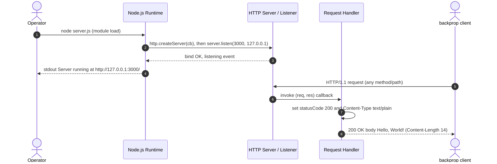
```mermaid
sequenceDiagram
    autonumber
    actor Op as Operator
    participant Node as Node.js Runtime
    participant Srv as HTTP Server / Listener
    participant Hnd as Request Handler
    actor Cli as backprop client

    Op->>Node: node server.js (module load)
    Node->>Srv: http.createServer(cb), then server.listen(3000, 127.0.0.1)
    Srv-->>Node: bind OK, listening event
    Node-->>Op: stdout Server running at http://127.0.0.1:3000/
    Cli->>Srv: HTTP/1.1 request (any method/path)
    Srv->>Hnd: invoke (req, res) callback
    Hnd->>Hnd: set statusCode 200 and Content-Type text/plain
    Hnd-->>Cli: 200 OK body Hello, World! (Content-Length 14)
```

**State transition diagram — process lifecycle.** The process moves through initialization, creation, binding, and a steady `Listening` state that alternates with per-request `Handling`. There is no graceful-shutdown state — no `SIGINT`/`SIGTERM` handler is registered — so termination is abrupt (Section 4.4).

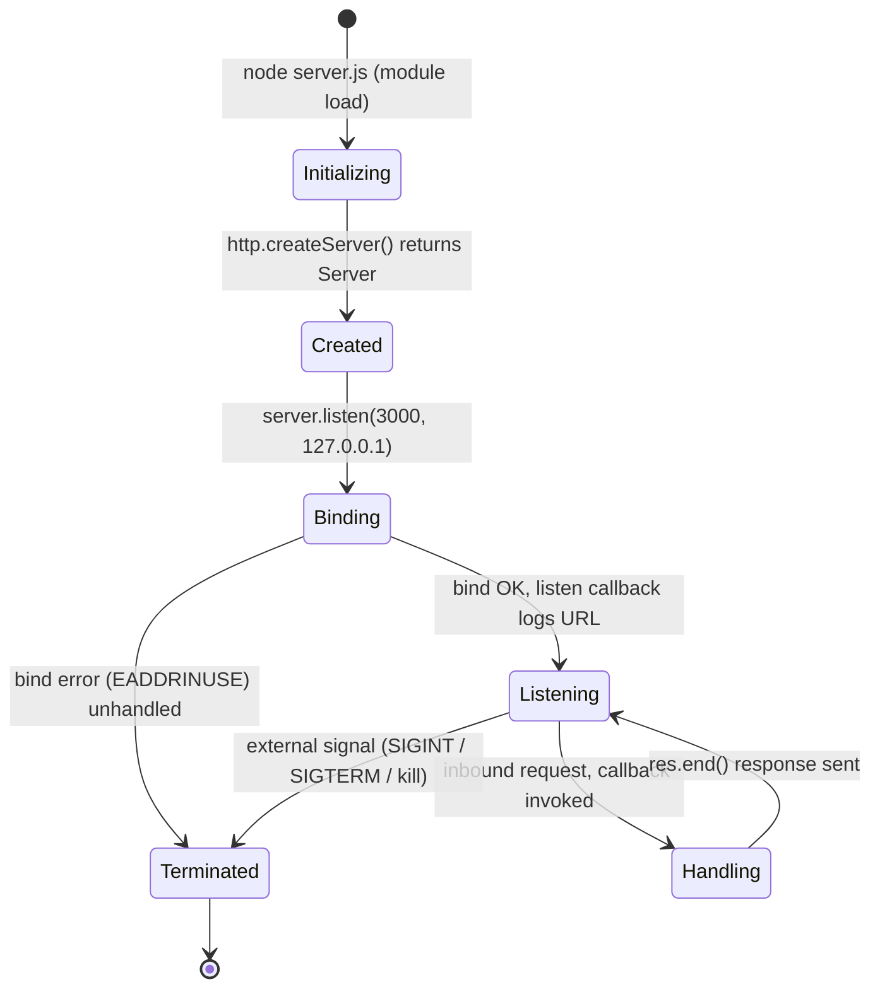
```mermaid
stateDiagram-v2
    [*] --> Initializing: node server.js (module load)
    Initializing --> Created: http.createServer() returns Server
    Created --> Binding: server.listen(3000, 127.0.0.1)
    Binding --> Listening: bind OK, listen callback logs URL
    Binding --> Terminated: bind error (EADDRINUSE) unhandled
    Listening --> Handling: inbound request, callback invoked
    Handling --> Listening: res.end() response sent
    Listening --> Terminated: external signal (SIGINT / SIGTERM / kill)
    Terminated --> [*]
```

**State transition diagram — connection lifecycle (keep-alive).** Persistent HTTP/1.1 connections are a Node default (`Connection: keep-alive`, `Keep-Alive: timeout=5`), so a socket may serve several sequential requests before idle closure.

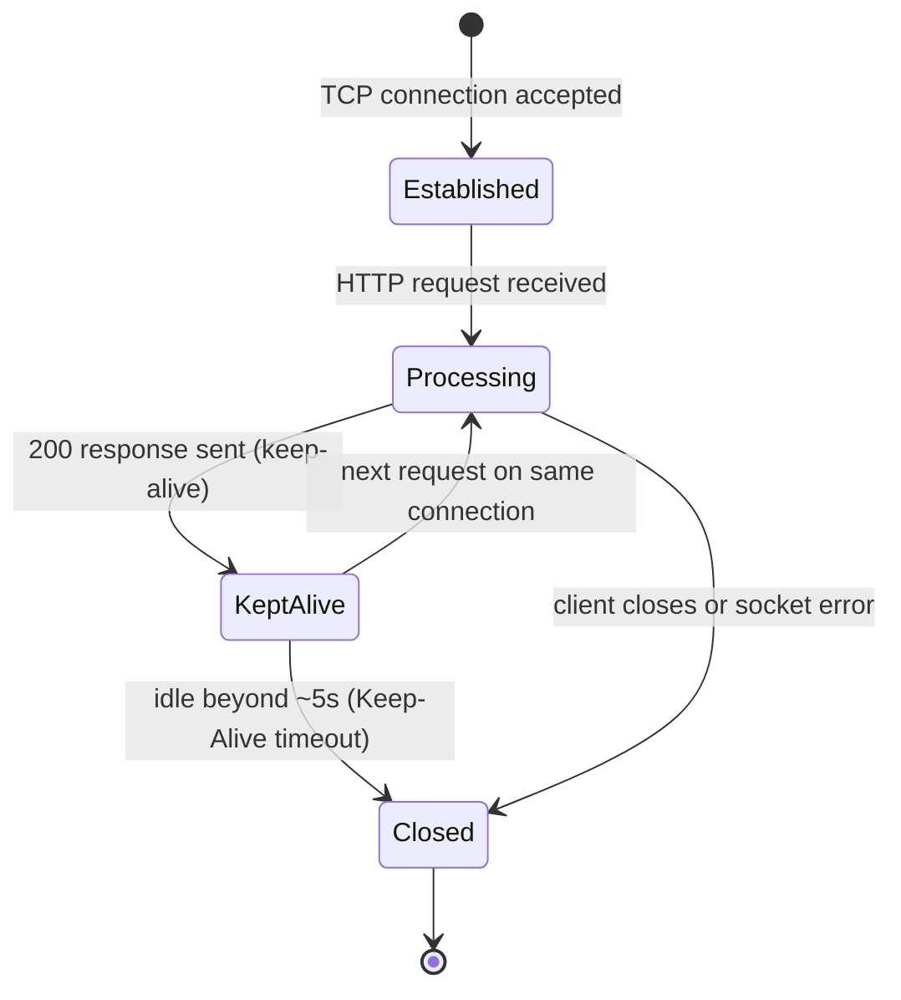
```mermaid
stateDiagram-v2
    [*] --> Established: TCP connection accepted
    Established --> Processing: HTTP request received
    Processing --> KeptAlive: 200 response sent (keep-alive)
    KeptAlive --> Processing: next request on same connection
    KeptAlive --> Closed: idle beyond ~5s (Keep-Alive timeout)
    Processing --> Closed: client closes or socket error
    Closed --> [*]
```

## 5.3 Technical Decisions

The technical decisions below are inferred strictly from what the code does and does not contain; each is a coherent choice in service of the fixture's stated purpose — a deterministic, zero-dependency, locally reachable HTTP target ("test project for backprop integration," `README.md`). Because the artifact is explicitly frozen ("Do not touch!"), every decision is treated as **Accepted** and stable.

### 5.3.1 Architecture Style Decisions and Tradeoffs

The system adopts a minimal single-process monolith built directly on the Node.js standard library (Section 5.1.1). The governing decisions and the tradeoffs they accept are summarized below (three columns).

| Decision | Benefit Gained | Tradeoff Accepted |
| --- | --- | --- |
| Built-in `http` module, no web framework | Zero dependencies, deterministic, trivially auditable | No routing/middleware ergonomics (unneeded for one fixed response) |
| Single file, single process | Minimal surface, easy to reason about and freeze | No separation of concerns or module boundaries |
| Hardcoded loopback host/port, static config | Fixed, discovery-free address for the consumer | Not remotely reachable; no environment override |
| Fixed response, `req` ignored | Byte-identical output eliminates test flakiness | No dynamic behavior or content negotiation |
| Self-start on module evaluation | `node server.js` is sufficient to run the service | Importing the module has a side effect; not isolable for unit tests |
| Fail-fast, no error handling | Errors surface loudly and immediately (exit 1) | No resilience; recovery is manual (Section 4.3.2) |

The overarching tradeoff is **capability and operability sacrificed for determinism, reproducibility, and auditability** — the correct balance for an integration test fixture rather than a production service.

### 5.3.2 Communication Pattern Selection

The system uses exactly one communication pattern: **synchronous, client-initiated HTTP/1.1 request/response** over a loopback TCP socket. This was chosen because the consuming backprop process needs only to issue a request and assert on a single, immediate response. Consequently, the repository contains no asynchronous or decoupled patterns — no message queue, publish/subscribe bus, event stream, webhook, or outbound API call (Sections 3.4, 4.1.2). The only transport-level nuance is Node's default HTTP/1.1 connection reuse (`Connection: keep-alive`, `Keep-Alive: timeout=5`), which is a runtime default rather than an application decision. Selecting a heavier communication substrate (e.g., a broker or RPC framework) would introduce dependencies and non-determinism that directly conflict with the fixture's goals.

### 5.3.3 Data Storage and Caching Rationale

- **Data storage:** None was selected. The response is a compile-time string literal, and the handler is stateless, so there is no database, file store, or session store to justify (Sections 3.5, 4.3.1). The rationale is determinism and reproducibility: with no persisted state, behavior cannot drift between runs, and install requires no data provisioning.
- **Caching strategy:** None was selected, and none is warranted. Because every response is an identical 14-byte literal computed with no I/O, there is no expensive computation or data fetch to cache; no cache layer, cache key, or invalidation logic exists, and no `Cache-Control` or `ETag` headers are emitted (Section 4.3.1). Introducing a cache would add complexity and state with zero benefit for a constant response.

### 5.3.4 Security Mechanism Selection

The repository implements **no application-level security mechanisms** — no TLS, authentication, authorization, input validation, rate limiting, or CORS configuration. This is a deliberate posture appropriate to the artifact, and its security rests on two implicit design choices rather than added controls:

- **Network isolation:** binding to `127.0.0.1` (`server.js` L3) confines the endpoint to the local host, so it is not exposed to a network by default.
- **Minimal attack surface:** zero third-party dependencies remove supply-chain risk (Section 3.3), and because the handler never parses `req` (method, path, headers, or body), there is no injection or deserialization vector to exploit (Section 4.1.2).

The rationale is that a local, trusted, deterministic test fixture gains nothing from cryptographic or identity controls, which would add dependencies and non-determinism. This choice is sound **only** under the loopback assumption; exposing the service on a routable interface (e.g., `0.0.0.0`) would necessitate reintroducing TLS, authentication/authorization, and input hardening.

### 5.3.5 Decision Tree

The decision tree below reconstructs the reasoning that yields this architecture from the fixture's requirement. Each "yes" branch (which would add framework, dependencies, network exposure, or state) is marked *not applicable* because the requirement does not call for it.

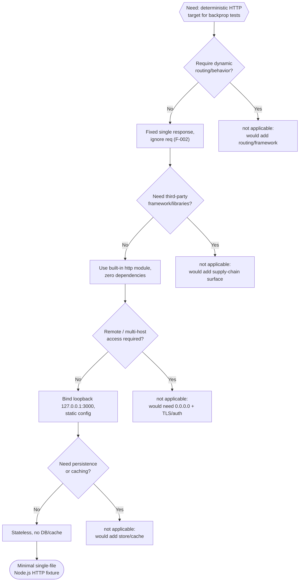
```mermaid
flowchart TD
    Start{{"Need: deterministic HTTP<br/>target for backprop tests"}} --> Q1{"Require dynamic<br/>routing/behavior?"}
    Q1 -->|"No"| D1["Fixed single response,<br/>ignore req (F-002)"]
    Q1 -->|"Yes"| X1["not applicable:<br/>would add routing/framework"]
    D1 --> Q2{"Need third-party<br/>framework/libraries?"}
    Q2 -->|"No"| D2["Use built-in http module,<br/>zero dependencies"]
    Q2 -->|"Yes"| X2["not applicable:<br/>would add supply-chain surface"]
    D2 --> Q3{"Remote / multi-host<br/>access required?"}
    Q3 -->|"No"| D3["Bind loopback 127.0.0.1:3000,<br/>static config"]
    Q3 -->|"Yes"| X3["not applicable:<br/>would need 0.0.0.0 + TLS/auth"]
    D3 --> Q4{"Need persistence<br/>or caching?"}
    Q4 -->|"No"| D4["Stateless, no DB/cache"]
    Q4 -->|"Yes"| X4["not applicable:<br/>would add store/cache"]
    D4 --> Result(["Minimal single-file<br/>Node.js HTTP fixture"])
```

### 5.3.6 Architecture Decision Records (ADRs)

The register below records the key architecture decisions; all share the status **Accepted (frozen)** per the "Do not touch!" directive. Detail for each follows.

| ADR | Decision | Status | Key Consequence |
| --- | --- | --- | --- |
| ADR-001 | Use the built-in `http` module, no web framework | Accepted | No routing/middleware; fully deterministic |
| ADR-002 | Zero third-party dependencies, locked | Accepted | No supply-chain surface or version drift |
| ADR-003 | Single-file monolith that self-starts on load | Accepted | Simple to run/freeze; side-effectful import |
| ADR-004 | Hardcoded loopback bind and static config | Accepted | Discovery-free but local-only, no override |
| ADR-005 | Fixed response, `req` never parsed | Accepted | Identical output; no dynamic behavior |
| ADR-006 | Fail-fast, no error handling or graceful shutdown | Accepted | Loud failures; manual recovery only |
| ADR-007 | Security by network isolation, no TLS/auth | Accepted | Adequate on loopback; unsafe if exposed |

- **ADR-001 — Standard-library HTTP:** *Context:* a fixed HTTP responder is required. *Decision:* call `http.createServer` directly (`server.js` L6) rather than adopt Express/Fastify/Koa. *Consequences:* eliminates all framework dependencies and keeps behavior deterministic, at the cost of routing/middleware conveniences that are not needed.
- **ADR-002 — Zero dependencies:** *Context:* installs must be reproducible and auditable. *Decision:* declare no `dependencies` and lock an empty graph (`package.json`; `package-lock.json`). *Consequences:* no network fetches, no version resolution, no supply-chain risk; any additional capability must be hand-rolled on the standard library.
- **ADR-003 — Single-file self-starting monolith:** *Context:* the fixture must run with one command. *Decision:* keep all logic in `server.js` and call `server.listen` at module load (L12). *Consequences:* `node server.js` is sufficient to start the service, but evaluating/importing the module has a start-up side effect and the server is not isolable for in-process testing.
- **ADR-004 — Loopback bind and static configuration:** *Context:* the consumer needs a stable, discovery-free address. *Decision:* hardcode `127.0.0.1:3000` as module constants (L3–4). *Consequences:* the address never varies between runs, but the service is unreachable from other hosts and cannot be reconfigured without editing source.
- **ADR-005 — Fixed deterministic response:** *Context:* tests need an easily asserted, non-flaky target. *Decision:* return `200`/`text/plain`/`Hello, World!\n` for every request and ignore `req` (L6–10). *Consequences:* byte-identical responses across methods/paths (verified in Section 4.1.2); no dynamic content, routing, or negotiation.
- **ADR-006 — Fail-fast, no recovery:** *Context:* a bind failure should be obvious. *Decision:* register no `error` listener, `try/catch`, or signal handler. *Consequences:* an unhandled bind error (`EADDRINUSE`) crashes the process with exit code 1 and a stderr stack trace; recovery is manual (Section 4.3.2).
- **ADR-007 — Security by isolation:** *Context:* the target is local and trusted. *Decision:* rely on the loopback bind and a minimal, un-parsed request surface instead of TLS/auth (Section 5.3.4). *Consequences:* appropriate for a local fixture; exposing it on a routable interface would require adding transport security, identity, and input hardening.

## 5.4 Cross-Cutting Concerns

This section documents the cross-cutting concerns as they actually exist in the repository. Because the system is a deliberately minimal fixture, most of these concerns are addressed implicitly, by Node.js defaults, or not at all; each is reported honestly with its supporting evidence. The table below (three columns) summarizes the posture; the sub-sections elaborate.

| Concern | Mechanism in this system | Status |
| --- | --- | --- |
| Monitoring & observability | Single startup stdout log line (F-003) | Minimal |
| Logging & tracing | One unstructured stdout line; no request logs or tracing | Minimal |
| Error handling | Node.js defaults only; no application handlers; fail-fast | Implicit only |
| Authentication & authorization | None; security by loopback isolation | Absent by design |
| Performance requirements & SLAs | None declared anywhere | Absent |
| Disaster recovery | Manual restart; artifact preserved in Git | Manual only |

### 5.4.1 Monitoring and Observability

The system's sole observability mechanism is the startup log line `Server running at http://127.0.0.1:3000/` emitted once by the Startup Logger (`server.js` L13, feature F-003). There is **no metrics endpoint, health/readiness probe, `/metrics` exporter, APM agent, or external monitoring integration** (Section 3.4). No per-request telemetry is produced, so request counts, latencies, and error rates are not observable from within the system. Operationally, the only signals available are the presence of the startup line (indicating a successful bind) and the process's liveness (indicating it has not crashed). This is consistent with the fixture's role: correctness is verified functionally by the calling backprop process asserting on the response, not by internal metrics (Section 1.2.3).

### 5.4.2 Logging and Tracing

Logging consists of a single, unstructured, plain-text line written to standard output at startup via `console.log` (`server.js` L13). There is **no structured/JSON logging, no log levels, no timestamps, no log rotation, and no request/access logging** — inbound requests are handled without any log emission. Distributed tracing is likewise **absent**: there is no OpenTelemetry, no trace/span propagation, and no correlation-ID handling, which is expected given the system makes no outbound calls and has no downstream services to correlate with (Sections 3.4, 4.1.2). The rationale is that a single-purpose, deterministic local fixture requires no diagnostic log trail; adding a logging framework would introduce dependencies contrary to the zero-dependency design (Section 3.3).

### 5.4.3 Error Handling Patterns

Error handling is **minimal and implicit**, delegating entirely to Node.js defaults (Section 4.3.2). `server.js` contains no `try/catch`, registers no `error` listener on the `http.Server`, and installs no process-level `uncaughtException`/`unhandledRejection` or signal handler. Two paths result:

- **Startup-time errors** (e.g., the listener cannot bind because the port is taken): the `http.Server` emits an `error` event with no listener, so Node's `EventEmitter` re-throws it as an uncaught exception, printing a stderr stack trace and exiting with code 1. This was verified at runtime as `Error: listen EADDRINUSE: address already in use 127.0.0.1:3000` (Section 4.3.2).
- **Request-time errors:** the handler performs no parsing and no fallible I/O, so an application exception is not reachable by construction; transport-level anomalies (malformed requests, client socket resets) are absorbed by Node's HTTP layer without an application handler.

There are **no retry mechanisms, fallback paths, degraded modes, or error-notification flows**; recovery is manual (free the port, re-run `node server.js`). The flowchart below models both paths.

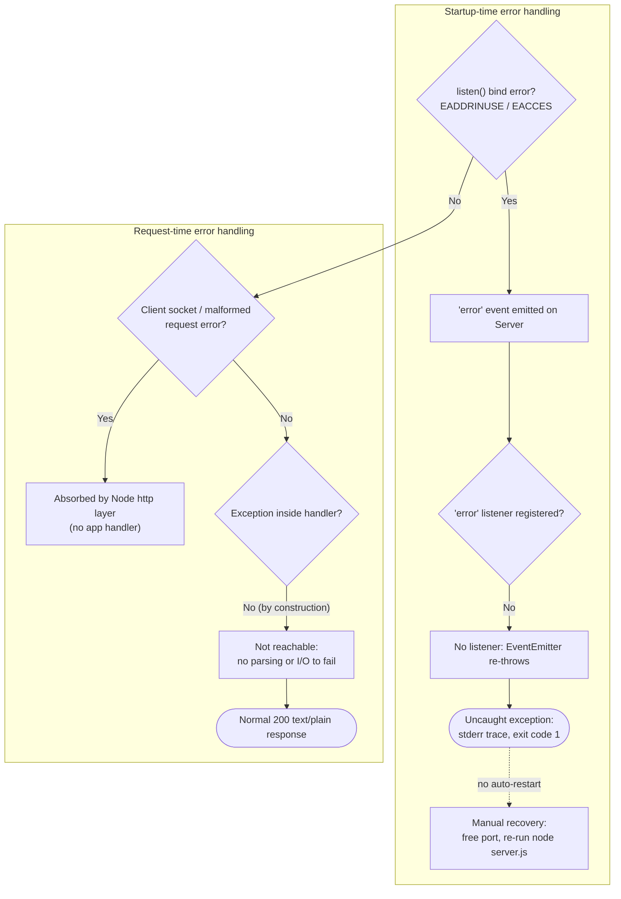
```mermaid
flowchart TD
    subgraph Startup["Startup-time error handling"]
        direction TB
        A1{"listen() bind error?<br/>EADDRINUSE / EACCES"}
        A2["'error' event emitted on Server"]
        A3{"'error' listener registered?"}
        A4["No listener: EventEmitter re-throws"]
        A5(["Uncaught exception:<br/>stderr trace, exit code 1"])
        A6["Manual recovery:<br/>free port, re-run node server.js"]
    end
    subgraph Request["Request-time error handling"]
        direction TB
        B1{"Client socket / malformed<br/>request error?"}
        B2["Absorbed by Node http layer<br/>(no app handler)"]
        B3{"Exception inside handler?"}
        B4["Not reachable:<br/>no parsing or I/O to fail"]
        B5(["Normal 200 text/plain response"])
    end
    A1 -->|"Yes"| A2
    A2 --> A3
    A3 -->|"No"| A4
    A4 --> A5
    A5 -.->|"no auto-restart"| A6
    A1 -->|"No"| B1
    B1 -->|"Yes"| B2
    B1 -->|"No"| B3
    B3 -->|"No (by construction)"| B4
    B4 --> B5
```

### 5.4.4 Authentication and Authorization

There is **no authentication or authorization framework** of any kind — no identity provider, credentials, API keys, tokens, sessions, cookies, or role/permission checks. Every request receives the same response regardless of origin or content (Section 4.1.2). As detailed in Section 5.3.4, the system's protective posture rests entirely on **network isolation** (the `127.0.0.1` loopback bind, `server.js` L3), which keeps the endpoint off the network by default, combined with a minimal attack surface (zero dependencies and a request object that is never parsed). This is adequate for a local, trusted fixture but would be insufficient if the service were exposed on a routable interface.

### 5.4.5 Performance Requirements and SLAs

**No performance requirements or SLAs are declared anywhere in the repository** — there are no latency, throughput, availability, uptime, or capacity targets, and (per Section 5.4.1) no instrumentation exists to measure them. This absence is confirmed consistently across Sections 1.2.3, 2.1, and 4.2.1. The performance-relevant properties that do exist are emergent characteristics of the design rather than commitments:

- The response is a constant 14-byte literal produced with no I/O, so per-request work is negligible.
- Requests are served on a single Node.js event loop; the non-blocking handler introduces no application-level bottleneck (Section 5.2.2).
- Node's default HTTP/1.1 keep-alive (`timeout=5`) reuses connections for successive requests.

These are stated as observed behavior, not as guaranteed service levels.

### 5.4.6 Disaster Recovery

There are **no disaster-recovery procedures** implemented, and no RTO/RPO objectives are defined. This reflects the system's stateless, single-instance nature:

- **No data to recover:** the system persists no state (no database, file, or session store), so there is nothing to back up or restore beyond the source itself (Section 4.3.1).
- **No redundancy or failover:** there is no clustering, standby instance, load balancer, health check, or process supervisor/auto-restart configured in the repository; a crash leaves no running instance until an operator re-launches it (Section 4.3.2).
- **Artifact durability:** the recoverable asset is the source code, preserved under Git version control (a single commit), so the "recovery" model for the fixture is to re-clone and re-run `node server.js`.

In short, resilience is "fail fast and restart manually": the process stops loudly on a bind failure and must be restarted by an operator, which is an acceptable model for a disposable, reproducible test fixture but provides no continuity guarantees.

## 5.5 References

The following repository files, folders, and previously authored specification sections were examined as evidence for this section.

**Repository files inspected (read in full):**

- `server.js` — The entire application runtime; established all logical components (HTTP Server/Listener, Request Handler, Startup Logger), the loopback `127.0.0.1:3000` bind, the fixed `200`/`text/plain`/`Hello, World!\n` response, self-start on module evaluation, and the absence of routing, error handling, and graceful shutdown.
- `package.json` — Established package identity (`hello_world` 1.0.0, MIT, author `hxu`), the absence of `dependencies`/`devDependencies` and `engines`, the `main`→`index.js` mismatch, the missing `start` script, and the failing `test` placeholder.
- `package-lock.json` — Established the zero-dependency locked graph (lockfile version 3, npm v7+) supporting the reproducibility and supply-chain decisions.
- `README.md` — Established the system's purpose ("test project for backprop integration") and the "Do not touch!" (frozen fixture) directive.

**Repository folders / checkout inspected:**

- Repository root (`/`) — Confirmed the complete surface is exactly four first-order files with no subfolders.
- Checkout `/tmp/blitzy/Sk-16-July/main_0d6e40/` — Verified via terminal that no `index.js`, CI workflow, `Dockerfile`, `.env`, or configuration file exists beyond the four tracked files (plus `.git`).

**Technical Specification sections cross-referenced (for terminology and consistency):**

- `1.2 System Overview` — Project context, primary capabilities, component list, and success criteria (no KPIs declared).
- `2.1 Feature Catalog` — Feature identifiers and priorities (F-001 startup/binding, F-002 fixed response, F-003 startup logging, F-004 zero-dependency packaging).
- `2.4 Implementation Considerations` — Concurrency/scalability and supply-chain considerations.
- `3.2 Frameworks & Libraries` — Built-in `http` module only; no web framework.
- `3.3 Open Source Dependencies` — Zero third-party dependencies; lockfile version 3.
- `3.4 Third-Party Services` — Absence of external APIs, auth, monitoring, and cloud services.
- `3.5 Databases & Storage` — Absence of databases, storage, and caching.
- `4.1 System Workflows` — Startup and request/response workflows and verified runtime facts (Content-Length 14, keep-alive, no routing).
- `4.2 Flowchart Requirements and Validation Rules` — Timing/SLA considerations (none declared).
- `4.3 Technical Implementation Flows` — State management (stateless) and error handling/recovery (fail-fast, EADDRINUSE behavior).
- `4.4 State Transition Diagrams` — Process lifecycle and connection (keep-alive) lifecycle state machines.

**Web sources:** None. No external web sources were required; every statement in this section is grounded in the repository files above and the cross-referenced specification sections.

# 6. SYSTEM COMPONENTS DESIGN

## 6.1 Core Services Architecture

### 6.1.1 Architecture Applicability Assessment

**Core Services Architecture is not applicable for this system.**

The `hao-backprop-test` system is a single-process, single-file Node.js HTTP fixture whose entire runtime resides in `server.js` (15 lines), supported only by npm packaging metadata (`package.json`, `package-lock.json`) and a two-line `README.md`. It does not employ microservices, a distributed architecture, or any decomposition into independently deployable service components. Consequently, the service-oriented concerns this section would normally document — inter-service communication, service discovery, load balancing, circuit breaking, horizontal auto-scaling, failover, and data redundancy — have no corresponding implementation anywhere in the repository.

#### 6.1.1.1 Rationale for Non-Applicability

As established in Section 5.1.1 (High-Level Architecture), the system follows a **minimal single-process monolith** style: one JavaScript module executes on the Node.js runtime, builds an HTTP/1.1 listener directly on the standard-library `http` module (`server.js` L1, L6), and answers every request from a single inline callback. There is no layering, no service decomposition, no web framework, and no companion process. The stated purpose, per `README.md`, is to be a "test project for backprop integration" — a fixed, deterministic HTTP target — and the "Do not touch!" directive freezes the artifact.

A repository-wide search confirms the total absence of any service-architecture machinery. There are no occurrences of Node clustering or multi-process primitives (`cluster`, `worker_threads`, `child_process`, `fork`, `spawn`), no process manager (`pm2`, `forever`, `nodemon`, supervisor), no containerization or orchestration artifacts (no `Dockerfile`, `docker-compose`, or Kubernetes manifests), no reverse-proxy or load-balancer configuration (`nginx`, `haproxy`, `envoy`), no service-discovery registry (`consul`, `eureka`, `zookeeper`), and no circuit-breaker, retry, or failover code. The dependency graph is empty — `package-lock.json` locks zero packages — so no resilience, mesh, or service-framework libraries are present either.

The following table classifies the system against the dimensions that determine whether a core-services (microservices/distributed) architecture is warranted.

| Dimension | Determination | Supporting Evidence |
| --- | --- | --- |
| Architecture style | Single-process monolith — not microservices or distributed | One 15-line `server.js`; "no service decomposition" (§5.1.1) |
| Independently deployable services | One (a single Node.js process) | Self-starting module; no companion process (§5.1.1) |
| Inter-service communication | None | All behavior in one inline callback; no IPC/RPC/messaging (§5.1.3) |
| External integrations / data stores | None | Zero dependencies; no DB, cache, or third-party API (§§3.4, 3.5) |
| Distributed coordination (discovery, LB, mesh) | None | No discovery/LB/proxy artifacts anywhere in the repository |
| Concurrency model | Single-threaded event loop; no clustering/workers | "no threads, workers, or clustering are configured" (§5.1.1) |

#### 6.1.1.2 Actual Runtime Topology

The system's real deployment topology is a single Node.js process bound to the loopback interface (`127.0.0.1:3000`), invoked by a local operator and called by a single local client role. Diagram 6.1.1-1 depicts this topology in full — it constitutes the entirety of the "service" landscape; there are no peers, dependencies, or downstream services to coordinate with.

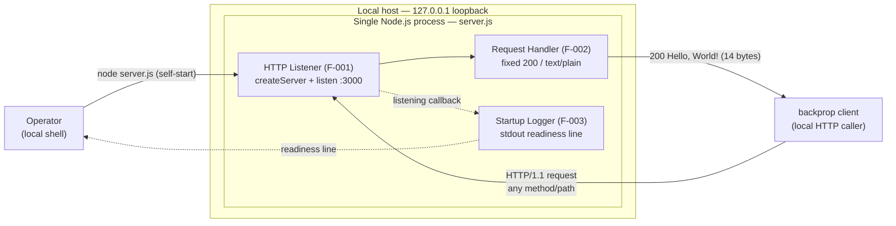
```mermaid
flowchart LR
    Operator["Operator<br/>(local shell)"]
    Client["backprop client<br/>(local HTTP caller)"]
    subgraph Host["Local host — 127.0.0.1 loopback"]
        direction TB
        subgraph Proc["Single Node.js process — server.js"]
            direction TB
            Listener["HTTP Listener (F-001)<br/>createServer + listen :3000"]
            Handler["Request Handler (F-002)<br/>fixed 200 / text/plain"]
            Logger["Startup Logger (F-003)<br/>stdout readiness line"]
        end
    end
    Operator -->|"node server.js (self-start)"| Listener
    Client -->|"HTTP/1.1 request<br/>any method/path"| Listener
    Listener --> Handler
    Handler -->|"200 Hello, World! (14 bytes)"| Client
    Listener -.->|"listening callback"| Logger
    Logger -.->|"readiness line"| Operator
```

**Diagram 6.1.1-1: Actual Runtime Topology** — a single self-contained process on the loopback interface, with no service boundaries to cross.

#### 6.1.1.3 Organization of This Section

Although the determination above is conclusive, the section prompt enumerates specific service-architecture concerns. To document them honestly and to supply the required diagrams, Sections 6.1.2 through 6.1.4 systematically address each mandated area — **Service Components** (§6.1.2), **Scalability Design** (§6.1.3), and **Resilience Patterns** (§6.1.4). For each concern they report the actual (largely absent) implementation, explain why the pattern is unnecessary for a frozen local fixture, and provide the required service-interaction, scalability-architecture, and resilience-pattern diagrams. Every finding reaffirms that a core-services architecture is neither present nor required.

### 6.1.2 Service Components Analysis

Section 6.1.1 established that the system comprises a single Node.js process with no networked services. This sub-section evaluates each **Service Components** concern named in the prompt against that reality. Because there is exactly one deployable unit, the classical service-component patterns are absent; the table below summarizes the posture, and the sub-sections explain each entry with evidence.

| Service Concern | Status in This System | Evidence / Rationale |
| --- | --- | --- |
| Service boundaries & responsibilities | In-process logical components only; no networked service boundaries | Listener/Handler/Logger/Config in one file (§5.1.2) |
| Inter-service communication | None — single inline callback; no IPC/RPC/messaging | Handler makes no downstream calls (§5.1.3) |
| Service discovery | Not applicable — no peers; static hardcoded address | `hostname`/`port` constants (`server.js` L3–4) |
| Load balancing | None — single instance on one event loop | No LB/proxy config; no clustering (§5.1.1) |
| Circuit breaker | None — no downstream dependency to protect | No breaker libraries; zero dependencies |
| Retry & fallback | None — single unconditional success path | "no retry mechanisms, fallback paths" (§5.4.3) |

#### 6.1.2.1 Service Boundaries and Responsibilities

The system exposes exactly **one runtime boundary**: the single Node.js process launched with `node server.js`. Within that process, Section 5.1.2 identifies distinct *logical* components — the HTTP Listener (F-001), the Request Handler (F-002), the Startup Logger (F-003), the Static Configuration constants, and the Package Manifest/Lockfile (F-004). These are in-process functions and object references that share one event loop and one address space; they are **not independently deployable, versionable, or scalable services**. There is no network or protocol boundary between them — the handler is simply the callback registered on the `http.Server` instance, and the logger runs inside the `listen` callback (`server.js` L6, L12–13). The only externally observable boundary is the single loopback HTTP endpoint documented in Section 5.1.4; there is no outbound boundary because the process makes no external calls.

#### 6.1.2.2 Inter-Service Communication, Discovery, and Load Balancing

**Inter-service communication patterns — none.** All logic executes within a single inline callback on one call stack; components interact through direct in-process function calls and shared object references, not over a wire. There is no IPC, RPC, gRPC, service-to-service REST, message queue, or event bus (Sections 5.1.3, 4.1.2). The only communication that crosses a boundary is the synchronous, client-initiated HTTP/1.1 request/response between the external caller and the process, illustrated in Diagram 6.1.2-1. Notably, the handler issues **no downstream calls**, so there are zero inter-service hops to coordinate, secure, or trace.

**Service discovery mechanisms — not applicable.** With a single process and no peer services, there is nothing to discover. The bind target is a pair of hardcoded module-scoped constants (`hostname = '127.0.0.1'`, `port = 3000`; `server.js` L3–4) with no service registry (no `consul`, `eureka`, or `zookeeper`), no DNS-based or client-side discovery, and no environment-variable/CLI override. Clients reach the fixture at the fixed, well-known address `http://127.0.0.1:3000/`.

**Load balancing strategy — none.** A single event loop in one process serves every request. There is no reverse proxy, no L4/L7 load balancer, no Node `cluster`-module fan-out across CPU cores, and no upstream instance pool. Concurrency is handled cooperatively by Node's non-blocking event loop rather than distributed across replicas (Section 5.1.1). Because the response is a constant produced with no I/O (Section 5.4.5), the single instance is not a throughput bottleneck for the fixture's intended local, low-volume use.

```mermaid
sequenceDiagram
    autonumber
    participant C as backprop client
    participant N as Node http layer (HTTP/1.1)
    participant H as Request Handler (F-002)
    C->>N: Open loopback TCP + send request (any method/path)
    N->>H: invoke handler(req, res)
    Note over H: req ignored#59; no routing#59;<br/>no downstream / inter-service calls
    H-->>N: res.end 200, text/plain, "Hello, World!\n"
    N-->>C: 200 OK (Content-Length: 14, Keep-Alive: timeout=5)
    Note over C,N: Connection reused ~5s, then idle-closed
```

**Diagram 6.1.2-1: Service Interaction (Request/Response Sequence)** — the complete set of interactions is a single client↔process exchange; the handler has no onward service calls, confirming the absence of inter-service communication.

#### 6.1.2.3 Circuit Breaker, Retry, and Fallback Mechanisms

**Circuit breaker patterns — none, and none is warranted.** A circuit breaker exists to protect calls to a failing downstream dependency; because the Request Handler performs no outbound calls and has no dependency to guard (Section 5.1.3), there is no failure to trip on and no breaker library present anywhere in the (zero-dependency) codebase.

**Retry mechanisms — none.** No operation is retried. A startup bind error is fatal and is not retried — it terminates the process (Sections 5.4.3, 4.3.2) — and there are no retriable downstream requests because the handler makes none.

**Fallback / service-degradation mechanisms — none.** The handler has a single, unconditional success path: status `200` with the fixed `Hello, World!\n` body (`server.js` L7–9). There is no alternative response, cached fallback, or degraded mode. Since the handler ignores `req` and performs no fallible I/O, an application-level exception is not reachable by construction (Section 5.4.3), so there is nothing for a fallback branch to catch. Degradation policy is discussed further in Section 6.1.4.5.

### 6.1.3 Scalability Design

Consistent with the single-process determination in Section 6.1.1, the repository contains **no scalability engineering** — no horizontal or vertical scaling controls, no auto-scaling, and no capacity targets. This sub-section documents each **Scalability Design** concern from the prompt as it actually exists. The table summarizes the posture; the sub-sections and Diagram 6.1.3-1 elaborate.

| Scalability Concern | Status in This System | Evidence / Rationale |
| --- | --- | --- |
| Horizontal scaling | Not configured — single instance; loopback bind | No cluster/LB/replicas; `127.0.0.1` (§5.1.1) |
| Vertical scaling | No tuning — inherits OS defaults; ~1 core used | Single event loop; no `engines`/runtime flags |
| Auto-scaling triggers & rules | None — no metrics source and no orchestrator | No metrics/probe (§5.4.1); no orchestration |
| Resource allocation | None defined — operating-system defaults | No container/cgroup/heap/ulimit settings in repo |
| Performance optimization | Emergent, not engineered | 14-byte constant, no I/O, keep-alive (§5.4.5) |
| Capacity planning | No targets declared | No latency/throughput/uptime targets (§5.4.5) |

#### 6.1.3.1 Horizontal and Vertical Scaling Approach

**Horizontal scaling — not configured.** The system runs as a single process instance. There is no Node `cluster`-module usage, no process manager spawning workers, no container replicas, and no load balancer to distribute traffic across instances (Section 6.1.2.2). Furthermore, the server binds to the loopback interface `127.0.0.1` (`server.js` L3), so it is not reachable from other hosts; scaling out across machines would require a source change to bind a routable interface plus the introduction of a load balancer — neither of which is present in the repository.

**Vertical scaling — no tuning.** No vertical-scaling controls are defined. The process inherits host CPU and memory with no container/cgroup limits and no Node runtime flags (for example, no `--max-old-space-size`), and the Node version itself is unpinned (no `engines` field in `package.json`). Because JavaScript executes on a single event-loop thread, the process effectively uses one CPU core for request handling regardless of how many cores the host provides; adding CPU or RAM to the host does not increase JavaScript execution parallelism for this workload.

Diagram 6.1.3-1 contrasts the current single-instance reality with the load-balanced, multi-instance topology that scaling would require — the latter shown explicitly as **not present** in the repository.

```mermaid
flowchart TB
    subgraph Current["Current — as implemented"]
        direction TB
        Client["backprop client"]
        Proc["Single Node.js process<br/>1 event loop • loopback :3000"]
        Client -->|"HTTP/1.1 request"| Proc
    end
    subgraph Absent["NOT configured in repository — would require code + infra changes"]
        direction TB
        LB["Load balancer / reverse proxy<br/>(NOT PRESENT)"]
        W1["Instance / cluster worker 1<br/>(NOT PRESENT)"]
        W2["Instance / cluster worker N<br/>(NOT PRESENT)"]
        LB -.->|"distribute"| W1
        LB -.->|"distribute"| W2
    end
```

**Diagram 6.1.3-1: Scalability Architecture (Current vs. Not-Configured)** — the solid path is the implemented single-instance topology; the dashed, "(NOT PRESENT)" nodes indicate the horizontal-scaling components that are absent from the repository.

#### 6.1.3.2 Auto-Scaling Triggers, Rules, and Resource Allocation

**Auto-scaling triggers and rules — none.** Auto-scaling requires both a metric source and an orchestrator that acts on thresholds; the system has neither. Section 5.4.1 confirms there is no metrics endpoint, health/readiness probe, or APM agent, so no signal exists to trigger scaling, and there is no orchestrator (no Kubernetes Horizontal Pod Autoscaler, no cloud auto-scaling group, no process supervisor) anywhere in the repository. Consequently there are no scaling rules to document — no CPU-utilization, memory, request-rate, or queue-depth thresholds are defined.

**Resource allocation strategy — none defined.** There are no container resource requests/limits, no cgroup constraints, no `ulimit` settings, and no Node heap or thread-pool tuning in the repository; the process runs entirely on operating-system defaults. The only fixed resource the system reserves is a single TCP listening socket on port 3000 held for the process lifetime (Section 5.1.3).

#### 6.1.3.3 Performance Optimization and Capacity Planning

**Performance optimization techniques — emergent, not engineered.** The performance-relevant properties are characteristics of the minimal design rather than deliberate optimizations (Section 5.4.5): the response is a constant 14-byte literal produced with no I/O, request handling is non-blocking on a single event loop, and Node's default HTTP/1.1 keep-alive (`timeout=5`) reuses connections for successive requests. There is no explicit optimization layer — no response caching or `Cache-Control`/`ETag` headers, no compression (gzip/brotli), no clustering across cores, and no connection pooling (there are no downstream connections to pool).

**Capacity planning guidelines — none declared.** No capacity targets or planning guidance exist anywhere in the repository (Sections 5.4.5, 1.2.3, 2.1); there are no latency, throughput, concurrency, or uptime figures against which to size the deployment. Practical capacity is bounded by the single event loop on one CPU core and by the loopback interface. For the fixture's intended role — a local, low-volume, deterministic HTTP target for backprop integration testing — this capacity is sufficient by design, and any expansion would require re-architecting toward the multi-instance model marked "(NOT PRESENT)" in Diagram 6.1.3-1.

### 6.1.4 Resilience Patterns

Resilience in this system is characterized by Section 5.4 as "fail fast and restart manually." The repository implements no dedicated resilience patterns — no fault-tolerance handlers, no failover, no data redundancy, and no degraded modes. This sub-section documents each **Resilience Patterns** concern from the prompt against that reality. The table summarizes the posture; the sub-sections and Diagram 6.1.4-1 elaborate.

| Resilience Concern | Status in This System | Evidence / Rationale |
| --- | --- | --- |
| Fault tolerance | Fail-fast; no handlers; handler cannot fail by construction | No `try/catch` or `error` listener (§5.4.3) |
| Disaster recovery | Manual restart only; no RTO/RPO; source in Git | "fail fast and restart manually" (§5.4.6) |
| Data redundancy | Not applicable — stateless; only source-controlled literal | No DB/file/session/cache (§§4.3.1, 3.5) |
| Failover configuration | None — no standby/cluster/LB/supervisor | "No redundancy or failover" (§5.4.6) |
| Service degradation policy | None — binary running-or-crashed | Single unconditional `200` path (§5.4.3) |

#### 6.1.4.1 Fault Tolerance Mechanisms

Fault tolerance is **minimal and implicit**, delegating entirely to Node.js defaults (Section 5.4.3). `server.js` contains no `try/catch`, registers no `error` listener on the `http.Server`, and installs no process-level `uncaughtException`/`unhandledRejection` or signal handler. Two consequences follow: a startup bind error (for example `EADDRINUSE`) is re-thrown by Node's `EventEmitter` as an uncaught exception and terminates the process with exit code 1 (verified at runtime, Section 4.3.2); and at request time the handler performs no parsing and no fallible I/O, so an application exception is not reachable by construction while transport-level anomalies are absorbed by Node's HTTP layer. There is thus no bulkhead, timeout, isolation, or self-healing mechanism — the fault posture is strictly fail-fast, as modeled in Diagram 6.1.4-1.

```mermaid
flowchart TD
    Start(["node server.js"])
    Bind{"Bind 127.0.0.1:3000<br/>succeeds?"}
    Run["Process LISTENING<br/>serves fixed 200 responses"]
    Fault{"Fatal fault?<br/>bind error / crash / kill signal"}
    Exit(["Process exits<br/>uncaught error → code 1"])
    Outage["TOTAL OUTAGE<br/>no standby, no failover, no auto-restart"]
    Manual["Manual recovery:<br/>operator re-runs node server.js"]
    Start --> Bind
    Bind -->|"No (EADDRINUSE / EACCES)"| Exit
    Bind -->|"Yes"| Run
    Run --> Fault
    Fault -->|"No"| Run
    Fault -->|"Yes"| Exit
    Exit --> Outage
    Outage -.->|"no automatic path exists"| Manual
    Manual --> Start
```

**Diagram 6.1.4-1: Resilience Pattern (Fail-Fast + Manual Recovery)** — any fatal fault terminates the single instance, producing a total outage with no automatic failover; the only recovery path is a manual operator restart.

#### 6.1.4.2 Disaster Recovery Procedures

**No disaster-recovery procedures are implemented, and no RTO/RPO objectives are defined** (Section 5.4.6). Recovery is entirely manual: because there is no process supervisor or auto-restart, a crash leaves no running instance until an operator re-runs `node server.js`. The only recoverable asset is the source code itself, preserved under Git version control (a single commit), so the effective DR model is "re-clone and re-run." This provides no continuity guarantee but is acceptable for a disposable, reproducible local test fixture.

#### 6.1.4.3 Data Redundancy Approach

**Data redundancy is not applicable** because the system is stateless and persists no data. There is no database, file store, session store, or cache (Sections 4.3.1, 3.5), so there is nothing to replicate, mirror, or back up at runtime. The only "data" in the system is the in-code response string literal `Hello, World!\n`, whose sole form of redundancy is its preservation in the Git repository. No runtime replication, no multi-AZ/multi-region copies, and no backup schedule exist because there is no runtime state to protect.

#### 6.1.4.4 Failover Configuration

**There is no failover configuration.** The repository defines no standby or hot/warm secondary instance, no clustering, no load balancer, no health check to detect failure, and no process supervisor or orchestrator to restart or reschedule the process (Sections 5.4.6, 6.1.2.2). As Diagram 6.1.4-1 illustrates, a fault takes the single instance to a terminated state and — with no automatic failover path — results in a total outage until an operator performs a manual restart.

#### 6.1.4.5 Service Degradation Policies

**There are no service-degradation policies.** The Request Handler has a single unconditional success path with no degraded mode, no load shedding, no rate limiting, and no circuit-breaker-driven partial responses (Section 6.1.2.3). There is likewise no graceful shutdown or connection draining — no `SIGTERM`/`SIGINT` handler is installed (Sections 5.4.3, 4.4) — so the service cannot wind down gracefully under termination. Availability is therefore **binary**: the process is either fully serving `200` responses or, after a fatal fault, not running at all. There is no intermediate degraded state by design, which is consistent with the fixture's goal of deterministic, all-or-nothing behavior.

### 6.1.5 References

**Repository files inspected and cited**

- `server.js` — the complete 15-line runtime; established the single-process monolith, the loopback bind (`127.0.0.1:3000`), the single inline handler returning a fixed `200`/`text/plain`/`Hello, World!\n` response, and the absence of routing, error handling, clustering, and graceful shutdown.
- `package.json` — established package identity (`hello_world` 1.0.0, MIT), the empty dependency set, the absent `start` script and `engines` field, and the `main` field pointing to a nonexistent `index.js`.
- `package-lock.json` — established the zero-dependency lock (`lockfileVersion` 3), confirming no resilience, scaling, service-mesh, or discovery libraries are present.
- `README.md` — established the project purpose ("test project for backprop integration") and the "Do not touch!" frozen-fixture directive.

**Repository structure**

- Repository root (`/`) — confirmed exactly four files and no subfolders; a repository-wide keyword search over all files confirmed the absence of clustering (`cluster`, `worker_threads`, `child_process`), process managers, containerization/orchestration, reverse-proxy/load-balancer, service-discovery, circuit-breaker, retry, and failover artifacts.

**Cross-referenced Technical Specification sections**

- Section 1.2 System Overview — system purpose and the absence of KPIs/SLAs.
- Section 2.1 Feature Catalog — feature identifiers F-001 through F-004 referenced throughout this section.
- Section 3.4 Third-Party Services — confirmed no external services or integrations.
- Section 3.5 Databases & Storage — confirmed no databases, caches, or persistence layers.
- Section 4.3 Technical Implementation Flows — state management (4.3.1) and error handling/recovery (4.3.2), including the verified `EADDRINUSE` fail-fast behavior.
- Section 4.4 State Transition Diagrams — process lifecycle and the absence of graceful shutdown/draining.
- Section 5.1 High-Level Architecture — the "minimal single-process monolith" style (5.1.1), core components (5.1.2), data flows (5.1.3), and external integration points and "None declared" SLAs (5.1.4).
- Section 5.4 Cross-Cutting Concerns — monitoring/observability (5.4.1), error-handling patterns (5.4.3), performance requirements & SLAs (5.4.5), and disaster recovery (5.4.6).

**External / web sources**

- None. All findings for this section were derived directly from the repository and from previously documented specification sections; no external web sources were required.

## 6.2 Database Design

### 6.2.1 Applicability Assessment

**Database Design is not applicable to this system.**

The repository implements a single, fully stateless Node.js HTTP server that neither reads from nor writes to any data store. There is no relational database, NoSQL database, embedded database, object/file storage, cache, or session store anywhere in the codebase. Consequently there is no schema, no persisted data model, no indexing or partitioning scheme, no replication topology, and no backup pipeline to document.

This determination is grounded in a complete inspection of the repository, which consists of exactly four files — `server.js`, `package.json`, `package-lock.json`, and `README.md` — and no subdirectories. The request handler produces its entire response from a compile-time string literal and ignores the incoming request object entirely.

| Evidence Source | Observation | Design Implication |
| --- | --- | --- |
| `server.js` line 1 | The only imported module is Node's built-in `http`; no database driver, ORM, or storage client is required | No data-access layer exists |
| `server.js` lines 6, 9 | The request callback ignores `req` and responds with the literal `Hello, World!` | Every response is served from memory; nothing is stored or retrieved |
| `package.json` / `package-lock.json` | No `dependencies` or `devDependencies`; the lockfile locks zero packages | No persistence, cache, or storage-client package is installed |
| Repository-wide search | No `.sql`, `.db`, `.sqlite`, `.env`, `.yaml`, `.prisma`, or migration files exist now or in git history | No schema, seed data, or migration artifacts to manage |

This finding is consistent with Section **3.5 Databases & Storage**, which records that the system "uses no database and no persistent storage" and is "fully stateless"; with the empty dependency graph documented in Section **3.3 Open Source Dependencies**; and with the behavioral and reproducibility constraints in Section **2.5 Constraints** (a single static response with no request parsing, and zero dependencies preserved for deterministic installs).

**Data flow without persistence.** The only data movement in the system is the in-process construction of a fixed response string and its transmission back to the caller. The following diagram traces that flow and makes explicit that the request path never touches a persistence tier.

```mermaid
flowchart LR
    Client["HTTP client on loopback<br/>127.0.0.1:3000"]
    Handler["Request callback in server.js<br/>req is ignored (line 6)"]
    Literal["In-memory string literal<br/>Hello, World! + newline (line 9)"]
    Response["HTTP 200 response<br/>Content-Type: text/plain (lines 7-8)"]
    NoStore["No database, file, cache, or<br/>session store exists"]

    Client -->|"request: any method / any path"| Handler
    Handler --> Literal
    Literal --> Response
    Response -->|"response body"| Client
    Handler -.->|"performs no reads or writes"| NoStore
```

**Entity-relationship and replication diagrams.** The entity-relationship (ERD) and replication-architecture diagrams normally expected in this section cannot be rendered because there are no persistent entities, tables, collections, keys, or relationships to model, and no primary/replica datastores or replication streams to depict. Rather than fabricate a schema that does not exist, this section documents the verified absence; the data-flow diagram above represents the only meaningful data movement present in the system.

### 6.2.2 Design Area Disposition

Although no database exists, each design area enumerated by this section's requirements has been assessed against the repository so that the non-applicability is explicit and auditable rather than merely asserted. In every case the status is **Not Applicable**, with the basis drawn directly from the four source files. All tables below use three columns.

#### 6.2.2.1 Schema Design

| Design Concern | Status | Basis in Repository |
| --- | --- | --- |
| Entity relationships | Not applicable | No entities, tables, or collections are defined anywhere in the codebase |
| Data models & structures | Not applicable | The response is a string literal; no domain object is modeled or persisted (`server.js` line 9) |
| Indexing strategy | Not applicable | There is no datastore to index |
| Partitioning approach | Not applicable | There is no dataset to partition or shard |
| Replication configuration | Not applicable | No database or replica set exists; the system is a single stateless process |
| Backup architecture | Not applicable | There is no persistent data to back up |

No indexes, primary or foreign keys, unique constraints, check constraints, or other schema constraints exist to document, because no schema is defined in the repository.

#### 6.2.2.2 Data Management

| Design Concern | Status | Basis in Repository |
| --- | --- | --- |
| Migration procedures | Not applicable | No schema exists and no migration tooling is present (no Prisma/Knex/Sequelize/TypeORM/etc. per `package-lock.json`) |
| Versioning strategy | Not applicable | There is no schema or data to version; the application version is fixed at `1.0.0` (`package.json`) |
| Archival policies | Not applicable | No data is generated, collected, or stored |
| Storage & retrieval mechanisms | Not applicable | The response is served from memory; no store is read or written (`server.js` line 6) |
| Caching policies | Not applicable | No cache exists and no `Cache-Control`/`ETag` header is emitted (only `Content-Type` is set, `server.js` line 8) |

#### 6.2.2.3 Compliance Considerations

| Design Concern | Status | Basis in Repository |
| --- | --- | --- |
| Data retention rules | Not applicable | No data is collected, processed, or stored, so there is nothing to retain or delete |
| Backup & fault tolerance | Not applicable | There is no persistent state; `server.js` also has no error handling or high-availability logic |
| Privacy controls | Not applicable | `req` is ignored, so no PII, credentials, or user data is captured (`server.js` line 6) |
| Audit mechanisms | Not applicable | Only a startup line is logged; there is no data-access audit trail (`server.js` line 13) |
| Access controls | Not applicable | No database accounts or roles exist; the loopback-only bind is the sole access boundary (`server.js` line 3) |

#### 6.2.2.4 Performance Optimization

| Design Concern | Status | Basis in Repository |
| --- | --- | --- |
| Query optimization | Not applicable | No queries are ever issued |
| Caching strategy | Not applicable | No cache layer exists (see 6.2.2.2) |
| Connection pooling | Not applicable | There are no database connections to pool |
| Read/write splitting | Not applicable | There are no reads or writes and no primary/replica topology to split across |
| Batch processing | Not applicable | There are no datasets or jobs; each request yields one synchronous in-memory response |

**When this section would become applicable.** A Database Design would need to be authored only if the system were extended to persist or retrieve data — for example, by introducing a database driver or ORM dependency (there are none today, per Section 3.3), by generating request-dependent dynamic content (today `req` is ignored, per Section 2.5), or by adding filesystem/object-storage I/O (none present). Under the `README.md` "Do not touch!" directive and the frozen `1.0.0` baseline documented in Section 2.5, no such change is present or planned.

### 6.2.3 References

The following repository artifacts and specification sections were examined as evidence for this section.

**Repository files**

- `server.js` — Established the stateless HTTP server: imports only the built-in `http` module (line 1), ignores the request object (line 6), and returns the in-memory literal `Hello, World!` (line 9); contains no data-access, persistence, or caching code.
- `package.json` — Confirmed the absence of any `dependencies`/`devDependencies` (no database driver, ORM, cache, or storage client) and the fixed application version `1.0.0`.
- `package-lock.json` — Confirmed `lockfileVersion` 3 with a `packages` map containing only the root record, verifying zero installed packages.
- `README.md` — Established the project's purpose as a backprop integration test fixture and the "Do not touch!" frozen-baseline directive.

**Repository inspection**

- Repository root (checkout) — Confirmed exactly four files and no subdirectories; git history has only ever tracked those same four files; no `.sql`, `.db`, `.sqlite`, `.env`, `.yaml`, `.prisma`, migration, or data files exist.

**Cross-referenced specification sections**

- Section 3.5 Databases & Storage — Corroborated that the system uses no database and no persistent storage and is fully stateless, with no cache or session store.
- Section 3.3 Open Source Dependencies — Corroborated the empty dependency graph, confirming no persistence or storage client library is installed.
- Section 2.5 Traceability Matrix, Assumptions & Constraints — Corroborated the single-static-response behavior, the zero-dependency reproducibility constraint, and the frozen `1.0.0` baseline.
- Section 2.4 Implementation Considerations — Corroborated that the F-002 request handler maintains no shared or mutable state.
- Section 1.2 System Overview — Corroborated the zero-dependency, stateless server design and its loopback binding.

No web sources were required for this section.

## 6.3 Integration Architecture

### 6.3.1 Integration Architecture Applicability Assessment

**Integration Architecture is not applicable for this system.**

The `hao-backprop-test` system is a single-process, single-file Node.js HTTP fixture whose entire runtime resides in `server.js` (15 lines), supported only by npm packaging metadata (`package.json`, `package-lock.json`) and a two-line `README.md`. It integrates with **no external systems or services**: it initiates no outbound calls, depends on no third-party packages (`package-lock.json` locks zero dependencies), and contains no message brokers, event buses, stream processors, batch jobs, databases, or API gateways. As established in Section 3.4, the system "integrates with no external or third-party services of any kind," and Section 5.1 characterizes its only integration pattern as synchronous, client-initiated HTTP/1.1 request/response over a loopback TCP socket, with "no asynchronous messaging, publish/subscribe, streaming, or outbound call of any kind."

The one integration-adjacent surface that does exist is a single **inbound** HTTP endpoint bound to the loopback interface `http://127.0.0.1:3000/`. Per Section 3.4, this is "an inbound contract rather than an outbound third-party integration" — a fixed, deterministic target that a co-located `backprop` test process calls locally on the same host. Because the classical concerns of an integration architecture — API management, message processing, and external-system integration — have no corresponding implementation anywhere in the repository, the remainder of this section records each mandated area as it actually exists (overwhelmingly absent), documents the sole inbound surface for completeness, and provides the integration-flow, API-architecture, message-flow, and sequence diagrams the section prompt requires. This mirrors the treatment and conclusions of Section 6.1 (Core Services Architecture), which is likewise not applicable to this fixture.

#### 6.3.1.1 Rationale for Non-Applicability

The determination rests entirely on the verifiable content — and absence of content — in the repository. `server.js` requires only Node's built-in `http` module (`server.js` L1); it opens a single inbound listener (L6, L12) and, for every request, writes a fixed response and returns (L7–L9). The request object is never inspected, and there is no client library, socket-initiating code, or scheduler to reach any other system. The table below classifies each integration category against that evidence.

| Integration Category | Present? | Evidence |
| --- | --- | --- |
| Outbound external API / service calls | No | No HTTP client, `fetch`, or SDK in `server.js`; handler only calls `res.end` (L6–L9) |
| Third-party / SaaS integrations | No | `package-lock.json` locks zero dependencies; Section 3.4 confirms none |
| Message broker / queue / event bus | No | No messaging library; sole `require` is built-in `http` (L1) |
| Stream / batch processing | No | No stream pipelines, schedulers, or batch jobs anywhere in the repository |
| Database / persistent store | No | No driver or ORM; stateless fixed response (Section 6.2) |
| API gateway / reverse proxy | No | No gateway or proxy configuration files; direct loopback bind (L3) |
| Inbound HTTP endpoint (sole surface) | Yes (trivial) | Single loopback listener `127.0.0.1:3000` returning a fixed string (L6–L13) |

Because six of the seven categories are entirely absent and the seventh is a single unrouted inbound endpoint, there is no integration topology to design, secure, version, or orchestrate. The conditions that would make a full integration architecture necessary — outbound dependencies, asynchronous messaging, multiple API consumers with distinct contracts, or an external gateway — are all missing by design, consistent with the "Do not touch!" frozen-fixture directive in `README.md`.

#### 6.3.1.2 The Sole Integration Surface

The system's only externally observable surface is the inbound loopback HTTP endpoint. It is a synchronous request/response contract: a local caller opens a TCP connection to `127.0.0.1:3000`, sends any HTTP/1.1 request, and receives an identical `200 OK` / `text/plain` / `Hello, World!\n` (14-byte) response regardless of method, path, headers, or body (`server.js` L6–L9). The endpoint issues no downstream calls, so the "flow" terminates at the handler with no fan-out to any other system. Diagram 6.3.1-1 depicts this surface and explicitly marks the external-system categories that are absent (dashed edges denote integration paths that do **not** exist in the repository).

```mermaid
flowchart LR
    Client["backprop client<br/>(local, same host)"]
    subgraph Host["Local host — 127.0.0.1 loopback"]
        direction TB
        Listener["Inbound HTTP Listener<br/>createServer + listen on :3000"]
        Handler["Request Handler<br/>fixed 200 / text/plain"]
    end
    subgraph Absent["External systems — NONE PRESENT (no outbound calls)"]
        direction TB
        DB["Database (absent)"]
        MQ["Message broker / queue (absent)"]
        TP["Third-party API / SDK (absent)"]
    end
    Client -->|"HTTP/1.1 request (any method/path)"| Listener
    Listener --> Handler
    Handler -->|"200 Hello, World! (14 bytes)"| Client
    Handler -.->|"no outbound integration"| DB
    Handler -.->|"no outbound integration"| MQ
    Handler -.->|"no outbound integration"| TP
```

**Diagram 6.3.1-1: Integration Flow (Sole Inbound Surface)** — the only integration path is the solid inbound request/response between the local `backprop` client and the single Node.js process; the dashed edges to database, message broker, and third-party nodes indicate outbound integrations that are absent from the repository.

#### 6.3.1.3 Organization of This Section

Although the determination above is conclusive, the section prompt enumerates specific integration concerns grouped under API Design, Message Processing, and External Systems. To document them honestly and to supply the required diagrams, Sections 6.3.2 through 6.3.4 systematically address each mandated area, reporting the actual (largely absent) implementation and, where a concrete surface exists, documenting it precisely. Section 6.3.2 (API Design) covers the single inbound endpoint's protocol, authentication, authorization, rate limiting, versioning, and documentation posture; Section 6.3.3 (Message Processing) addresses event, queue, stream, batch, and error-handling concerns; Section 6.3.4 (External Systems) addresses third-party integration, legacy interfaces, API-gateway configuration, and external service contracts, and documents the (empty) external-dependency set. Section 6.3.5 lists all references. Every finding reaffirms that an integration architecture is neither present nor required for this local test fixture.

### 6.3.2 API Design

The system exposes exactly one API surface: the single inbound HTTP endpoint served by `server.js`. It is not a designed, managed API — there is no framework, router, specification, or middleware pipeline. It is a raw Node.js `http.Server` whose sole callback returns a constant response for every request (`server.js` L6–L10). The two tables below summarize the concrete protocol characteristics and the (absent) API-management concerns; the sub-sections then document each prompt-mandated aspect with evidence.

| API Aspect | Specification | Evidence |
| --- | --- | --- |
| Protocol | HTTP/1.1 over TCP (Node `http` default) | `server.js` L1, L6 |
| Bind address | `127.0.0.1:3000` (loopback only) | `server.js` L3–L4, L12 |
| Routing | Single implicit route; `req` ignored — any method/path | `server.js` L6 |
| Request parsing | None — body, headers, and query never read | `server.js` L6 |
| Response status | `200 OK` (constant) | `server.js` L7 |
| Response content type | `text/plain` (constant) | `server.js` L8 |
| Response body | `Hello, World!\n` (14 bytes, constant) | `server.js` L9 |
| Transport security | None — plain HTTP, no TLS | Section 2.4.1 |

| API Management Concern | Status | Evidence |
| --- | --- | --- |
| Authentication | None (unauthenticated by design) | Section 5.4.4; no auth code in `server.js` |
| Authorization | None (no roles/scopes/policies) | Section 5.4.4; handler ignores `req` (L6) |
| Rate limiting / throttling | None | No middleware or counters in `server.js` |
| Versioning | None (no path or header versioning) | Single unrouted endpoint (L6) |
| Documentation (OpenAPI/Swagger) | None | No spec files; `README.md` is two lines |

Diagram 6.3.2-1 shows the request-processing "architecture" as it actually exists — a straight pass-through from the socket to a single callback to a fixed response, with the conventional API-gateway concerns (authentication, routing, rate limiting, version negotiation) explicitly marked absent.

```mermaid
flowchart TB
    In["Inbound HTTP/1.1 request<br/>any method / any path / any headers"]
    subgraph Proc["Node.js process — server.js (single event loop)"]
        direction TB
        Parse["Built-in http parser<br/>builds req / res objects"]
        Cb["Single request callback L6-L10<br/>req is ignored — no routing"]
        Resp["res: statusCode 200<br/>Content-Type text/plain<br/>body Hello, World! (14 bytes)"]
    end
    NoAuth["No authentication / authorization"]
    NoRoute["No router / no method or path matching"]
    NoRate["No rate limiting / throttling"]
    NoVer["No version negotiation"]
    In --> Parse
    Parse --> Cb
    Cb --> Resp
    Resp -->|"serialized HTTP response"| Out["Client receives 200"]
    Cb -.->|"absent"| NoAuth
    Cb -.->|"absent"| NoRoute
    Cb -.->|"absent"| NoRate
    Cb -.->|"absent"| NoVer
```

**Diagram 6.3.2-1: API Architecture (Single Unrouted Endpoint)** — the solid path is the implemented request/response pipeline; the dashed nodes denote API-management layers that are absent from the repository.

#### 6.3.2.1 Protocol Specifications

The endpoint speaks **HTTP/1.1** — the default protocol of Node's built-in `http.Server` — over a TCP socket bound to the loopback address `127.0.0.1:3000` (`server.js` L3–L4, L12). The loopback bind means the API is reachable only from the same host and is not exposed on the network. The handler produces a single, deterministic response for every request; the three lines below constitute the entire response contract:

```javascript
res.statusCode = 200;                          // constant status
res.setHeader('Content-Type', 'text/plain');   // constant content type
res.end('Hello, World!\n');                     // constant 14-byte body
```

Because the callback never reads `req`, the response is identical for any HTTP method, path, query string, header set, or body — behavior consistent with the request/response lifecycle documented in Section 4.1. Node's HTTP layer auto-appends `Date`, `Content-Length: 14`, and default keep-alive headers (`Keep-Alive: timeout=5`); no content negotiation, compression, caching directives (`Cache-Control`/`ETag`), or chunked/streamed transfer is implemented. Diagram 6.3.2-2 is the sequence view of this single key flow.

```mermaid
sequenceDiagram
    autonumber
    participant C as backprop client (local)
    participant T as OS TCP stack (loopback)
    participant N as Node http layer (HTTP/1.1)
    participant H as Request handler (L6-L10)
    C->>T: Open loopback TCP connection to port 3000
    C->>N: Send HTTP/1.1 request (any method/path)
    Note over N,H: No auth check, no routing,<br/>no rate limit, no version negotiation
    N->>H: invoke callback(req, res)
    H-->>N: res.end 200 / text/plain / Hello, World!
    N-->>C: 200 OK (Content-Length 14, Keep-Alive timeout=5)
    Note over C,N: Connection reused ~5s, then idle-closed
```

**Diagram 6.3.2-2: Request/Response Sequence (Key API Flow)** — the complete interaction for the sole endpoint; the handler performs no authentication, routing, rate limiting, or version negotiation and makes no downstream calls.

#### 6.3.2.2 Authentication and Authorization

There is **no authentication method and no authorization framework** of any kind. As documented in Section 5.4.4, the system has "no identity provider, credentials, API keys, tokens, sessions, cookies, or role/permission checks," and every request receives the same response regardless of origin or content. The endpoint's only protective posture is **network isolation**: the `127.0.0.1` loopback bind (`server.js` L3) keeps it off the network, and traffic is plain HTTP with no TLS (Section 2.4.1). Because the handler ignores `req` entirely, there is no request-driven parsing or injection surface (Section 2.4.2). This posture is adequate for a local, trusted fixture but would be insufficient if the service were exposed on a routable interface.

#### 6.3.2.3 Rate Limiting Strategy

There is **no rate limiting, throttling, quota, or back-pressure strategy**. `server.js` registers no counting middleware, token bucket, connection cap, or concurrency limit; every inbound request is accepted and served on the single Node.js event loop. The only implicit bounds are those of the host OS TCP stack and Node's default socket handling. No `429 Too Many Requests` path or `Retry-After` header exists because there is no limiter to trigger it.

#### 6.3.2.4 Versioning Approach

There is **no API versioning scheme**. The endpoint exposes no version prefix (for example `/v1`), no `Accept`/`Content-Type` media-type versioning, and no version header, because the handler performs no routing or content negotiation (`server.js` L6). The only version identifier anywhere in the system is the npm package version `1.0.0` declared in `package.json` (L3) and mirrored in `package-lock.json` — a packaging version, not an API contract version. Consistent with the "Do not touch!" directive in `README.md`, the response contract is frozen, so no versioning is needed to manage compatibility across changes.

#### 6.3.2.5 Documentation Standards

There is **no API documentation and no documentation standard** in force. The repository contains no OpenAPI/Swagger specification, no API blueprint, no Postman collection, and no generated reference; the only descriptive artifact is the two-line `README.md`, which states the project purpose and the "Do not touch!" directive rather than documenting an interface. The effective, self-evident contract is the behavior encoded directly in `server.js` L6–L9: a `200` / `text/plain` / `Hello, World!\n` response for any request. For a single-endpoint, single-response fixture, the source itself is the specification.

### 6.3.3 Message Processing

The system implements **no message processing**. There is no message broker, queue, topic, event bus, stream processor, or batch scheduler anywhere in the repository, and no dependency that could provide one (`package-lock.json` locks zero packages). The only "messages" that flow through the system are the synchronous inbound HTTP request and its outbound HTTP response, handled entirely within a single in-process callback (`server.js` L6–L10). As Section 5.1 states, there is "no asynchronous messaging, publish/subscribe, streaming, or outbound call of any kind." The table summarizes each mandated concern; Diagram 6.3.3-1 shows the sole (synchronous) message flow with all asynchronous messaging infrastructure marked absent.

| Message Processing Concern | Status | Evidence |
| --- | --- | --- |
| Event processing patterns | Node `http` lifecycle events only (`request`, `listening`) | `server.js` L6, L12 |
| Message queue / broker | None | No queue library; sole `require` is `http` (L1) |
| Stream processing | None | No stream pipelines or transforms in `server.js` |
| Batch processing | None | No scheduler, cron, or job runner in the repository |
| Error handling | Fail-fast; Node.js defaults only | Section 5.4.3; no `try/catch` or `error` listener |

```mermaid
flowchart LR
    Req["Inbound message:<br/>HTTP/1.1 request"]
    Proc["Synchronous handler L6-L10<br/>(no queue, no buffer)"]
    Res["Outbound message:<br/>HTTP 200 response"]
    Req --> Proc
    Proc --> Res
    subgraph Absent["Asynchronous messaging — NONE PRESENT"]
        direction TB
        Q["Message queue (absent)"]
        Topic["Pub/Sub topic / event bus (absent)"]
        Stream["Stream processor (absent)"]
        Batch["Batch job / scheduler (absent)"]
    end
    Proc -.->|"no async dispatch"| Q
    Proc -.->|"no events published"| Topic
    Proc -.->|"no streaming"| Stream
    Proc -.->|"no batch jobs"| Batch
```

**Diagram 6.3.3-1: Message Flow (Synchronous Only)** — the sole message path is the solid, synchronous request/response through one handler; the dashed edges to queue, topic, stream, and batch nodes denote asynchronous messaging components that are absent from the repository.

#### 6.3.3.1 Event Processing Patterns

The only events in the system are the **transport-level lifecycle events of Node's built-in `http.Server`** — the `request` event, whose handler is the callback registered at `server.js` L6, and the `listening` event, whose callback logs the startup line at L12–L13. These are internal runtime events of the HTTP library, not application- or domain-level events. There is no event emitter of the system's own, no event sourcing, no publish/subscribe, no webhook dispatch, and no event-driven fan-out; the `request` handler processes each request inline and synchronously with no onward event emission.

#### 6.3.3.2 Message Queue Architecture

There is **no message queue architecture**. The system integrates no broker or queue technology (for example RabbitMQ, Kafka, SQS, NATS, or Redis streams), declares no producer or consumer, and defines no queues, exchanges, topics, or partitions. Requests are neither enqueued nor buffered — each is served immediately on the event loop and discarded once the response is written. Consequently there is no delivery-guarantee model (at-least-once/exactly-once), no acknowledgement or offset handling, and no dead-letter queue.

#### 6.3.3.3 Stream Processing Design

There is **no stream processing design**. Although Node's `http` request and response objects are technically stream instances, `server.js` uses neither their streaming APIs nor `pipe`/`Transform` pipelines: the request body is never read, and the response is emitted as a single `res.end('Hello, World!\n')` call (L9) rather than a streamed payload. There is no windowing, aggregation, back-pressure management, or continuous-processing topology of any kind.

#### 6.3.3.4 Batch Processing Flows

There are **no batch processing flows**. The repository contains no scheduler, cron definition, job queue, worker, or background task; the `package.json` scripts block defines only a failing `test` placeholder (L6–L8) and no batch or job command. The process performs exactly one action — serve inbound HTTP requests — and does no bulk, periodic, or offline data processing. There are therefore no batch windows, chunking strategies, or job-orchestration dependencies to document.

#### 6.3.3.5 Error Handling Strategy

Because there is no message pipeline, there are **no message-level error-handling constructs** — no dead-letter queues, no retry/redelivery, no poison-message handling, and no compensating transactions. The only error handling that exists is the **process-level fail-fast** behavior documented in Section 5.4.3: `server.js` contains no `try/catch`, registers no `error` listener on the `http.Server`, and installs no `uncaughtException`/`unhandledRejection` or signal handler. Two paths result:

- **Startup-time errors** (for example the listener cannot bind because port 3000 is taken): the `http.Server` emits an `error` event with no listener, so Node re-throws it as an uncaught exception, prints a stderr stack trace, and exits with code 1 — verified at runtime as `EADDRINUSE` (Sections 5.4.3, 4.3.2). Recovery is manual: free the port and re-run `node server.js`.
- **Request-time errors:** the handler performs no parsing and no fallible I/O, so an application exception is not reachable by construction; transport-level anomalies (malformed requests, client socket resets) are absorbed by Node's HTTP layer without an application handler (Section 5.4.3).

There are no fallback paths, degraded modes, or error-notification flows. This strictly fail-fast posture is appropriate for a disposable, deterministic local fixture but provides no message durability or automatic recovery guarantees.

### 6.3.4 External Systems

The system connects to **no external systems**. It has no third-party integrations, no legacy-system interfaces, no API gateway, and no outbound service contracts. Section 3.4 states the system "integrates with no external or third-party services of any kind," and the only cross-boundary interaction is the single **inbound** HTTP contract consumed locally by the `backprop` test process. Diagram 6.3.4-1 places the system in its (empty) external-systems context, and the two tables document the external service contracts and the external-dependency set.

```mermaid
flowchart LR
    Client["backprop client (local)"]
    Gateway["API gateway / reverse proxy<br/>NONE PRESENT"]
    Server["server.js listener<br/>127.0.0.1:3000"]
    Legacy["Legacy system interface<br/>NONE PRESENT"]
    ThirdParty["Third-party service / SDK<br/>NONE PRESENT"]
    Client -->|"direct HTTP/1.1, no intermediary"| Server
    Client -.->|"absent"| Gateway
    Gateway -.->|"absent"| Server
    Server -.->|"no outbound contract"| ThirdParty
    Server -.->|"no legacy bridge"| Legacy
```

**Diagram 6.3.4-1: External Systems Context** — the only real path (solid) is the direct, gateway-less inbound call from the local client to the process; every dashed element (API gateway, third-party service, legacy interface) is absent from the repository.

| External Service Contract | Type | Present? |
| --- | --- | --- |
| Inbound HTTP endpoint (`127.0.0.1:3000`) | Synchronous request/response | Yes (sole contract) |
| Outbound third-party API contract | Client integration | No |
| Legacy system interface contract | Adapter / bridge | No |
| Formal SLA / uptime / rate agreement | Operational | No (none declared) |

| External Dependency | Type | Source |
| --- | --- | --- |
| `http` (Node.js core module) | Standard-library module | Built into the Node.js runtime — not an npm package |
| External npm packages | Runtime / dev dependency | None — `package-lock.json` locks zero packages |

#### 6.3.4.1 Third-Party Integration Patterns

There are **no third-party integration patterns**. `server.js` imports only the built-in `http` module (L1) and contains no HTTP client, no SDK, no `fetch`/socket-initiating code, and no credentials or API keys; the empty dependency graph in `package-lock.json` confirms that no client library could be present (Section 3.4). Consequently, none of the usual third-party integration patterns apply — there is no adapter or anti-corruption layer, no request/reply or webhook client, no OAuth/token exchange, no retry-with-backoff or circuit breaker (there is no downstream dependency to protect), and no data mapping/transformation for an external schema. The handler produces its response from an in-code string literal and never reaches outside the process.

#### 6.3.4.2 Legacy System Interfaces

There are **no legacy system interfaces**. The repository contains no bridge, connector, or adapter to any mainframe, database, file-transfer (FTP/SFTP), SOAP/XML service, message-oriented middleware, or other pre-existing system, and no protocol-translation or format-conversion code. As established in Sections 3.4 and 3.5, the system depends on no external service and no data store, so there is no legacy surface to interface with, wrap, or migrate.

#### 6.3.4.3 API Gateway Configuration

There is **no API gateway and no gateway configuration**. The client connects directly to the Node.js process on the loopback interface (`server.js` L3, L12); there is no reverse proxy (nginx, HAProxy, Envoy), no API-management gateway (Kong, Apigee, AWS API Gateway), and no service mesh sidecar anywhere in the repository. Section 6.1 confirms the absence of any reverse-proxy or load-balancer configuration. Consequently, the cross-cutting concerns a gateway would normally provide — TLS termination, routing, authentication, rate limiting, request/response transformation, and centralized logging — are neither configured nor present (see also Sections 6.3.2.2 and 6.3.2.3).

#### 6.3.4.4 External Service Contracts and Dependencies

**External service contracts.** The system participates in exactly one contract, and it is inbound: any HTTP/1.1 caller reaching `127.0.0.1:3000` receives a `200` / `text/plain` / `Hello, World!\n` (14-byte) response (`server.js` L6–L9). Per Section 3.4 this is "an inbound contract rather than an outbound third-party integration," consumed locally by the `backprop` process. There are **no outbound service contracts** and **no declared SLAs** — Section 5.1 confirms that no latency, throughput, availability, or uptime targets exist anywhere in the repository.

**External dependencies (all documented).** The external-dependency set is **empty**. `package.json` declares no `dependencies` or `devDependencies`, and `package-lock.json` (lockfileVersion 3) locks only the root package, confirming zero external or transitive packages (Sections 3.3, 6.1). The sole module the runtime uses is Node's built-in `http` (`server.js` L1), which ships with the Node.js runtime and is not an installable dependency. The only external touchpoints that exist at all are development- and hosting-time concerns rather than runtime integrations — the npm registry (which resolves nothing, since the dependency set is empty) and the Git/GitHub source host — both documented in Section 3.6 (Development & Deployment) and neither contacted by the running process. There is therefore nothing to version-pin, monitor, or secure at the integration layer beyond the frozen source itself.

### 6.3.5 References

**Repository files inspected and cited**

- `server.js` — the complete 15-line runtime; established HTTP/1.1 over the loopback bind `127.0.0.1:3000`, the single unrouted request callback returning a constant `200` / `text/plain` / `Hello, World!\n` (14-byte) response for every request, and the absence of authentication, authorization, rate limiting, versioning, request parsing, outbound calls, messaging, and error handling.
- `package.json` — established package identity (`hello_world` 1.0.0, MIT), the empty dependency set, the failing `test` placeholder, and the absent `start` script; the only version identifier in the system.
- `package-lock.json` — established the zero-dependency lock (`lockfileVersion` 3), confirming no client, broker, gateway, or integration library is present.
- `README.md` — established the project purpose ("test project for backprop integration") and the "Do not touch!" frozen-fixture directive that motivates the fixed inbound contract.

**Repository structure**

- Repository root (`/`) — confirmed exactly four files and no subfolders; direct inspection found no API-gateway/reverse-proxy configuration, no message-broker/queue/stream/batch code, no third-party SDKs, and no `node_modules`, `.env`, container, or CI artifacts.

**Cross-referenced Technical Specification sections**

- Section 2.4 Implementation Considerations — loopback-only bind, plain HTTP (no TLS), no authentication, no routing/content negotiation, and no `error` listener.
- Section 3.3 Open Source Dependencies — confirmed the zero-dependency graph.
- Section 3.4 Third-Party Services — confirmed no external/third-party services and the "inbound contract rather than outbound integration" framing of the sole endpoint.
- Section 3.5 Databases & Storage — confirmed no data store or persistence layer.
- Section 3.6 Development & Deployment — confirmed npm/Git/GitHub tooling with no build, containerization, or CI/CD (context for development/hosting touchpoints).
- Section 4.1 System Workflows — the request/response lifecycle underpinning the sequence diagram.
- Section 4.3 Technical Implementation Flows — the verified `EADDRINUSE` fail-fast startup behavior.
- Section 5.1 High-Level Architecture — the "minimal single-process monolith" style, the sole synchronous HTTP/1.1 integration pattern, the three integration touchpoints, and the absence of declared SLAs.
- Section 5.4 Cross-Cutting Concerns — error-handling patterns (5.4.3), authentication/authorization posture (5.4.4), and performance/SLA absence (5.4.5).
- Section 6.1 Core Services Architecture — confirmed the absence of reverse proxy, load balancer, and service mesh, and provided the "not applicable" applicability-assessment model mirrored here.
- Section 6.2 Database Design — confirmed the stateless, no-persistence design referenced in the integration-category assessment.

**External / web sources**

- None. All findings for this section were derived directly from the repository and from previously documented specification sections; no external web sources were required.

## 6.4 Security Architecture

### 6.4.1 Security Architecture Applicability and Security Posture

**Detailed Security Architecture is not applicable for this system.**

The `hao-backprop-test` system is a single-process, single-file Node.js HTTP fixture whose entire runtime is the 15-line `server.js`, supported only by npm packaging metadata (`package.json`, `package-lock.json`) and a two-line `README.md`. It implements **no application-level security mechanisms of any kind** — no authentication, authorization, session or token handling, password management, cryptography, transport security (TLS), input validation, rate limiting, CORS, or audit logging. A case-insensitive scan of every tracked file for the full range of security constructs (`auth`, `login`, `jwt`, `token`, `session`, `cookie`, `password`/`bcrypt`/`scrypt`/`argon`, `crypto`/`cipher`/`encrypt`, `tls`/`ssl`/`https`, `helmet`/`cors`/`csrf`, `secret`/`credential`/`api_key`, `rbac`/`role`/`permission`/`acl`, `oauth`/`saml`/`ldap`/`mfa`/`otp`, `audit`, `process.env`) returns **no genuine match** — the sole hit is the substring "auth" inside the npm `"author"` metadata field. This is consistent with Section 5.3.4, which records that the repository "implements no application-level security mechanisms," and Section 5.4.4, which documents "no authentication or authorization framework of any kind."

The system therefore has no identity, credential, or data-protection domain to design. In place of a formal security architecture, it relies on a small set of **implicit, standard security practices** appropriate to a local, deterministic, trusted integration-test fixture — chief among them binding the listener to the `127.0.0.1` loopback interface so that the endpoint is not reachable from the network by default (`server.js` L3). The applicability determination, the standard practices that apply in its place, and the trust-boundary (security zone) model that constitutes the system's only material protective control are detailed in the sub-sections below. The remainder of Section 6.4 then addresses each area mandated by the section prompt (Authentication Framework, Authorization System, Data Protection) honestly and with evidence, mirroring the "not applicable" treatment already established for this fixture in Sections 6.1 (Core Services Architecture), 6.2 (Database Design), and 6.3 (Integration Architecture).

#### 6.4.1.1 Applicability Determination and Rationale

The determination rests entirely on the verifiable content — and the absence of content — in the repository. `server.js` requires only Node's built-in `http` module (L1), binds a single inbound listener to `127.0.0.1:3000` (L3–L4, L12), and returns a constant `200` / `text/plain` / `Hello, World!\n` response for every request without ever inspecting the request object (L6–L9). There is no user, no account, no protected resource, no persisted data, and no external dependency, so the classical security domains have no corresponding implementation. The table below classifies each security domain against that evidence.

| Security Domain | Present in Repository? | Evidence |
| --- | --- | --- |
| Authentication (identity, MFA, sessions, tokens, passwords) | No | No auth/login/jwt/session/cookie/password code; Section 5.4.4 |
| Authorization (RBAC, permissions, policy enforcement) | No | Handler ignores `req`; no role/permission/ACL logic (`server.js` L6) |
| Transport security (TLS/HTTPS) | No | `require('http')` only — plain HTTP, no `https`/TLS (`server.js` L1) |
| Cryptography and key management | No | No `crypto`/cipher/encrypt usage; no keys or certificates in repo |
| Secrets management | No | Host/port hardcoded; no `process.env`, `.env`, or committed credentials |
| Audit logging | No | Single startup `console.log` only; no request or audit logs (Section 5.4.2) |
| Data protection (PII, storage) | No | Stateless; no data collected or persisted (Section 6.2) |
| Rate limiting / input validation | No | `req` never parsed; no limiter or validation (Sections 6.3.2.2–6.3.2.3) |

Because every security domain is absent by design, there is no authentication framework, authorization model, or data-protection scheme to specify. The conditions that would necessitate a detailed security architecture — authenticated users, protected resources, sensitive or regulated data, or exposure on a routable network interface — are all missing, consistent with the frozen "Do not touch!" fixture directive in `README.md`.

#### 6.4.1.2 Standard Security Practices Followed Instead

In lieu of dedicated security controls, the system's posture is grounded in six standard, defense-oriented practices that are observable in the code and packaging. These are the practices in effect for the fixture and the baseline to be maintained under its frozen state.

| Standard Practice | How It Is Realized in This System | Evidence |
| --- | --- | --- |
| Network isolation (localhost-only) | Listener bound to `127.0.0.1`, not routable from off-host | `server.js` L3, L12; Section 5.3.4 |
| Minimal attack surface / least functionality | Single fixed response; `req` never parsed, so no injection sink | `server.js` L6–L9; Section 5.3.4 |
| Zero-dependency supply chain | No third-party packages to audit, patch, or trust | `package-lock.json`; Section 3.3 |
| No secrets in version control | No credentials, keys, or `.env` committed; host/port are literals | Repository scan; `server.js` L3–L4 |
| Data minimization | No personal or business data collected, stored, or logged | Stateless design; Section 6.2 |
| Fail-fast error surfacing | Bind errors crash loudly (exit 1) with no silent degraded state | Section 5.4.3 |

Per Section 5.3.4, this posture is "sound **only** under the loopback assumption"; the analysis in Sections 6.4.2 through 6.4.5 repeatedly notes that exposing the service on a routable interface (for example `0.0.0.0`) would require reintroducing transport security, authentication and authorization, and input hardening as first-class controls.

#### 6.4.1.3 Security Zones and Trust Boundaries

The single material security control in the system is a **network trust boundary** created by the loopback bind. Because `server.js` listens on `127.0.0.1` rather than a routable address, the inbound endpoint lives inside a process-local "loopback zone" that off-host clients — including any remote attacker — cannot reach. The only actor that can exercise the endpoint is a co-located, trusted caller (the `backprop` test client) running on the same host. Diagram 6.4.1-1 models these zones and boundaries; the solid edges are permitted, implemented paths, and the dashed edge denotes an access path that is blocked by construction.

```mermaid
flowchart TB
    subgraph Ext["Untrusted Zone: External Network / Internet"]
        direction TB
        Remote["Remote client / attacker"]
    end
    subgraph HostTB["Trust Boundary: Local Host (single machine)"]
        direction TB
        Operator["backprop test client / operator<br/>(same host, trusted)"]
        subgraph LoopZone["Loopback Security Zone: 127.0.0.1 (process-local)"]
            direction TB
            Endpoint["Inbound endpoint<br/>127.0.0.1:3000 - plain HTTP/1.1"]
            Proc["Node.js process<br/>server.js - http.Server (F-001)"]
        end
    end
    Remote -. "blocked: loopback bind is<br/>not routable from off-host" .-> Endpoint
    Operator -->|"HTTP/1.1 request (any method/path)"| Endpoint
    Endpoint --> Proc
    Proc -->|"200 / text/plain / Hello, World!"| Operator
```

**Diagram 6.4.1-1: Security Zone and Trust-Boundary Model** — the loopback bind (`server.js` L3) is the system's de-facto security perimeter: it places the endpoint in a process-local zone reachable only by trusted, same-host callers, while off-host clients in the untrusted zone are blocked because the address is not routable. No cryptographic, identity, or gateway control participates in this boundary; the isolation is purely a property of the bind address.

#### 6.4.1.4 Organization of This Section

Although the determination above is conclusive, the section prompt enumerates specific concerns grouped under Authentication Framework, Authorization System, and Data Protection, and requires authentication-flow, authorization-flow, and security-zone diagrams together with security-policy tables and control matrices. To document the posture honestly and supply the required artifacts, Sections 6.4.2 through 6.4.5 systematically address each mandated area, reporting the actual (overwhelmingly absent) implementation, the standard practice that applies in its place, and the condition under which a real control would become necessary. Section 6.4.2 covers the Authentication Framework (identity management, multi-factor authentication, session management, token handling, and password policies) with an authentication-flow diagram; Section 6.4.3 covers the Authorization System (role-based access control, permission management, resource authorization, policy enforcement points, and audit logging) with an authorization-flow diagram; Section 6.4.4 covers Data Protection (encryption standards, key management, data-masking rules, secure communication, and compliance controls); Section 6.4.5 consolidates the standard practices into a security control matrix with residual-risk and hardening guidance; and Section 6.4.6 lists all references.

### 6.4.2 Authentication Framework

The system has **no authentication framework**. As documented in Section 5.4.4, there is "no identity provider, credentials, API keys, tokens, sessions, cookies, or role/permission checks," and every request receives the same response regardless of origin or content. The request callback in `server.js` (L6) never inspects the request object, so no credential, header, or principal is ever read; the endpoint is effectively **anonymous by design**, and its only protective control is the loopback trust boundary described in Section 6.4.1.3. The table below records each authentication concern the section prompt enumerates against the repository evidence; the sub-sections then document each concern and the standard practice or triggering condition that would apply if the fixture were ever exposed beyond loopback.

| Authentication Concern | Status | Evidence |
| --- | --- | --- |
| Identity management / user directory | Absent | No user store, account model, or IdP anywhere (`server.js`) |
| Multi-factor authentication (MFA) | Absent | No primary credential or second-factor challenge (L6) |
| Session management | Absent | No session store or cookie; no `Set-Cookie` emitted (L6–L9) |
| Token handling (JWT / OAuth / API key) | Absent | `Authorization` header never read; no token issue/verify logic |
| Password policies | Absent | No password field, hashing, or credential storage (repo scan) |
| Anonymous access | Yes (by design) | Every request served identically without identification (L6–L9) |

Diagram 6.4.2-1 depicts the actual authentication "flow": an inbound request passes straight to the fixed-response handler with no authentication checkpoint. The solid path is the implemented request/response; the dashed nodes are the conventional authentication stages (credential verification, identity resolution, MFA challenge, session/token issuance) that are absent from the repository.

```mermaid
flowchart TB
    Start(["Inbound HTTP/1.1 request<br/>(any method / path / headers)"])
    subgraph Proc["Node.js process - server.js (single event loop)"]
        direction TB
        Recv["http.Server accepts request (L6)"]
        Handler["Request callback L6-L9<br/>req is never inspected"]
        Resp["res: 200 / text/plain /<br/>Hello, World! (14 bytes)"]
    end
    NoCred["No credential verification"]
    NoIdP["No identity provider / directory lookup"]
    NoMFA["No MFA challenge"]
    NoIssue["No session / token issuance"]
    Start --> Recv
    Recv --> Handler
    Handler --> Resp
    Resp --> Done(["Client receives 200<br/>(unauthenticated, anonymous)"])
    Recv -.->|"absent"| NoCred
    Handler -.->|"absent"| NoIdP
    Handler -.->|"absent"| NoMFA
    Handler -.->|"absent"| NoIssue
```

**Diagram 6.4.2-1: Authentication Flow (No Authentication Checkpoint)** — the solid edges show the implemented flow, in which the request is served without any identification; the dashed edges mark the credential, identity, MFA, and session/token stages that a real authentication framework would insert but that are absent here.

#### 6.4.2.1 Identity Management

There is **no identity management**. The system defines no users, accounts, or principals; maintains no user directory or profile store; and integrates no identity provider (no OpenID Connect, SAML, LDAP/Active Directory, or social-login broker). Because the handler ignores `req` (`server.js` L6), no identity is extracted from the request (no client certificate, `Authorization` header, or claim is parsed), so every caller is treated as the same anonymous client. The standard practice in effect is anonymous-only access constrained by the loopback boundary (Section 6.4.1.3). An identity source would become necessary only if the endpoint were changed to serve per-user or otherwise protected content.

#### 6.4.2.2 Multi-Factor Authentication

**Multi-factor authentication is not applicable.** MFA strengthens an existing primary authentication factor, and this system has no primary factor to strengthen: there is no password, one-time password (OTP/TOTP), WebAuthn/FIDO2 authenticator, push approval, or SMS/email second factor anywhere in the repository. With no login step of any kind (Section 6.4.2.1), there is no authentication ceremony into which an additional factor could be inserted. Were authenticated access ever introduced, MFA would be layered on top of the new primary factor rather than retrofitted into the current anonymous flow.

#### 6.4.2.3 Session Management

There is **no session management**. The system establishes no server-side sessions, issues no session identifiers, and sets no cookies — the handler emits only `statusCode`, `Content-Type`, and the body (`server.js` L7–L9) and never calls `res.setHeader('Set-Cookie', ...)`. Each request is fully independent and stateless (Section 4.3.1); no session store (in-memory, Redis, or database) exists because there is no state to retain. The only connection-level reuse is Node's default HTTP/1.1 keep-alive (`Keep-Alive: timeout=5`), which is a **transport-layer** optimization for socket reuse and not an application session, carries no identity, and expires after roughly five idle seconds. Stateful authenticated access would require introducing either a server-side session store or a stateless token scheme (Section 6.4.2.4).

#### 6.4.2.4 Token Handling

There is **no token handling**. The system neither issues nor validates tokens of any kind — there is no JSON Web Token (JWT), OAuth 2.0 access/refresh token, API key, or bearer credential. The `Authorization` request header is never read (the request object is ignored at `server.js` L6), so no token is parsed, verified, or introspected; there is no token-issuance endpoint, no signing or verification key (Section 6.4.4.2), and no expiry, refresh, revocation, or audience/scope-validation logic. This is consistent with the API-management posture recorded in Section 6.3.2.2, which confirms no authentication method is present on the sole endpoint. Token-based API authentication would require adding token issuance, cryptographic signature verification, and the associated key management currently absent from the system.

#### 6.4.2.5 Password Policies

There are **no password policies** because there are no passwords or credentials. The repository contains no password capture field, no credential store, and no password-hashing implementation — a scan for `bcrypt`, `scrypt`, `argon`, `pbkdf2`, and `password` returns no matches. Consequently there is nothing to which complexity, minimum-length, rotation, history, lockout-on-failure, or breached-password-check policies could apply. If user accounts were ever introduced, the standard practice would be to store only salted, adaptively hashed password digests (for example Argon2id or bcrypt) under an explicit policy governing length, complexity, rotation, and account lockout — none of which exists in the current frozen fixture.

### 6.4.3 Authorization System

The system has **no authorization system**. Because there is no authentication (Section 6.4.2) and the request callback never inspects the request (`server.js` L6), no access-control decision is ever made: every caller — necessarily anonymous — receives the identical `200` / `text/plain` / `Hello, World!\n` response. This is an **implicit allow-all** model, adequate only because the loopback trust boundary (Section 6.4.1.3) limits who can reach the endpoint at all. Section 5.4.4 confirms there are no "role/permission checks," and Section 6.3.2.2 confirms "no authorization framework of any kind" on the sole endpoint. The table records each authorization concern against the evidence; the sub-sections elaborate.

| Authorization Concern | Status | Evidence |
| --- | --- | --- |
| Role-based access control (RBAC) | Absent | No roles/groups; handler ignores `req` (`server.js` L6) |
| Permission management | Absent | No permission/scope/ACL model or grant store anywhere |
| Resource authorization | Absent | Single unrouted endpoint; no per-resource checks (L6) |
| Policy enforcement point (PEP) | Absent | No middleware/guard between request and fixed response |
| Audit logging | Absent | Only a startup `console.log`; no per-request log (Section 5.4.2) |
| Effective access model | Implicit allow-all | Every request served identically (L6–L9) |

Diagram 6.4.3-1 shows the authorization "flow": the request reaches the handler and is served with no policy decision or enforcement step. The solid path is the implemented behavior; the dashed nodes are the enforcement point, role/permission evaluation, per-resource check, and audit record that a real authorization system would apply but that are absent from the repository.

```mermaid
flowchart TB
    Req(["Inbound request<br/>(anonymous - no principal)"])
    subgraph Proc["Node.js process - server.js (single event loop)"]
        direction TB
        Enter["Request enters callback (L6)"]
        Decide["Fixed-response path<br/>no access-control decision"]
        Serve["res: 200 / text/plain /<br/>Hello, World! (14 bytes)"]
    end
    NoPEP["No policy enforcement point / guard"]
    NoRBAC["No role or permission evaluation"]
    NoRes["No per-resource / per-verb authorization"]
    NoAudit["No authorization audit record"]
    Req --> Enter
    Enter --> Decide
    Decide --> Serve
    Serve --> Grant(["Access granted to all<br/>(implicit allow-all)"])
    Enter -.->|"absent"| NoPEP
    Decide -.->|"absent"| NoRBAC
    Decide -.->|"absent"| NoRes
    Serve -.->|"absent"| NoAudit
```

**Diagram 6.4.3-1: Authorization Flow (No Policy Enforcement)** — the solid edges show the implemented flow, in which access is unconditionally granted; the dashed edges mark the policy enforcement point, role/permission evaluation, resource authorization, and audit logging that are absent from the repository.

#### 6.4.3.1 Role-Based Access Control

There is **no role-based access control**. The system defines no roles, groups, or role hierarchy; performs no role assignment; and maintains no role-to-permission mapping. Because all callers are the same anonymous, unauthenticated principal (Section 6.4.2.1), there is no basis on which roles could be distinguished, and the handler applies no role check before responding (`server.js` L6). Differentiated access would require first establishing authenticated identities and then binding them to a role model — neither of which exists in this fixture.

#### 6.4.3.2 Permission Management

There is **no permission management**. The repository contains no permission, scope, capability, or access-control-list (ACL) model; no grant/revoke mechanism; and no permission store or evaluation function. No operation is gated behind a permission, because the single endpoint performs exactly one unconditional action for every request (`server.js` L6–L9). Fine-grained authorization — for example scoping specific operations to specific principals — would require introducing a permission model and an evaluation step that the current design does not contain.

#### 6.4.3.3 Resource Authorization

There is **no resource authorization**. The system exposes a single logical resource — the one inbound endpoint — and serves it identically for any HTTP method, path, query string, or body, because the request object is never routed or inspected (Section 6.3.2). There is consequently no per-resource, object-level, or ownership-based authorization, and no verb-based restriction (a `GET`, `POST`, or `DELETE` to any path all yield the same `200` response, as verified in Section 4.1.2). Protecting distinct resources or operations differently would require request routing plus a per-resource policy, both absent here.

#### 6.4.3.4 Policy Enforcement Points

There are **no policy enforcement points (PEPs)**. In the standard decision/enforcement model, a PEP intercepts a request and consults a policy decision point (PDP) before allowing it to proceed; this system contains neither. `server.js` installs no middleware, guard, interceptor, or filter between the inbound socket and the fixed-response handler — the request flows directly into the single callback and out through `res.end` (L6–L9) with no interception. Access is therefore unconditional. Introducing enforcement would require inserting a guard ahead of the handler (and a policy decision function for it to call), which the frozen fixture does not provide.

#### 6.4.3.5 Audit Logging

There is **no audit logging**. As documented in Section 5.4.2, the system's only log output is a single unstructured startup line (`server.js` L13); there is no per-request access log, no authorization-decision log, and no security-event or tamper-evident append-only audit trail. Because no authentication or authorization decisions are ever made, there are no security events to record. The only durable history that exists is the source code's Git version history (a single commit, Section 5.4.6) — a source-control record, not a runtime audit trail. If the system were ever to authenticate users or gate resources, standard practice would require structured, time-stamped, tamper-resistant logging of authentication and authorization events for forensic and compliance purposes — a capability that would also entail the logging framework the zero-dependency design deliberately omits (Section 5.4.2).

### 6.4.4 Data Protection

The system has **no data-protection scheme, and none is required**, because it collects, stores, and processes no data. The handler never reads the request (`server.js` L6), so no input data enters the system; the only data element that leaves it is a compile-time constant, the public 14-byte string `Hello, World!\n` (`server.js` L9), which carries no confidentiality, integrity, or privacy requirement. As established in Section 6.2, the system is entirely stateless with no database, file, session, or cache to protect, and Section 5.3.3 confirms the response "is a compile-time string literal" produced with no I/O. The one genuine gap relative to a hardened service is the absence of transport encryption — traffic is plain HTTP — which is mitigated (not eliminated) by the loopback trust boundary. The table below summarizes each data-protection control; the sub-sections elaborate and document the compliance posture.

| Data Protection Control | Status | Evidence |
| --- | --- | --- |
| Data classification / inventory | None needed (no data) | Only output is a public constant string (`server.js` L9) |
| Encryption at rest | Not applicable | No database, file, or persistence to encrypt (Section 6.2) |
| Encryption in transit (TLS) | Absent | Plain HTTP via `require('http')`; no `https`/TLS (`server.js` L1) |
| Key management | Not applicable | No keys or certificates; no `crypto` usage (repository scan) |
| Data masking / redaction | Not applicable | No sensitive fields; response is public and constant |
| Secrets management | None present | Host/port hardcoded; no `.env` or credentials committed |

#### 6.4.4.1 Encryption Standards

There are **no encryption standards** defined or implemented. The system uses no symmetric cipher (for example AES), no asymmetric algorithm (RSA/ECC), and no cryptographic hashing for integrity; a scan for `crypto`, `cipher`, `encrypt`, and `decrypt` returns no matches. Encryption at rest is **not applicable** — there is no stored data to encrypt (Section 6.2) — and encryption in transit is **absent** (see Section 6.4.4.4). This is coherent for the fixture: the only data element is a non-secret constant string, so there is nothing whose confidentiality or integrity an encryption standard would protect. Handling sensitive data or exposing the service beyond loopback would require adopting concrete standards (for example TLS 1.2+/1.3 for transport and AES-256 for any at-rest data), none of which the current design contains.

#### 6.4.4.2 Key Management

There is **no key management**. The repository contains no cryptographic keys, no key store, no integration with a key-management service (KMS) or hardware security module (HSM), and no X.509 certificates or private keys — the targeted search for `*.pem`, `*.key`, and `*.crt` files returned nothing, and no `crypto` API is invoked. Because nothing is encrypted or signed, there are no keys to generate, distribute, rotate, escrow, or revoke, and there is no certificate lifecycle to manage. Any future encryption or signing capability (TLS server certificates, or signing keys for tokens per Section 6.4.2.4) would require establishing a full key-management process — secure generation, protected storage, and periodic rotation — that does not exist today.

#### 6.4.4.3 Data Masking Rules

There are **no data-masking rules**, and none are needed. Masking, redaction, tokenization, and pseudonymization apply to sensitive fields within processed data or emitted logs; this system processes no input (the request is ignored, `server.js` L6) and returns a fixed, public string, so no response field contains sensitive data to mask. Its only log output is the static startup URL `http://127.0.0.1:3000/` (Section 5.4.2), which contains no user or personal data and therefore requires no redaction. Were the system to process or log personal or otherwise sensitive data, masking rules for both responses and log output would become a required control.

#### 6.4.4.4 Secure Communication

Communication is **plain, unencrypted HTTP/1.1**. `server.js` imports the built-in `http` module (L1) — not `https` — and configures no TLS certificate, cipher suite, or HSTS behavior, so traffic between the local `backprop` client and the endpoint is not cryptographically protected (Section 2.4.1). The associated confidentiality risk is **mitigated, not eliminated,** by the loopback bind: because traffic addressed to `127.0.0.1` never traverses a physical or routed network interface, it is not exposed to on-the-wire eavesdropping under the single-host trust assumption (Sections 5.3.4, 6.4.1.3). This is an acceptable posture for a local, deterministic test fixture but would be inadequate for a networked deployment; exposing the service on a routable interface would require TLS termination, and Section 6.3.4.3 confirms there is no API gateway or reverse proxy present to provide it.

#### 6.4.4.5 Compliance Controls

The system implements **no explicit compliance controls, and no regulatory regime is triggered,** because it processes, stores, and transmits no regulated data. There is no personal data (GDPR), no cardholder data (PCI-DSS), and no protected health information (HIPAA); the sole data element is a non-personal, public constant. The table records the applicability of the common frameworks.

| Regulation / Framework | Regulated Data Present? | Applicability |
| --- | --- | --- |
| GDPR (EU personal data) | None processed | Not triggered — no personal data |
| PCI-DSS (cardholder data) | None processed | Not triggered — no payment data |
| HIPAA (protected health info) | None processed | Not triggered — no PHI |
| SOC 2 / ISO 27001 | No customer data or service commitments | Not applicable to a local fixture |

The system's data-minimization posture (Section 6.4.1.2) and its complete absence of persistence (Section 6.2) mean there are no data-retention schedules, data-subject-rights workflows, or breach-notification obligations to satisfy. The MIT license declared in `package.json` governs software distribution but imposes no security or privacy control. Introducing any regulated data category in the future would activate the corresponding regime and its mandated controls — lawful basis and consent, encryption in transit and at rest, retention limits, audit logging, and breach response — none of which are present in, or needed by, the current frozen fixture.

### 6.4.5 Standard Security Practices and Control Matrix

This sub-section consolidates the findings of Sections 6.4.2 through 6.4.4 into a single security control matrix and records the residual risks together with the hardening that would be required if the fixture's operating assumptions changed. The standard, defense-oriented practices the system does rely on — network isolation, minimal attack surface, a zero-dependency supply chain, no secrets in version control, data minimization, and fail-fast error surfacing — are enumerated in Section 6.4.1.2 and are not repeated here; the matrix below instead maps each control domain to the control actually present and the compensating control that stands in its place.

#### 6.4.5.1 Security Control Matrix

The matrix uses four status values: **Absent (by design)** — no control and none needed for a loopback fixture; **Mitigated** — no dedicated control, but a compensating design property reduces the risk; **Not applicable** — the risk category does not exist because the underlying asset (data, secrets) is absent; and **Minimal** — only Node.js default behavior applies. Every entry is grounded in the evidence cited in the preceding sub-sections.

| Control Domain | Dedicated Control | Compensating Control | Status |
| --- | --- | --- | --- |
| Network exposure | None | Loopback bind `127.0.0.1` (`server.js` L3) | Mitigated |
| Authentication | None | Loopback isolation (Section 6.4.2) | Absent (by design) |
| Authorization | None | Loopback isolation (Section 6.4.3) | Absent (by design) |
| Transport encryption | None (plain HTTP) | Traffic confined to loopback (Section 6.4.4.4) | Mitigated |
| Data protection | None needed | No data collected or stored (Section 6.2) | Not applicable |
| Secrets management | None | No secrets in code or VCS (Section 6.4.1.2) | Not applicable |
| Supply-chain security | None | Zero dependencies locked (Section 3.3) | Mitigated |
| Input validation | None | `req` never parsed — no injection sink (Section 5.3.4) | Mitigated |
| Audit logging | None | Git source history only (Section 5.4.6) | Absent |
| DoS / resource resilience | None | Fail-fast, single-purpose handler (Section 5.4.3) | Minimal |

The matrix makes explicit that the system's entire protective posture is compensating rather than dedicated: with the sole exception of data protection and secrets management (which are genuinely not applicable because no data or secrets exist), every domain is secured only by the loopback trust boundary and the minimal, deterministic design. This is a sound posture **exclusively** under the assumption that the host is trusted and the bind remains on loopback (Sections 5.3.4, 6.4.1.3).

#### 6.4.5.2 Residual Risks and Hardening Recommendations

Under the fixture's actual operating assumptions — a trusted local host, a loopback-only bind, no data, and zero dependencies — the residual security risk is low and the current posture is appropriate for its stated purpose as a frozen integration-test target ("Do not touch!", `README.md`). The residual risks below are therefore **conditional**: each is realized only if the fixture's scope is changed in the specified way, and each carries the control that standard practice would require in that event. None of these changes is present in, or planned for, the current repository.

| Residual Risk | Condition That Would Realize It | Recommended Control |
| --- | --- | --- |
| Network eavesdropping / MITM | Bind moved to a routable interface (`0.0.0.0`) | Add TLS 1.2+/1.3 termination |
| Unauthorized access | Endpoint exposed beyond the local host | Add authentication and authorization |
| Same-host process access | Any local process may reach loopback:3000 | OS access controls; add auth if needed |
| Injection / request abuse | Handler begins parsing `req` (body/headers/path) | Input validation and rate limiting |
| Dependency vulnerabilities | Third-party npm packages introduced | Dependency scanning and version pinning |
| No forensic trail | Security-relevant behavior is added | Structured, tamper-resistant audit logging |

A notable accepted characteristic is same-host reachability: because the listener binds to loopback rather than a firewalled port, any process or user on the same machine can call the endpoint. Under the trusted-local-host assumption this is acceptable and is treated as an accepted risk rather than a defect. The overarching recommendation is unchanged from Section 5.3.4: the current controls are sufficient while the service remains a local, loopback-bound, stateless fixture, and any move toward network exposure, statefulness, or third-party dependencies must be accompanied by the corresponding controls above before deployment.

### 6.4.6 References

**Repository files inspected and cited**

- `server.js` — the complete 15-line runtime; established the built-in `http` (not `https`) import, the loopback bind `127.0.0.1:3000` (L3–L4, L12) that constitutes the sole security boundary, and the single request callback (L6–L9) that ignores the request object and returns a constant response — evidencing the absence of authentication, authorization, session/token handling, TLS, input validation, and audit logging.
- `package.json` — established package identity (`hello_world` 1.0.0, MIT license, author `hxu`) and the absence of any security dependency, `dependencies`/`devDependencies`, or `engines` field; the MIT license reference for the compliance discussion.
- `package-lock.json` — established the zero-dependency lock (`lockfileVersion` 3), the basis for the supply-chain and secrets findings (no third-party or transitive packages to trust).
- `README.md` — established the project purpose ("test project for backprop integration") and the "Do not touch!" frozen-fixture directive that frames the security posture as intentional and fixed.

**Repository structure and direct inspection**

- Repository root (`/`) — confirmed exactly four tracked files and no subfolders; a targeted search found no `.env` files, no TLS certificates or private keys (`*.pem`/`*.key`/`*.crt`), no `.github/` CI workflows, no `.gitignore`, and no `node_modules`, corroborating the "no committed secrets" and "no supply chain" findings.
- Security-construct scan — a case-insensitive scan of all four files for authentication, authorization, cryptography, transport-security, secrets, and audit constructs returned no genuine match (the only hit was the substring "auth" within the `"author"` metadata field), providing the primary evidence for the "not applicable" determination.

**Cross-referenced Technical Specification sections**

- Section 2.4 Implementation Considerations — loopback-only bind, plain HTTP (no TLS), and no authentication.
- Section 3.3 Open Source Dependencies — the zero-dependency graph underpinning the supply-chain posture.
- Section 3.4 Third-Party Services — no external services, including no third-party authentication or identity provider.
- Section 4.1.2 (System Workflows) — verified byte-identical responses across HTTP methods and paths, evidencing the absence of resource/verb authorization.
- Section 5.3.3 Data Storage and Caching Rationale — the response as a stateless compile-time string literal (no data at rest).
- Section 5.3.4 Security Mechanism Selection, and ADR-002/ADR-005/ADR-007 — the "no application-level security mechanisms" decision, the network-isolation and minimal-attack-surface rationale, and the "adequate on loopback; unsafe if exposed" consequence.
- Section 5.4.2 Logging and Tracing — the single unstructured startup log and absence of request/audit logging.
- Section 5.4.3 Error Handling Patterns — the fail-fast posture referenced in the control matrix.
- Section 5.4.4 Authentication and Authorization — "no authentication or authorization framework of any kind" and "security by loopback isolation."
- Section 5.4.6 Disaster Recovery — the Git-preserved source artifact as the only durable record.
- Section 6.1 Core Services Architecture — the "not applicable" applicability-assessment model mirrored in Section 6.4.1.
- Section 6.2 Database Design — the stateless, no-persistence design underpinning the data-protection and compliance findings.
- Section 6.3 Integration Architecture (6.3.2.2, 6.3.2.3, 6.3.4.3) — no authentication/authorization on the sole endpoint, no rate limiting, and no API gateway/reverse proxy to provide TLS termination.

**External / web sources**

- None. All findings for this section were derived directly from the repository and from previously documented specification sections; no external web sources were required.

## 6.5 Monitoring and Observability

### 6.5.1 Monitoring Architecture Applicability Assessment

**Detailed Monitoring Architecture is not applicable for this system.**

The `hao-backprop-test` system is a single-process, single-file Node.js HTTP fixture whose entire runtime is the 15-line `server.js`, accompanied only by npm packaging metadata (`package.json`, `package-lock.json`) and a two-line `README.md`. It contains no metrics pipeline, no log-aggregation stack, no distributed tracing, no alerting or on-call tooling, and no dashboards, because none of these are implemented anywhere in the repository. In place of a monitoring architecture, the system requires nothing beyond basic health signals: it relies on a single startup readiness line written to standard output and on the liveness of the operating-system process, supplemented by an external functional check performed by the calling backprop client. The remainder of this section documents each concern named in the section prompt honestly against that reality, describes the basic monitoring practices that apply in place of a dedicated stack, and supplies the required diagrams and matrices.

#### 6.5.1.1 Rationale for Non-Applicability

Consistent with Section 5.4.1, the system's sole built-in observability mechanism is the startup line `Server running at http://127.0.0.1:3000/`, emitted once by the Startup Logger (`server.js` L13, feature F-003). A repository-wide inspection confirms the complete absence of monitoring machinery: `package.json` declares no dependencies and `package-lock.json` (`lockfileVersion` 3) locks zero packages, so no metrics client (`prom-client`, `statsd`), logging framework (`winston`, `pino`, `morgan`), tracing SDK (OpenTelemetry, Jaeger, Zipkin), or APM agent is available to the process. A keyword search across the repository for the common metrics, logging, tracing, alerting, and dashboard tools returned no matches, and there is no `/metrics`, `/health`, or `/healthz` route — the request handler ignores `req` and returns a fixed `200` for every method and path (`server.js` L6–L10, verified at runtime).

There is likewise no monitoring configuration to deploy or host: Section 3.6 confirms the repository has no containerization, no CI/CD, and no process manager or orchestrator that could run sidecar exporters, scrape targets, log shippers, or health probes. This posture is appropriate for the artifact's stated role. Per `README.md`, the project is a "test project for backprop integration" and is marked "Do not touch!"; its correctness is verified functionally — the calling backprop process asserts on the fixed HTTP response — rather than through internal telemetry (Sections 1.2.3, 5.4.1). Introducing a monitoring stack would add dependencies and operational surface that contradict the zero-dependency, frozen-fixture design (Section 3.3).

The following table classifies each monitoring capability the prompt enumerates against its actual presence in the repository.

| Monitoring Capability | Status | Evidence |
| --- | --- | --- |
| Metrics collection (Prometheus / StatsD / OpenTelemetry) | Not present | Zero deps (`package-lock.json`); no `/metrics` route (verified) |
| Log aggregation (ELK / Loki / CloudWatch Logs) | Not present | Single `console.log` to stdout (`server.js` L13); no shipper |
| Distributed tracing (OpenTelemetry / Jaeger / Zipkin) | Not present | No tracing SDK; single process, no outbound calls (§5.4.2) |
| Alert management (Alertmanager / PagerDuty / Sentry) | Not present | No alert configuration anywhere; keyword search empty |
| Dashboard design (Grafana / Datadog / Kibana) | Not present | No dashboard definitions; no metrics source to visualize |
| Health / readiness probe endpoint | Not present | No `/health` route; every path returns generic `200` (verified) |
| APM / external monitoring integration | Not present | No APM agent or SaaS SDK; zero deps (§3.4) |
| Startup readiness log | Present (minimal) | `console.log('Server running at …')` (`server.js` L13, F-003) |

#### 6.5.1.2 Current-State Observability Surface

The complete observability surface consists of exactly two emitted signals plus one external check:

- **Startup readiness line (stdout).** When the listener binds successfully, the `listen` callback prints one plain-text line to standard output (`server.js` L12–L13). Its presence indicates a successful bind on `127.0.0.1:3000`; its absence indicates the process failed to start.
- **Process liveness / exit code.** Because `server.js` registers no error handler, a fatal condition such as a port conflict (`EADDRINUSE`) is re-thrown as an uncaught exception that prints a stderr stack trace and exits with code 1 (Section 5.4.3). A running process holding the bound socket signals "up"; a terminated process signals "down."
- **External functional assertion.** The authoritative correctness signal lives outside the system: the backprop client verifies the `200` / `text/plain` / `Hello, World!\n` response it receives (Sections 1.2.3, 5.4.1).

Diagram 6.5.1-1 depicts this surface in full and situates it against the monitoring stack that a production service would normally have — shown explicitly as **NOT PRESENT** in this repository.

```mermaid
flowchart TB
    Operator["Operator terminal<br/>(stdout / stderr)"]
    Client["backprop client<br/>(external caller)"]
    Assert["External correctness assertion<br/>(client verifies 200 + body)"]
    subgraph Proc["Single Node.js process — server.js"]
        direction TB
        Listener["HTTP Listener F-001<br/>127.0.0.1:3000"]
        Handler["Request Handler F-002<br/>fixed 200 / text/plain"]
        Logger["Startup Logger F-003<br/>one stdout line"]
    end
    subgraph Signals["Emitted signals — the entire observability surface"]
        direction TB
        S1["Startup readiness line<br/>'Server running at ...'"]
        S2["Process liveness / exit code<br/>(uncaught error exits code 1)"]
    end
    subgraph Absent["Monitoring stack — NOT PRESENT in repository"]
        direction TB
        M["Metrics collector<br/>Prometheus / StatsD"]
        L["Log aggregator<br/>ELK / Loki"]
        T["Tracing backend<br/>OpenTelemetry / Jaeger"]
        A["Alert manager<br/>Alertmanager / PagerDuty"]
        D["Dashboards<br/>Grafana"]
    end
    Client -->|"HTTP/1.1 request (any path)"| Listener
    Listener --> Handler
    Handler -->|"200 Hello, World! (14 bytes)"| Client
    Client --> Assert
    Logger --> S1
    Listener --> S2
    S1 --> Operator
    S2 --> Operator
```

**Diagram 6.5.1-1: Monitoring Architecture (Current State).** The only wired signals are the startup readiness line and process liveness, both observed at the operator's terminal, with correctness asserted externally by the backprop client. The unconnected nodes inside the "NOT PRESENT" group are the metrics, logging, tracing, alerting, and dashboard components that do not exist in the repository and are not integrated with the process.

#### 6.5.1.3 Organization of This Section

Although the determination above is conclusive, the section prompt enumerates specific monitoring, observability, and incident-response concerns. To document them honestly and to supply the required diagrams and tables, Sections 6.5.2 through 6.5.4 address each mandated area in turn — **Monitoring Infrastructure** (§6.5.2: metrics collection, log aggregation, distributed tracing, alert management, dashboard design), **Observability Patterns** (§6.5.3: health checks, performance metrics, business metrics, SLA monitoring, capacity tracking), and **Incident Response** (§6.5.4: alert routing, escalation procedures, runbooks, post-mortem processes, improvement tracking). For each concern they report the actual (largely absent) implementation, describe the basic practice that applies in its place, and, where the prompt requires it, provide the mandated diagram or matrix. Every finding reaffirms that a detailed monitoring architecture is neither present nor required for this local, deterministic test fixture.

### 6.5.2 Monitoring Infrastructure

Section 6.5.1 established that no monitoring architecture exists. This sub-section evaluates each **Monitoring Infrastructure** concern named in the prompt against that reality and states the basic practice that applies in place of each dedicated component. The table below summarizes the posture; the sub-sections elaborate with evidence.

| Infrastructure Concern | Status | Basic Practice in Place |
| --- | --- | --- |
| Metrics collection | Not implemented | None; correctness asserted externally by the client (§5.4.1) |
| Log aggregation | Not implemented | Operator reads/redirects process `stdout`+`stderr` (`server.js` L13) |
| Distributed tracing | Not implemented | None required — single process, no outbound calls (§5.4.2) |
| Alert management | Not implemented | Manual observation of process exit / `stderr` (§5.4.3) |
| Dashboard design | Not implemented | Operator terminal (console) is the sole view |

#### 6.5.2.1 Metrics Collection

**No metrics are collected.** There are no counters, gauges, or histograms; no metrics client library (`prom-client`, `statsd`, OpenTelemetry Metrics) is present because the dependency graph is empty (`package-lock.json`), and there is no `/metrics` exporter endpoint — a request to `/metrics` returns the same generic `200` / `text/plain` / `Hello, World!\n` body as any other path (verified at runtime). Consequently, request counts, latencies, error rates, and resource-utilization figures are **not observable from within the system** (Section 5.4.1); `server.js` emits no per-request telemetry of any kind.

In place of collected metrics, the only signals available are those enumerated below, none of which is stored, sampled, or aggregated — they are read directly by a human operator or, in the case of the response, by the calling client. The authoritative signal of health for this fixture is external: the backprop client asserting on the response it receives (Section 1.2.3).

| Observable Signal | Source | What It Indicates |
| --- | --- | --- |
| Startup readiness line | `console.log`, `server.js` L13 (F-003) | Successful bind on `127.0.0.1:3000` |
| Process running / socket bound | OS process + listening socket | Service is up and accepting connections |
| Process exit code | Node.js runtime (uncaught error → 1) | Fatal fault (e.g., `EADDRINUSE`); service down |
| HTTP `200` to any request | Request Handler, `server.js` L6–L9 (F-002) | Event loop responsive (liveness only) |

#### 6.5.2.2 Log Aggregation

**No log aggregation exists.** Logging consists of a single, unstructured, plain-text line written to standard output at startup via `console.log` (`server.js` L13, feature F-003). There is no structured or JSON logging, no log levels, no timestamps, no log rotation, and no request/access logging — inbound requests are served without emitting any log line (Section 5.4.2). No log-shipping agent (Fluent Bit, Filebeat, Vector) and no aggregation backend (Elasticsearch/Kibana, Loki, CloudWatch Logs) is configured; the empty dependency set precludes a logging framework.

The basic practice that applies is direct capture of the process streams: an operator reads `stdout` and `stderr` in the launching terminal, or redirects them to a file at launch (for example, appending `> server.out 2>&1` to the `node server.js` command). Because no process supervisor is configured (Section 3.6), there is no managed log file, no retention policy, and no centralized search — log "retention" is whatever the operator's shell or terminal buffer provides.

#### 6.5.2.3 Distributed Tracing

**Distributed tracing is absent and is not warranted.** There is no OpenTelemetry SDK, no trace/span instrumentation, and no correlation-ID or context propagation anywhere in the code (Section 5.4.2). A trace exists to follow a request across service or process hops; here the request is handled by a single synchronous inline callback within one process, and the handler makes no outbound or downstream calls (Section 6.1.2.2). There is therefore exactly one in-process hop and nothing to correlate across services. The basic practice is that no tracing is needed: the entire request lifecycle is the single client → process → client exchange already documented in Section 4.1.

#### 6.5.2.4 Alert Management

**There is no alert-management subsystem.** No alerting engine (Prometheus Alertmanager, PagerDuty, Opsgenie, Sentry) is integrated, no alert rules are defined, and no notification channels (email, Slack, webhook, SMS) are configured. This follows directly from the absence of a metrics or log pipeline on which alert rules could evaluate.

The basic practice for fault notification is implicit and manual: because `server.js` installs no error handler, a fatal condition prints a `stderr` stack trace and the process exits with code 1 (Section 5.4.3), which an operator watching the launching terminal observes directly. The end-to-end flow of how a fault surfaces and is acted upon — together with the alert threshold matrix the prompt requires — is documented in Section 6.5.4.1.

#### 6.5.2.5 Dashboard Design

**No dashboards are defined.** There is no Grafana, Kibana, or Datadog board, and no dashboard-as-code definitions, because there is no metrics or log store to visualize. The basic practice is that the operator's terminal (console) is the only "dashboard": a single text stream that shows the startup readiness line during normal operation and, on failure, the `stderr` crash trace. Diagram 6.5.2-1 depicts this minimal layout alongside the graphical panels a production dashboard would provide — shown explicitly as **NOT PRESENT**.

```mermaid
flowchart TB
    Watcher["Operator (human)<br/>reads the console"]
    subgraph Console["Console dashboard (the only view) — single text stream"]
        direction TB
        Row1["Readiness line:<br/>Server running at http://127.0.0.1:3000/"]
        Row2["Steady state:<br/>no per-request or metric lines emitted"]
        Row3["On fatal fault:<br/>stderr stack trace, then exit code 1"]
    end
    subgraph Panels["Graphical dashboard panels — NOT PRESENT"]
        direction TB
        G1["Traffic: requests/s, latency p50/p95"]
        G2["Errors: 4xx / 5xx rate"]
        G3["Resources: CPU, memory (RSS), event-loop lag"]
        G4["Availability: uptime %, SLO burn"]
    end
    Watcher --> Console
```

**Diagram 6.5.2-1: Dashboard Layout (Current State).** The sole dashboard is the operator's console, a single text stream carrying the readiness line and, on failure, the crash trace; the grouped "NOT PRESENT" panels are the traffic, error, resource, and availability visualizations that do not exist for this fixture.

### 6.5.3 Observability Patterns

This sub-section documents each **Observability Pattern** named in the prompt as it actually exists. Because the system emits only the two elementary signals described in Section 6.5.1.2, most patterns are either implicit or not applicable; the table summarizes the posture and the sub-sections elaborate with evidence, the required health-check diagram, and the documented SLA requirements.

| Observability Pattern | Status | Evidence / Basic Practice |
| --- | --- | --- |
| Health checks | Implicit only | No `/health` route; any `200` / TCP connect = liveness (verified) |
| Performance metrics | Not measured | No instrumentation; emergent 14-byte, no-I/O response (§5.4.5) |
| Business metrics | Not applicable | Fixture has no business KPIs; correctness checked externally |
| SLA monitoring | Not applicable | No SLAs declared anywhere (§5.4.5) |
| Capacity tracking | Not tracked | No targets; bounded by one event loop / one core (§6.1.3.3) |

#### 6.5.3.1 Health Checks

**There is no dedicated health-check endpoint.** No `/health`, `/healthz`, or `/readyz` route exists. Because the Request Handler ignores `req` and returns a fixed `200` for every method and path (`server.js` L6–L10), a probe to `/health` receives the generic `Hello, World!\n` body rather than a health status — verified at runtime, where `GET /health` and `GET /metrics` both returned the same `200` / `text/plain` / 14-byte response. As a result, the `200` response functions **only as a liveness/process-up signal**: it confirms that the process is listening and that the event loop is responsive, but it cannot express application health, readiness, or degradation, because there is no branch in the code that could return anything other than success.

The two health signals that do exist are: **readiness**, inferred from the startup line `Server running at http://127.0.0.1:3000/` plus a successful bind (Section 6.5.1.2); and **liveness**, inferred from the process running and returning a `200` to any request. The basic practice that applies is therefore a simple external probe — a TCP connect or an HTTP `GET` to `http://127.0.0.1:3000/` expecting a `200` (optionally validating the 14-byte body). This is precisely the check the backprop client performs functionally (Section 1.2.3). Diagram 6.5.3-1 models this liveness-check flow.

```mermaid
flowchart TD
    Start(["Basic health check<br/>(operator or client)"])
    Probe["TCP connect / HTTP GET<br/>http://127.0.0.1:3000/ (any path)"]
    Conn{"Connection accepted<br/>and 200 returned?"}
    Up["Signal: UP<br/>process listening, event loop responsive"]
    Down["Signal: DOWN<br/>connection refused / no response"]
    Note["200 is a LIVENESS signal only —<br/>cannot express app health/readiness<br/>(/health returns the generic greeting)"]
    Start --> Probe
    Probe --> Conn
    Conn -->|"Yes"| Up
    Conn -->|"No"| Down
    Up --> Note
```

**Diagram 6.5.3-1: Basic Health-Check (Liveness) Flow.** A connect or `GET` that yields a `200` signals the process is up; a refused connection or no response signals it is down. The `200` cannot distinguish a healthy application from a degraded one, so it is a liveness signal rather than an application-health check.

#### 6.5.3.2 Performance Metrics

**No performance metrics are measured or exposed.** There is no instrumentation for latency, throughput, CPU, memory, or event-loop lag, and no endpoint or log line reports them. As documented in Section 5.4.5, the performance-relevant properties of the system are emergent characteristics of its minimal design rather than tracked metrics: the response is a constant 14-byte literal produced with no I/O; request handling is non-blocking on a single event loop; and Node's default HTTP/1.1 keep-alive (`timeout=5`, confirmed at runtime) reuses connections for successive requests. These are stated as observed behavior, not as sampled measurements. The basic practice, should a one-off measurement ever be desired, is external and ad hoc — an operator can time requests with an HTTP client or benchmarking tool against the endpoint — but nothing in the repository performs, records, or exposes such measurements.

#### 6.5.3.3 Business Metrics

**Business metrics are not applicable.** The system is a deterministic test fixture with no business domain — no users, transactions, orders, revenue events, or funnels — so there are no business key performance indicators to instrument, and Section 1.2.3 records that no KPIs are defined. The only "business outcome" the fixture is responsible for is returning the expected fixed response, and that outcome is validated externally by the backprop integration rather than counted internally (Section 5.4.1).

#### 6.5.3.4 SLA Monitoring

**No SLAs are defined anywhere in the repository, and no instrumentation exists to measure them.** This absence is confirmed consistently across Sections 1.2.3, 2.1, 4.2.1, and 5.4.5: there are no availability, latency, throughput, or error-rate targets. Consequently there are no service-level objectives to monitor against, no error budgets, no burn-rate alerts, and no SLA dashboards. The table below documents the SLA requirements as they stand — each dimension is explicitly undefined, and no monitoring is in place for any of them.

| SLA / SLO Dimension | Defined Target | Monitoring in Place |
| --- | --- | --- |
| Availability / uptime | None defined | None (process liveness observed manually) |
| Latency (response time) | None defined | None (emergent constant, no-I/O response, §5.4.5) |
| Throughput | None defined | None (bounded by single event loop, §6.1.3.3) |
| Error rate | None defined | None (handler returns fixed `200`; no error path, §5.4.3) |

#### 6.5.3.5 Capacity Tracking

**No capacity tracking or planning exists.** There are no capacity targets, no utilization tracking, and no scaling triggers (Section 6.1.3). Practical capacity is bounded by the single Node.js event loop on one CPU core and by the loopback interface, but this ceiling is neither measured nor recorded anywhere in the system. The basic practice is that no tracking is performed: for the fixture's intended role as a local, low-volume, deterministic HTTP target, the available capacity is sufficient by design, and any need to grow it would require re-architecting toward the multi-instance model that Section 6.1.3.1 documents as absent.

### 6.5.4 Incident Response

Incident response for this system is characterized in Section 5.4 as "fail fast and restart manually." The repository defines no incident-response tooling — no alert routing, no on-call escalation, no formal runbooks, no post-mortem process, and no improvement tracking. This sub-section documents each concern against that reality, provides the required alert-flow diagram and alert threshold matrix, and records the de facto operational runbook that is grounded in observed behavior. The table summarizes the posture.

| Incident-Response Concern | Status | Basic Practice in Place |
| --- | --- | --- |
| Alert routing | Not implemented | Fault surfaces as `stderr` trace + exit; operator observes (§5.4.3) |
| Escalation procedures | Not defined | Single operator; no tiers or on-call rotation |
| Runbooks | Informal | `README` + `node server.js`; free port & re-run on `EADDRINUSE` |
| Post-mortem processes | Not defined | Disposable fixture; source preserved in Git (§5.4.6) |
| Improvement tracking | Not defined | Frozen artifact ("Do not touch!"); no issue tracker in repo |

#### 6.5.4.1 Alert Routing

**There is no alert routing.** No alert channels, routing rules, or receivers (email, Slack, PagerDuty, webhook) are configured, because — as established in Sections 6.5.2.4 and 5.4.3 — no alerting engine and no metrics/log pipeline exist to generate alerts. Fault notification is implicit: because `server.js` installs no error handler, a fatal condition is re-thrown as an uncaught exception that prints a `stderr` stack trace and exits the process with code 1, producing a total outage with no automatic restart. The only "receiver" is the operator watching the launching terminal, or the backprop client whose next request fails with a refused connection. Diagram 6.5.4-1 traces this flow from fault to manual recovery.

```mermaid
flowchart TD
    Healthy["Process LISTENING<br/>serves fixed 200 responses"]
    Fault{"Fatal fault?<br/>bind error / crash / kill signal"}
    Uncaught["Uncaught exception<br/>(no error handler in server.js)"]
    Stderr["stderr stack trace printed<br/>e.g. EADDRINUSE 127.0.0.1:3000"]
    Exit(["Process exits, code 1<br/>TOTAL OUTAGE — no auto-restart"])
    Detect{"How is it noticed?"}
    Term["Operator sees stderr /<br/>missing readiness line"]
    ClientFail["backprop client request fails<br/>(connection refused)"]
    Manual["Manual recovery:<br/>free port, re-run node server.js"]
    Healthy --> Fault
    Fault -->|"No"| Healthy
    Fault -->|"Yes"| Uncaught
    Uncaught --> Stderr
    Stderr --> Exit
    Exit --> Detect
    Detect --> Term
    Detect --> ClientFail
    Term --> Manual
    ClientFail --> Manual
    Manual --> Healthy
```

**Diagram 6.5.4-1: Alert Flow (Fault Surfacing and Manual Recovery).** No automated alert is emitted; a fatal fault manifests as a `stderr` trace and process exit, is noticed manually (by the operator or by a failing client request), and is recovered manually by re-running the process.

The alert threshold matrix below enumerates the candidate failure conditions and confirms that **no automated thresholds are configured** for any of them; detection and response are manual throughout.

| Failure Condition | Automated Threshold | Detection & Response |
| --- | --- | --- |
| Startup bind failure (`EADDRINUSE` / `EACCES`) | None configured | `stderr` trace + exit 1; free port, re-run (§5.4.3) |
| Process crash / exit | None configured | Missing readiness line / refused connections; re-run |
| Unresponsive (port not accepting) | None configured | Basic health probe (§6.5.3.1) fails; restart process |
| Elevated latency or error rate | None configured | Not measurable — no metrics pipeline (§6.5.2.1) |

#### 6.5.4.2 Escalation Procedures

**No escalation procedures are defined.** There is no on-call rotation, no severity classification, no escalation policy, and no paging tier. The operational model is a single operator who launches the process directly with `node server.js` (Section 3.6.3); there is no second tier to escalate to and no service owner registry in the repository. For a local, disposable fixture, "escalation" reduces to the same operator freeing the port and restarting the process.

#### 6.5.4.3 Runbooks

**No formal runbooks are maintained.** The effective operating instructions are minimal and derive from the repository itself and its verified behavior: launch with `node server.js` (not `npm start`, which is undefined — Section 3.6.3), and on a port conflict free port 3000 or stop the conflicting process before re-running (the verified `EADDRINUSE` recovery — Section 5.4.3). The table below is the de facto operational runbook, drawn entirely from observed behavior rather than from any committed document.

| Symptom | Likely Cause | Recovery Action |
| --- | --- | --- |
| No readiness line at startup; exit 1 | Port 3000 already in use (`EADDRINUSE`) | Free port 3000 / stop conflicting process; re-run `node server.js` |
| `npm start` does nothing / errors | No `start` script defined (§3.6.3) | Launch with `node server.js` directly |
| Client receives connection refused | Process not running or crashed | Verify the process; re-run `node server.js` |
| Unexpected response content | Not reachable — body is a fixed literal (F-002) | Re-clone from Git (single-commit artifact, §5.4.6) |

#### 6.5.4.4 Post-Mortem Processes

**No post-mortem process is defined.** There is no incident log, no post-mortem or root-cause-analysis template, and no blameless-review cadence in the repository. This is consistent with the artifact's disposable, reproducible nature (Section 5.4.6): a fault is resolved by a manual restart, the system persists no state to analyze, and the source is preserved as a single Git commit, so there is no accumulated operational history against which a post-mortem would be conducted.

#### 6.5.4.5 Improvement Tracking

**No improvement tracking is defined.** There is no issue tracker, backlog, metrics-driven feedback loop, or SLO-review cycle within the repository, and — given the absence of any metrics or incident data (Sections 6.5.2, 6.5.4.4) — there would be no telemetry to drive one. The `README.md` explicitly marks the project "Do not touch!", signaling that the fixture is intentionally frozen; deliberate iterative improvement is therefore out of scope by design, which is why no improvement-tracking mechanism exists.

### 6.5.5 References

**Repository files inspected and cited**

- `server.js` — established the single startup `console.log` readiness line (L12–L13, feature F-003), the fixed `200` / `text/plain` / `Hello, World!\n` handler that ignores `req` (L6–L10, feature F-002), the loopback bind `127.0.0.1:3000` (L3–L4, feature F-001), and the absence of any `/health` or `/metrics` route, error handling, tracing instrumentation, and graceful shutdown.
- `package.json` — established the empty dependency set, the absent `start` script, and the intentionally failing `test` placeholder; confirmed that no metrics, logging, tracing, or alerting library is declared.
- `package-lock.json` — established the zero-dependency lock (`lockfileVersion` 3), confirming that no observability or monitoring libraries are present in the resolved dependency graph.
- `README.md` — established the fixture's purpose ("test project for backprop integration") and the "Do not touch!" frozen-artifact directive that makes improvement tracking out of scope.

**Repository structure and runtime verification**

- Repository root (`/`) — confirmed exactly four files and no subfolders; direct inspection (`ls -la`, `find`) confirmed no `.github/` workflows, no `Dockerfile`/compose, and no monitoring configuration, and a repository-wide keyword search for Prometheus, Grafana, Datadog, Sentry, OpenTelemetry, Winston, Pino, Morgan, StatsD, Jaeger, Zipkin, CloudWatch, `/metrics`, and `/health` returned zero matches.
- Runtime verification — executing `node server.js` and probing `/`, `/health`, `/metrics`, and `HEAD /` confirmed the single startup readiness line and byte-identical `200` / `text/plain` / 14-byte responses across all paths, establishing that the `200` is a liveness-only signal and that no dedicated health or metrics endpoint exists.

**Cross-referenced Technical Specification sections**

- Section 1.2 System Overview — fixture purpose and the absence of KPIs (1.2.3).
- Section 2.1 Feature Catalog — feature identifiers F-001 through F-004, including F-003 Startup Logger, referenced throughout.
- Section 3.3 Open Source Dependencies — confirmed the zero-dependency posture.
- Section 3.4 Third-Party Services — confirmed no external monitoring or APM integrations.
- Section 3.6 Development & Deployment — launch via `node server.js`; no CI/CD, containerization, or process manager/supervisor to host probes or exporters.
- Section 4.1 System Workflows — the single client → process → client request/response lifecycle relevant to tracing and health checks.
- Section 5.4 Cross-Cutting Concerns — monitoring/observability (5.4.1), logging and tracing (5.4.2), error handling and the verified `EADDRINUSE` fail-fast behavior (5.4.3), performance requirements and SLAs (5.4.5), and disaster recovery (5.4.6).
- Section 6.1 Core Services Architecture — the single-process loopback topology, the "fail-fast + manual recovery" model, and the scalability/capacity determinations (6.1.3) referenced for capacity tracking.

**External / web sources**

- None. All findings for this section were derived directly from the repository and from previously documented specification sections; no external web sources were required.

## 6.6 Testing Strategy

### 6.6.1 Testing Strategy Applicability Assessment

**Detailed Testing Strategy is not applicable for this system.**

The `hao-backprop-test` system is a single-process, single-file Node.js HTTP fixture whose entire runtime is the 14-line `server.js`, accompanied only by npm packaging metadata (`package.json`, `package-lock.json`) and a two-line `README.md`. It ships **no automated tests, no test framework, no test-runner configuration, no code-coverage tooling, and no continuous-integration pipeline**, because none of these exist anywhere in the repository. The single test-related artifact is an intentionally failing placeholder npm script — `echo "Error: no test specified" && exit 1` (`package.json` line 7) — verified at runtime to print its message and exit with code `1`. This posture is consistent with Section 3.6, which records "No functional test tooling exists," and with the constraint in Section 2.5.3 that "No automated tests … no CI or linting is present."

In place of a comprehensive, multi-layer test strategy, this section states the determination plainly, explains it against the evidence, and then documents the **basic unit-testing approach** that is appropriate for a fixture of this size — a zero-dependency functional check of the single HTTP behavior the service exposes. Because the section prompt nonetheless enumerates specific testing, automation, and quality concerns, Sections 6.6.2 through 6.6.4 address each mandated area honestly against the reality of the codebase and supply the required diagrams and matrices; every finding reaffirms that layered testing is neither present nor warranted for this local, deterministic fixture, while the practical basic approach is documented in full.

The following table classifies each testing capability the prompt implies against its actual presence in the repository.

| Testing Capability | Status | Evidence |
| --- | --- | --- |
| Unit test suite | Not present | No `*.test.js`/`*.spec.js`; no `test/` directory (recursive `find`) |
| Test framework / runner | Not present (deps) | Zero dependencies (`package-lock.json`); no Jest/Mocha/Tap/AVA/Vitest |
| Integration test suite | Not present | No test files; single service, no downstream calls (§6.1) |
| End-to-end / UI tests | Not applicable | No UI/frontend; no browser automation deps (§5.1) |
| Code-coverage tooling | Not present | No `.nycrc`/`c8`/`nyc`; no coverage config anywhere |
| CI/CD test automation | Not present | No `.github/workflows`, GitLab CI, or `Jenkinsfile` (§3.6) |
| Placeholder `test` script | Present (fails) | `package.json` line 7; `npm test` exits `1` (verified) |

#### 6.6.1.1 Rationale for Non-Applicability

The determination rests on five independent, directly observed facts, each of which alone would reduce testing to a basic approach and which together make a comprehensive strategy unnecessary:

- **No test code exists.** A recursive inspection of the checkout returns exactly four tracked files (`server.js`, `package.json`, `package-lock.json`, `README.md`) and no subdirectories. There is no `test/` or `__tests__/` folder and no `*.test.js`/`*.spec.js` file of any kind.
- **No test framework or runner is available.** `package.json` declares no `devDependencies`, and `package-lock.json` (`lockfileVersion` 3) locks zero packages, so no third-party runner (Jest, Mocha, AVA, Tap, Vitest, Jasmine) and no assertion or mocking library is installed. This is consistent with the zero-dependency posture documented in Section 3.3.
- **The only test script is an intentionally failing placeholder.** `package.json` line 7 defines `"test": "echo \"Error: no test specified\" && exit 1"`. Running `npm test` was verified to emit `Error: no test specified` and terminate with exit code `1`; it executes no assertions.
- **No automation or quality gate exists.** Per Section 3.6.2, there is no `.github/workflows` directory, no GitLab CI configuration, and no `Jenkinsfile`; no build, lint, coverage, or test job runs on any trigger.
- **The system under test is trivially small and deterministic.** As established in Sections 5.1 and 6.1, `server.js` is a single event-driven module with one inline request handler that ignores `req` and returns a fixed `200` / `text/plain` / `Hello, World!\n` response for every method and path. There is no routing, no branching, no input parsing, no I/O, no persisted state (Section 6.2), and no external integration (Sections 3.4, 6.3). There is therefore almost no behavioral surface for a layered test pyramid to exercise.

Finally, the `README.md` marks the project "Do not touch!", signaling that the fixture is intentionally frozen (Section 2.5.2). Its correctness is asserted **externally** by the consuming backprop client rather than by an internal suite (Sections 1.2.3, 5.4.1). Introducing a heavyweight test stack would add dependencies and files that contradict the frozen, zero-dependency design — so the appropriate scope is a single, dependency-free functional check, documented as the basic approach below.

#### 6.6.1.2 Current-State Verification Surface

In the absence of an automated suite, correctness of the fixture is established today by three mechanisms, none of which is a committed, self-checking test:

- **The intentionally failing placeholder script.** `npm test` currently fails by design; any real verification requires replacing this placeholder (Section 6.6.3).
- **External functional assertion by the backprop client.** The authoritative correctness signal lives outside the repository — the calling backprop process asserts on the `200` / `text/plain` / `Hello, World!\n` response it receives (Sections 1.2.3, 5.4.1).
- **Deterministic manual/CLI checks.** Every requirement in the Section 2.5.1 traceability matrix carries a concrete verification method (for example, "Any HTTP request returns status `200`"). These are the de facto test cases and were each confirmed at runtime during the preparation of this specification.

Diagram 6.6.1-1 depicts this current surface: the only committed "test" fails, while real verification is performed externally by the client and manually via the CLI.

```mermaid
flowchart TB
    Runner["Developer runs: npm test"]
    subgraph Repo["Committed verification artifacts (in repository)"]
        direction TB
        Placeholder["npm test script<br/>echo error and exit 1<br/>(package.json L7)"]
        NoSuite["No test files / no framework<br/>/ no coverage config"]
    end
    Failout(["Exit code 1 — zero assertions executed"])
    subgraph External["Verification actually in place (outside the suite)"]
        direction TB
        Client["backprop client<br/>functional assertion on 200 + fixed body"]
        Manual["Manual CLI checks<br/>node server.js + curl probes"]
    end
    Target["server.js listener<br/>127.0.0.1:3000"]
    Runner --> Placeholder
    Placeholder --> Failout
    Client -->|"asserts fixed response"| Target
    Manual -->|"probes any method/path"| Target
```

**Diagram 6.6.1-1: Current-State Verification Surface.** The sole committed test is a failing placeholder that runs no assertions; correctness is instead established by the external backprop client and by manual CLI probes against the loopback listener. The unconnected `NoSuite` node denotes the test suite, framework, and coverage configuration that do not exist in the repository.

The table below re-expresses the Section 2.5.1 verification methods as the concrete checks that a basic test suite would automate, together with the result observed at runtime for this specification.

| Requirement | Verification Check | Observed Result |
| --- | --- | --- |
| F-001-RQ-002 | TCP/HTTP connect to `127.0.0.1:3000` is accepted | Connection accepted; listener bound |
| F-002-RQ-001 | Any HTTP request returns status `200` | `200` for `GET /`, `GET /health`, `POST /anything` |
| F-002-RQ-002 | Response `Content-Type` equals `text/plain` | `text/plain` on every probe |
| F-002-RQ-003 | Body equals `Hello, World!\n` across methods/paths | Identical 14-byte body on every probe |
| F-003-RQ-001 | Stdout contains the startup readiness line | `Server running at http://127.0.0.1:3000/` printed |

#### 6.6.1.3 Organization of This Section

Although the determination above is conclusive, the section prompt enumerates a full testing taxonomy. To document it honestly and to supply the mandated diagrams and matrices, the remaining sub-sections proceed as follows: **Section 6.6.2 (Testing Approach)** documents the basic unit-testing approach that applies and reports integration and end-to-end testing against the codebase, including the required test-data-flow and test-environment-architecture diagrams; **Section 6.6.3 (Test Automation)** covers CI/CD integration, triggers, parallelism, reporting, failed-test handling, and flaky-test management, with the required test-execution-flow diagram and the security-testing requirements; and **Section 6.6.4 (Quality Metrics)** records coverage targets, success-rate expectations, performance thresholds, quality gates, and documentation requirements. Section 6.6.5 lists all cited evidence.

### 6.6.2 Testing Approach

For a fixture with one deterministic behavior, the conventional test pyramid collapses to a **single basic level**: a functional check that the HTTP endpoint returns the expected fixed response. Because `server.js` exports nothing and self-starts on module evaluation by calling `server.listen(...)` (lines 12–14), it cannot be `require()`d in-process without immediately binding port 3000; the practical, non-invasive way to test it is therefore **black-box** — launch the real process and assert on its HTTP response. Under this constraint the "unit," "integration," and "end-to-end" levels all reduce to the same spawn-and-probe check, and the sub-sections below document that check as the basic approach while reporting the higher test levels honestly against the codebase.

The matrix below records the applicability and basic approach for each test level.

| Test Level | Applicability | Basic Approach | Reference |
| --- | --- | --- | --- |
| Unit / functional | Basic approach applies | Zero-dependency `node:test` black-box HTTP assertion | §6.6.2.1 |
| Integration | Minimal (one service) | Same HTTP probe is the only integration boundary | §6.6.2.2 |
| End-to-end | External only | backprop client functional assertion | §6.6.2.3 |
| UI / cross-browser | Not applicable | No UI or browser client exists | §6.6.2.3 |
| Performance | Not applicable | No latency/throughput SLAs declared (§5.4.5) | §6.6.4 |
| Security | Posture only | Loopback isolation; zero deps; `req` ignored (§6.4) | §6.6.3 |

All tooling for the basic approach is drawn exclusively from the Node.js standard library, which preserves the zero-dependency constraint of Section 3.3. No third-party framework is present, and none is required.

| Tool / Framework | Role | Status |
| --- | --- | --- |
| `node:test` (built-in) | Test runner (`node --test`) | Recommended; not yet adopted |
| `node:assert` (built-in) | Assertions | Recommended; not yet adopted |
| `node:http` (built-in) | Test HTTP client | Recommended; not yet adopted |
| `child_process.spawn` (built-in) | Launch server under test | Recommended; not yet adopted |
| `--experimental-test-coverage` | Coverage report | Available; limited (see §6.6.2.1) |
| Jest / Mocha / Supertest / nock / Sinon | External runner / mocks | Not used (zero-dependency design) |

#### 6.6.2.1 Unit Testing

**Testing frameworks and tools.** No unit-testing framework is present today. The approach consistent with the technology stack is Node's **built-in test runner, `node:test`, with `node:assert`**, both of which ship with the Node.js runtime and therefore add no dependency to `package.json` or `package-lock.json`. This was validated on the environment's Node v22 runtime: `node --test` produced TAP version 13 output with per-test `ok`/`not ok` lines and a pass/fail summary. Because the built-in runner is invoked directly, adopting it would not disturb the empty dependency graph (Section 3.3) — only the failing placeholder script (Section 6.6.1.1) would need to be replaced.

**Test organization structure.** Given the four-file layout, a single co-located `server.test.js` at the repository root (or a small `test/` directory) discovered automatically by `node --test` is sufficient. No multi-package, per-module, or layered test tree is warranted because there is exactly one source module.

**Mocking strategy.** Mocking is effectively **not required**. The module imports only the built-in `http` module, makes no outbound calls, and touches no database, filesystem, clock, or external service, so there is nothing to stub or fake. The only "test double" the approach needs is launching the real server as a child process via `child_process.spawn`. Note that because `server.js` exposes no exports, function-level mocking of the request handler in-process is not possible without refactoring the module to export its server or handler — which would conflict with the `README.md` "Do not touch!" directive (Section 2.5.2).

**Code coverage requirements.** No coverage target is defined anywhere in the repository. A material limitation applies to the recommended black-box approach: `node --test --experimental-test-coverage` instruments the **runner** process, not the separately **spawned** `server.js` child process, so a black-box run reports coverage only for the test file itself and yields **no measurable line or branch coverage of `server.js`**. This was confirmed during specification preparation — the coverage table listed only the test file at 100%, never `server.js`. Measuring `server.js` coverage would require importing and exercising it in-process (again implying an export/refactor). In lieu of a coverage percentage, requirement-level completeness — every requirement in the Section 2.5.1 traceability matrix having an automated check — is the meaningful "coverage" measure for this fixture.

**Test naming conventions.** No convention exists to document. The recommended convention is behavior-oriented test titles that name the observable outcome (for example, `GET / returns 200 text/plain "Hello, World!"`) and a `*.test.js` file suffix so `node --test` auto-discovers the file.

**Test data management.** Test data is a tiny set of **static constants** with no lifecycle: the input is an HTTP request on any method and path, and the expected output is the fixed tuple `status 200` / `Content-Type: text/plain` / body `Hello, World!\n` (14 bytes). There are no fixtures, factories, seed data, snapshots, or database records to manage, because the system is stateless and returns a compile-time literal (Section 6.2). Diagram 6.6.2-1 shows this flow.

```mermaid
flowchart LR
    subgraph Inputs["Test inputs — static constants (no fixtures/DB)"]
        direction TB
        Req["Request: any method + any path"]
        Expected["Expected: status 200,<br/>Content-Type text/plain,<br/>body Hello, World! (14 bytes)"]
    end
    Server["server.js<br/>127.0.0.1:3000"]
    Actual["Actual response<br/>captured by test client"]
    Assert{"Actual equals Expected?"}
    Passed(["Test passes"])
    Failed(["Test fails — diff reported"])
    Req -->|"sent by test client"| Server
    Server -->|"fixed 200 response"| Actual
    Actual --> Assert
    Expected --> Assert
    Assert -->|"Yes"| Passed
    Assert -->|"No"| Failed
```

**Diagram 6.6.2-1: Test Data Flow.** The test supplies a request and a set of expected constants, captures the server's actual response, and asserts equality; there is no persisted or generated test data because the response is a fixed literal.

An illustrative pattern using only built-ins (harness details such as `spawn` and `http.get` elided) is:

```javascript
const { test } = require('node:test');
const assert = require('node:assert');
test('GET / returns 200 and fixed body', async () => assert.strictEqual(status, 200));
```

#### 6.6.2.2 Integration Testing

**Service integration test approach.** The system is a single service with exactly one integration boundary — the inbound HTTP listener. There are no internal service-to-service calls to integrate (Section 6.1). Consequently the black-box spawn-and-probe check described in Section 6.6.2.1 **is** the integration test: it exercises the real listener over a real TCP loopback socket rather than an in-memory stub, validating startup binding (F-001) and the response contract (F-002) end to end within the process.

**API testing strategy.** API testing asserts the deterministic HTTP contract against representative inputs: send `GET /`, a request to an arbitrary path (e.g., `/health`), and a non-GET method (e.g., `POST /anything`), and confirm each returns `200`, `Content-Type: text/plain`, and the 14-byte `Hello, World!\n` body. These three probes were each verified at runtime to return byte-identical responses, demonstrating the "ignores `req`" behavior of F-002. Optional assertions may cover `Content-Length: 14` and the Node-default `Keep-Alive: timeout=5` header observed at runtime (Section 5.4.5).

**Database integration testing.** **Not applicable.** The system uses no database and no persistent storage, as documented in Section 6.2 ("Database Design is not applicable"). There is no schema, connection, migration, or transaction to integrate against, so no database test harness, test schema, or fixture loader is needed.

**External service mocking.** **Not applicable.** The service integrates with no external or third-party systems and makes no outbound calls (Sections 3.4, 6.3). There is nothing to mock, so tools such as `nock`, `msw`, or WireMock are unnecessary and absent, consistent with the zero-dependency posture.

**Test environment management.** The environment is a **single host on the loopback interface**. A test run starts `server.js` (via `spawn`), waits briefly for the readiness line, executes the HTTP probes, and terminates the child process on completion. Because the port is hardcoded to `3000` and the module installs no error handler, a pre-occupied port causes the `EADDRINUSE` fail-fast documented in Section 5.4.3; the environment must therefore ensure port 3000 is free (or the harness should spawn, assert, and reliably kill the child to avoid leaking a listener). No containers, `docker-compose`, orchestration, or provisioned test infrastructure are involved (Section 3.6). **Resource requirements** for a run are minimal: the Node.js runtime, a single CPU core, a few megabytes of memory, a free loopback TCP port, and no network egress or storage; a full run completes in well under a second. Diagram 6.6.2-2 depicts this environment.

```mermaid
flowchart TB
    subgraph Host["Single host — developer workstation or CI runner"]
        direction TB
        Runner["Node.js test runner<br/>node --test"]
        Testf["Test file<br/>node:test + node:assert"]
        Child["Child process<br/>node server.js (spawned)"]
        Listener["HTTP listener<br/>127.0.0.1:3000 (loopback)"]
        Runner --> Testf
        Testf -->|"child_process.spawn"| Child
        Child --> Listener
        Testf -->|"node:http request"| Listener
    end
    subgraph Absent["Not required for this fixture"]
        direction TB
        DB["Database / test schema"]
        Ext["External service mocks"]
        Browser["Browser grid (Selenium/Playwright)"]
    end
```

**Diagram 6.6.2-2: Test Environment Architecture.** The entire environment is one host: the runner spawns `server.js` as a child bound to loopback and probes it over `node:http`. The grouped "Not required" nodes — database, external mocks, and a browser grid — do not exist for this fixture and are shown unconnected.

#### 6.6.2.3 End-to-End Testing

**E2E test scenarios.** The complete end-to-end path is a single hop: a client issues an HTTP request, the server returns the fixed response, and the client asserts on it. The authoritative end-to-end verification is **external** — the backprop client asserting on the `200` / `text/plain` / `Hello, World!\n` response it receives (Sections 1.2.3, 5.4.1). A local E2E scenario is identical to the integration probe in Section 6.6.2.2 because no additional tiers (UI, API gateway, database, downstream service) exist to traverse.

**UI automation approach.** **Not applicable.** There is no user interface, no front-end assets, and no browser-rendered output — the response is `text/plain` served by a headless HTTP process (Section 5.1). There is nothing for a browser-automation tool (Selenium, Cypress, Playwright) to drive, so no UI-automation approach is defined.

**Test data setup / teardown.** Setup is limited to starting the server process (and ensuring port 3000 is free); teardown is terminating that process. Because the system persists no state (Section 6.2), there is no data to seed before a run or to clean up afterward, and every run is fully independent and repeatable.

**Performance testing requirements.** **None are defined.** No latency, throughput, availability, or capacity target exists anywhere in the repository, as established consistently in Section 5.4.5. The performance-relevant properties (a constant 14-byte, no-I/O response on a single event loop) are emergent characteristics rather than commitments. An operator may run an ad-hoc HTTP benchmark against the endpoint, but there is no threshold to gate against, so performance testing is documented as not required (see also Section 6.6.4).

**Cross-browser testing strategy.** **Not applicable.** The consumer is a programmatic HTTP client (the backprop process), not a web browser, and the response carries no HTML, CSS, or JavaScript. There is no rendering behavior that could vary across browsers, so no cross-browser matrix or strategy applies.

### 6.6.3 Test Automation

No test automation exists in the repository: there is no CI/CD pipeline, no automated trigger, no reporting integration, and no flaky-test tooling, because — as Section 3.6.2 establishes — the project has "no `.github/workflows` directory, no GitLab CI configuration, and no `Jenkinsfile`," and the only test script is the failing placeholder. This sub-section documents each automation concern against that reality, describes the minimal practice that would apply if the basic suite of Section 6.6.2 were adopted, and supplies the required test-execution-flow diagram and the security-testing requirements. The posture is summarized below.

| Automation Concern | Status | Basic Practice in Place |
| --- | --- | --- |
| CI/CD pipeline | Not present | Local `node --test` invocation only (§3.6) |
| Automated triggers | Not configured | Manual invocation; single-commit history (§3.6.1) |
| Parallel execution | Not needed | One behavior, one shared port; run serially |
| Test reporting | Console TAP | No dashboard, artifact store, or service |
| Failed-test handling | Non-zero exit | Fail-fast; console output; no retry/notify |
| Flaky-test management | None observed | Mitigate startup timing and port contention |
| Security testing | Posture only | `npm audit` clean (0 deps); no input to fuzz |

Diagram 6.6.3-1 traces the execution flow that a basic run would follow, from the manual trigger through teardown and console reporting; the absent CI trigger is called out explicitly.

```mermaid
flowchart TD
    Trigger["Trigger: developer runs node --test<br/>(no CI push/PR/schedule trigger)"]
    Replace["Precondition: replace failing<br/>npm test placeholder (package.json L7)"]
    Spawn["Spawn node server.js;<br/>wait for readiness line"]
    Run["Execute node:test assertions<br/>over loopback HTTP"]
    TAP["Collect TAP v13 output<br/>ok / not ok + summary"]
    Result{"All tests ok?"}
    Zero(["Exit 0 — success"])
    NonZero(["Exit non-zero — failures printed"])
    Teardown["Teardown: terminate child process"]
    Report["Report = console TAP stream<br/>(no dashboard, no CI artifact)"]
    Trigger --> Replace
    Replace --> Spawn
    Spawn --> Run
    Run --> TAP
    TAP --> Result
    Result -->|"Yes"| Zero
    Result -->|"No"| NonZero
    Zero --> Teardown
    NonZero --> Teardown
    Teardown --> Report
```

**Diagram 6.6.3-1: Test Execution Flow.** Execution is triggered manually; after replacing the placeholder script it spawns the server, runs assertions over loopback HTTP, collects TAP output, and exits `0` on success or non-zero on failure, with the console stream serving as the only report.

#### 6.6.3.1 CI/CD Integration

**There is no CI/CD integration.** No pipeline configuration of any kind is present (Section 3.6.2), so no build, lint, test, or deploy job runs on any platform. The only automation-facing artifact is the `npm test` placeholder, which — being a hard failure by design — would immediately break any pipeline that invoked it. If continuous integration were ever desired without violating the zero-dependency design, a single-job workflow that checks out the code and runs `node --test` would be sufficient, but no such workflow exists and adding one would modify the frozen fixture (Section 2.5.2). This section therefore documents CI/CD as intentionally absent.

#### 6.6.3.2 Automated Test Triggers

**No automated triggers are configured.** Because there is no CI system, there are no push, pull-request, scheduled, tag, or webhook triggers. The repository's single `Add files via upload` commit (Section 3.6.1) is consistent with the absence of any push-triggered automation. Once a basic suite exists, its trigger is manual: a developer runs `node --test` directly, or `npm test` after the placeholder script is replaced with a real invocation.

#### 6.6.3.3 Parallel Test Execution

**Parallel execution is neither configured nor beneficial here.** The built-in `node --test` runner is capable of running multiple test files concurrently across worker processes, but the basic suite exercises a single behavior through a single hardcoded port (`3000`). Running spawned-server tests in parallel would create port contention and the `EADDRINUSE` fail-fast documented in Section 5.4.3. The recommended practice is therefore to run serially, or — if parallelism is ever introduced — to bind each spawned server to an ephemeral port rather than the fixed `3000`.

#### 6.6.3.4 Test Reporting

**Reporting is limited to the console.** The built-in runner emits TAP version 13 to standard output — verified to include a per-test `ok`/`not ok` line and a summary block (`# tests`, `# pass`, `# fail`, `# duration_ms`). Node additionally offers alternative reporters (for example `spec` or `dot`) via `--test-reporter`. There is no HTML report, no coverage artifact upload, no JUnit XML export, and no external reporting service (such as a CI dashboard or a code-quality SaaS). The console stream is the sole report, mirroring the "operator's terminal is the only dashboard" model documented for this system in Section 6.5.2.5.

#### 6.6.3.5 Failed Test Handling

**Failures surface as a non-zero exit code and console output.** On an assertion failure the runner marks the test `not ok`, prints the failing assertion (expected-vs-actual diff and stack), and exits non-zero; a clean run exits `0`. This was confirmed empirically: the passing basic suite exits `0`, while the current placeholder exits `1`. There is no automatic retry, no test quarantine, and no notification channel — consistent with the absence of any alerting subsystem for this system (Sections 6.5.2.4, 6.5.4.1). A developer reads the console output and fixes the defect; this fail-fast handling mirrors the runtime error posture described in Section 5.4.3.

#### 6.6.3.6 Flaky Test Management

**No flakiness has been observed because no suite exists**, but the recommended black-box approach carries two intrinsic flakiness risks that a harness must manage:

- **Startup timing.** The test client must not probe before the server is listening. A fixed `sleep` is fragile under load; the robust practice is to wait on the readiness line (`Server running at http://127.0.0.1:3000/`) or the child's `listening` signal, or to retry the initial connection with a short backoff.
- **Port contention.** A leaked prior process or a concurrent run holding port `3000` triggers `EADDRINUSE` (Section 5.4.3). The harness must reliably terminate the spawned child in a teardown hook and/or bind to an ephemeral port.

With those two mitigations in place, the check is inherently stable: the response is fully deterministic, with no randomness, no time or timezone dependence, no ordering dependence, and no external network calls that could introduce nondeterminism.

#### 6.6.3.7 Security Testing Requirements

Security testing is limited to posture verification, consistent with Section 6.4, which determines that a detailed security architecture is not applicable. The specific requirements and their rationale are:

- **No authentication/authorization tests** — there is no identity, session, token, or permission logic to exercise (Sections 5.4.4, 6.4).
- **No input-validation or injection/fuzz tests** — the handler ignores `req` entirely (no parsing of method, path, headers, or body), so there is no injection or deserialization sink to attack (Sections 5.3.4, 6.4).
- **Dependency / supply-chain scanning is trivially clean** — `npm audit` has no packages to evaluate because the dependency graph is empty (Section 3.3); there is no third-party code to flag.
- **Network-exposure assertion** — the one meaningful security check is confirming the listener binds to loopback (`127.0.0.1`) and is not reachable on a routable interface, which is the system's sole protective control (Section 5.3.4).

No SAST, DAST, or penetration-testing regime is warranted for a local, unauthenticated, zero-input fixture. Should the service ever be exposed on a routable interface, security testing for TLS, authentication/authorization, and input hardening would become necessary, as noted in Sections 5.3.4 and 6.4.

### 6.6.4 Quality Metrics

No quality metrics, targets, or gates are defined anywhere in the repository, which follows directly from the absence of a test suite, a coverage tool, and a CI system. This sub-section records each metric the prompt enumerates against that reality and states the practical measure that applies for a fixture of this size. The matrix summarizes the posture; the sub-sections elaborate with evidence.

| Quality Metric | Defined Target | Practical Measure / Basis |
| --- | --- | --- |
| Code coverage | None defined | Requirement completeness (§2.5.1); line % unmeasurable black-box |
| Test success rate | None defined | 100% pass expected for a deterministic single behavior |
| Performance thresholds | None defined | No SLAs (§5.4.5); emergent 14-byte, no-I/O response |
| Quality gates | None configured | Only nominal gate is `npm test` (currently fails) |
| Documentation | This spec + §2.5.1 | Traceability matrix is the requirement-to-verification record |

#### 6.6.4.1 Code Coverage Targets

**No coverage target is defined.** As detailed in Section 6.6.2.1, the recommended black-box approach cannot itself produce a meaningful `server.js` coverage figure, because `--experimental-test-coverage` instruments the runner process rather than the separately spawned server child — the coverage table lists only the test file, never `server.js`. The practical, meaningful measure of test completeness for this fixture is therefore **requirement coverage**, not line percentage: the five deterministic checks tabulated in Section 6.6.1.2 exercise every observable behavior of features F-001, F-002, and F-003. Because `server.js` contains 14 lines with **no conditional branches**, a single successful functional assertion already drives the entire executable path (status code, header, body, and bind), even though the spawn model prevents the tooling from attributing that execution as a coverage number. Should a genuine line/branch percentage ever be mandated, the handler would have to be exercised in-process, which implies exporting or refactoring the module against the "Do not touch!" directive (Section 2.5.2).

#### 6.6.4.2 Test Success Rate Requirements

**No success-rate requirement is defined.** For a deterministic, single-behavior fixture the natural expectation is a **100% pass rate**: the response is invariant across methods and paths (verified), so any non-passing result signals a genuine regression or an environment fault (for example, port `3000` already in use) rather than statistical noise. This expectation is enforced structurally by the runner's all-or-nothing exit code — any `not ok` test yields a non-zero process exit (Section 6.6.3.5) — so there is no tolerance band, retry budget, or acceptable-failure percentage to configure.

#### 6.6.4.3 Performance Test Thresholds

**No performance thresholds are defined.** Consistent with Section 5.4.5 — and confirmed across Sections 1.2.3, 2.1, and 4.2.1 — the system declares no latency, throughput, availability, uptime, or capacity target. There is consequently no threshold for a performance test to pass or fail against. The performance-relevant properties (a constant 14-byte literal produced with no I/O, served on a single event loop, with Node's default `Keep-Alive: timeout=5`) are emergent characteristics rather than commitments, so performance testing is documented as not required for this fixture.

#### 6.6.4.4 Quality Gates

**No quality gates are configured.** Because there is no CI/CD pipeline (Section 3.6.2), no automated gate blocks a change, merge, or deployment — there is no coverage gate, lint gate, static-analysis gate, or required-status check. The only nominal gate is the `npm test` script, which fails by design (Section 6.6.1.1) and therefore gates nothing that is not already failing. If the basic suite of Section 6.6.2 were adopted and wired into the `test` script, the effective gate would become "all functional assertions pass (process exits `0`)"; until then, quality is gated only by the external backprop client's functional assertion and by manual verification (Section 6.6.1.2).

#### 6.6.4.5 Documentation Requirements

**The testing documentation for this system is this Section 6.6, together with the Section 2.5.1 requirements traceability matrix and the `README.md`.** The traceability matrix already maps each requirement (F-001-RQ-001 through F-004-RQ-003) to its source evidence and a concrete verification method, which serves as the authoritative record of what must be verified. There is no separate test plan and no per-test docstring standard, and none is warranted at this size. The recommended documentation requirement for any test that is added is that its title name the behavior and requirement it verifies (traceable to an `F-XXX-RQ-YYY` identifier), keeping the suite self-documenting and aligned with the traceability matrix so that requirement coverage — the practical completeness measure of Section 6.6.4.1 — remains auditable.

### 6.6.5 References

**Repository files inspected and cited**

- `server.js` — established the single-behavior system under test: the built-in `http` listener bound to `127.0.0.1:3000` (F-001, lines 3–4, 12), the request handler that ignores `req` and returns a fixed `200` / `text/plain` / `Hello, World!\n` for every method and path (F-002, lines 6–10), the startup readiness line (F-003, lines 12–13), and the absence of exports, routing, branching, error handling, and any test hook — the facts that make the black-box spawn-and-probe approach necessary.
- `package.json` — established the intentionally failing `test` placeholder `echo "Error: no test specified" && exit 1` (line 7), the absence of `devDependencies` and any real test/build/CI scripts, and the empty dependency set that constrains the basic approach to Node built-ins.
- `package-lock.json` — established the zero-dependency lock (`lockfileVersion` 3), confirming that no test framework, assertion library, mocking library, or coverage tool is installed.
- `README.md` — established the fixture's purpose ("test project for backprop integration") and the "Do not touch!" frozen-artifact directive that scopes testing to a non-invasive, dependency-free check.

**Repository structure and runtime / test-feasibility verification**

- Repository root — confirmed exactly four tracked files and no subfolders; a recursive `find` confirmed no `test/`/`__tests__/` directory, no `*.test.js`/`*.spec.js` files, no `.github/workflows`, no CI configuration, and no coverage configuration.
- Runtime verification — executing `npm test` reproduced the failing placeholder (prints `Error: no test specified`, exit code `1`); running `node server.js` emitted the startup readiness line; `curl` probes of `GET /`, `GET /health`, and `POST /anything` each returned byte-identical `200` / `text/plain` / 14-byte `Hello, World!\n` responses with the Node-default `Keep-Alive: timeout=5`; and a second concurrent instance reproduced the `EADDRINUSE` fail-fast.
- Test-feasibility verification — on the Node v22 runtime, `node --test` produced TAP version 13 output and `--experimental-test-coverage` produced a coverage table; an authored black-box example test (using `node:test`, `node:assert`, `node:http`, and `child_process.spawn`, kept outside the repository) passed, and the coverage report listed only the test file — never the spawned `server.js` — establishing the documented black-box coverage limitation.

**Cross-referenced Technical Specification sections**

- Section 1.2 System Overview — fixture purpose and the absence of KPIs; external correctness assertion by the backprop client (1.2.3).
- Section 2.1 Feature Catalog — feature identifiers F-001 through F-004 referenced throughout.
- Section 2.5 Traceability Matrix, Assumptions & Constraints — the requirement-to-verification methods reused as the basic test cases (2.5.1) and the "no automated tests / no CI or linting" constraint and "Do not touch!" freeze (2.5.2, 2.5.3).
- Section 3.3 Open Source Dependencies — the zero-dependency posture that bounds tooling to Node built-ins.
- Section 3.4 Third-Party Services — confirmed no external services, hence nothing to mock in integration testing.
- Section 3.6 Development & Deployment — the failing `test` placeholder and the absence of a build system, containerization, and CI/CD (3.6.2); launch via `node server.js` (3.6.3).
- Section 4.2 Flowchart Requirements and Validation Rules — corroborated the absence of declared SLAs referenced under performance thresholds (4.2.1).
- Section 5.1 High-Level Architecture — the single-process, single-endpoint topology that collapses the test pyramid.
- Section 5.3 Technical Decisions — the security-by-network-isolation rationale (5.3.4) underpinning the security-testing requirements.
- Section 5.4 Cross-Cutting Concerns — the `EADDRINUSE` fail-fast (5.4.3), the absence of performance requirements and SLAs (5.4.5), and the authoritative external functional assertion (5.4.1).
- Section 6.1 Core Services Architecture — the single-service model (no inter-service integration to test).
- Section 6.2 Database Design — "not applicable," establishing that database integration testing does not apply.
- Section 6.3 Integration Architecture — "not applicable," establishing that external-service integration testing and mocking do not apply.
- Section 6.4 Security Architecture — "not applicable," the basis for the posture-only security-testing requirements.
- Section 6.5 Monitoring and Observability — the "console is the only dashboard" model reused for test reporting (6.5.2.5) and the no-alerting posture reused for failed-test handling (6.5.2.4, 6.5.4.1).

**External / web sources**

- None. All findings for this section were derived directly from the repository, from runtime and test-feasibility verification on the Node.js v22 runtime, and from previously documented specification sections; no external web sources were required.

# 7. User Interface Design

## 7.1 User Interface Assessment

**No user interface required.**

The `hao-backprop-test` system does not define, implement, or depend on any user interface. It is a headless, single-process Node.js HTTP fixture whose entire runtime resides in `server.js` (15 lines) and whose only external surface is a single loopback HTTP endpoint. There is no web front end, no rendered markup, no templating layer, no single-page-application client, no mobile or desktop GUI, and no interactive terminal (TUI) interface anywhere in the repository. This assessment is consistent with Section 3.2 (Frameworks & Libraries), which records the templating/view engine as "None," and with Section 5.1 (High-Level Architecture), which identifies the sole inbound interface as a loopback HTTP endpoint returning `text/plain`.

**Basis for determination.** The finding rests on an exhaustive inspection of the repository, which contains exactly four files and no subdirectories (`server.js`, `package.json`, `package-lock.json`, `README.md`). The table below lists the concrete evidence and its user-interface implication.

| Evidence | Observation | UI Implication |
| --- | --- | --- |
| Repository contents | Only `server.js`, `package.json`, `package-lock.json`, `README.md`; no subfolders | No `public/`, `views/`, `static/`, `assets/`, or front-end source tree |
| Response content type | `server.js` sets `Content-Type: text/plain` (line 8) | Output is plain text, never rendered `text/html` |
| Response body | `res.end('Hello, World!\n')` (line 9); `req` is ignored (line 6) | A fixed 14-byte string, not a document or view |
| Dependency graph | `package.json` declares no dependencies; `package-lock.json` locks zero packages | No React/Vue/Angular, no Express, no view engine |
| Front-end asset scan | No `.html`/`.css`/`.jsx`/`.tsx`/`.vue`/`.ejs`/`.pug`/`.hbs`/`.svelte`/`.scss` files exist | No screens, stylesheets, or client scripts to document |

Because the request handler ignores the request object entirely and always emits the same plain-text payload, even a web browser navigating to `http://127.0.0.1:3000/` receives an unstyled text string rather than a rendered page. The complete response — confirmed by direct HTTP probing of the running server — is reproduced below:

```text
HTTP/1.1 200 OK
Content-Type: text/plain
Content-Length: 14

Hello, World!
```

The startup line `Server running at http://127.0.0.1:3000/`, written to standard output by `console.log` in `server.js` (line 13), is a one-time readiness log emitted after the listener binds — it is not an interactive command-line interface and accepts no input.

**Applicability of required UI topics.** Because no user interface exists, each topic enumerated for this section is Not Applicable. The table records the status and the repository-grounded reason for each.

| UI Topic | Status | Reason (evidence) |
| --- | --- | --- |
| Core UI technologies | Not Applicable | No front-end framework, bundler, or view engine; zero dependencies (`package.json`, `package-lock.json`) |
| UI use cases | Not Applicable | The consumer is the machine "backprop" integration process (`README.md`) issuing HTTP calls, not a human operator |
| UI / backend interaction boundaries | Not Applicable | The only boundary is a loopback HTTP request/response on `127.0.0.1:3000` (`server.js` L3–4, L12), documented in Section 5.1 |
| UI schemas | Not Applicable | The response is an untyped, fixed `text/plain` literal; no JSON, form, or view schema is defined |
| Screens required | Not Applicable | No screens, pages, routes, or views exist; the handler performs no routing (`server.js` L6) |
| User interactions | Not Applicable | No inputs are read or validated; every method and path yields the identical response |
| Visual design considerations | Not Applicable | No markup, styling, layout, color, typography, or accessibility surface exists |

Should a user-facing interface ever be introduced, it would constitute entirely new scope: the current artifact is explicitly frozen by the `README.md` "Do not touch!" directive and would require a deliberate front-end technology selection, an HTTP contract richer than the present fixed plain-text response, and corresponding screens, schemas, and interaction flows — none of which are present today.

## 7.2 References

The following repository artifacts and previously authored specification sections were examined as evidence for the user-interface assessment in this section.

**Files examined**

- `server.js` — The entire application (15 lines); established that every request receives a fixed `200` / `Content-Type: text/plain` / `Hello, World!\n` response with no routing, no templating, and no HTML rendering, and that the startup `console.log` is a one-time readiness log rather than an interactive interface.
- `package.json` — npm manifest for `hello_world` 1.0.0; confirmed the absence of any `dependencies`/`devDependencies` and therefore of any front-end framework, bundler, or view engine.
- `package-lock.json` — npm lockfile (lockfileVersion 3); confirmed a zero-dependency graph, corroborating the absence of UI libraries.
- `README.md` — Two-line note identifying the project as a "test project for backprop integration" with the "Do not touch!" directive; established that the consumer is a machine integration process, not a human-facing UI, and that the artifact is frozen.

**Folders examined**

- `` (repository root) — Confirmed the repository comprises exactly four first-order files and contains no subdirectories, i.e., no `public/`, `views/`, `static/`, `assets/`, or front-end source tree.

**Repository-wide inspection**

- Recursive scan of the repository checkout for front-end assets (`.html`, `.htm`, `.css`, `.jsx`, `.tsx`, `.vue`, `.ejs`, `.pug`, `.hbs`, `.svelte`, `.scss`) and for UI/rendering keywords (`text/html`, `render`, `template`, `view`, framework names) — returned no matches, confirming that no screens, stylesheets, client scripts, or templating exist.
- Direct HTTP probing of the running server — confirmed the verbatim `text/plain` response (`Content-Length: 14`) reproduced in Section 7.1.

**Cross-referenced specification sections**

- Section 1.2 (System Overview) — Confirmed the response is `text/plain` with no routing, content negotiation, or dynamic output.
- Section 3.2 (Frameworks & Libraries) — Confirmed the templating/view engine is "None" and that no web framework (Express/Fastify/Koa/etc.) is present.
- Section 5.1 (High-Level Architecture) — Confirmed the sole inbound interface is a single loopback HTTP endpoint returning `text/plain`.

# 8. Infrastructure

## 8.1 Infrastructure Applicability Assessment

**Detailed Infrastructure Architecture is not applicable for this system.**

The `hao-backprop-test` repository is a standalone, single-file, dependency-free Node.js application that provisions and requires no deployment infrastructure of any kind. It is launched as an ordinary local operating-system process (`node server.js`), binds an HTTP listener to the loopback interface, and returns a fixed response; it defines no cloud account, container image, orchestration manifest, Infrastructure-as-Code definition, or CI/CD pipeline. These absences were established by direct inspection of the complete checkout and are consistent with Section 3.6 (Development & Deployment), Section 1.3 (Scope), and Section 5.4.6 (Disaster Recovery).

In accordance with the section template, this section therefore leads with the applicability determination, then documents the **minimal build and distribution requirements** the system does have (Section 8.2). For completeness and document consistency, the remaining sub-sections systematically walk each infrastructure area the template enumerates — Deployment Environment (Section 8.3), Cloud Services (Section 8.4), Containerization (Section 8.5), Orchestration (Section 8.6), CI/CD Pipeline (Section 8.7), and Infrastructure Monitoring (Section 8.8) — reporting each honestly against repository evidence and supplying the required diagrams. No SLAs, capacities, or platform commitments are asserted that are not directly observable in the repository.

### 8.1.1 Determination Rationale

The determination rests on the complete contents of the repository, which comprises exactly four tracked files (`server.js`, `package.json`, `package-lock.json`, `README.md`) and no subdirectories. The table below maps each infrastructure decision factor to its observed finding.

| Decision Factor | Finding | Evidence |
| --- | --- | --- |
| Application type | Standalone single-process HTTP server | `server.js` L6–14 |
| External dependencies | None — zero packages locked | `package-lock.json`; `package.json` |
| Deployment artifacts | None — no Dockerfile / IaC / CI config | Repository file listing; Section 3.6.2 |
| Network exposure | Loopback only, `127.0.0.1:3000` | `server.js` L3–4 |
| Provisioned infrastructure | None — runs as a local OS process | Section 3.6.3; Section 1.3.1 |
| State / data tier | None — stateless static response | `server.js` L9; Section 5.4.6 |

Because the application binds to the loopback interface and expects its consuming "backprop" client to run on the same host (Section 3.6.3), there is no multi-node topology, no provisioned compute, and no network fabric to design, size, or document.

### 8.1.2 Runtime Topology and Infrastructure Footprint

The entire runtime "infrastructure" is a single Node.js process on a single host. An operator launches the process with `node server.js`; Node loads the built-in `http` module and opens an HTTP/1.1 listener on `127.0.0.1:3000`; a co-located client issues requests and receives the fixed 14-byte `Hello, World!\n` response (verified at runtime; Section 5.4.5). No provisioning, networking, or platform layer exists between the operator, the process, and the client. Diagram 8.1-1 depicts this footprint together with the infrastructure elements that are deliberately absent (rendered as dashed, "not present" nodes).

```mermaid
flowchart TB
    subgraph Host["Single host: developer workstation or CI runner"]
        direction TB
        Operator["Operator<br/>launches: node server.js"]
        NodeProc["Node.js process<br/>single event loop"]
        HttpMod["Node core http module"]
        Listener["HTTP listener<br/>127.0.0.1:3000 loopback"]
        Client["Local backprop client"]
        Operator -->|"starts"| NodeProc
        NodeProc -->|"require http"| HttpMod
        HttpMod -->|"createServer + listen"| Listener
        Client -->|"HTTP/1.1 request"| Listener
        Listener -->|"200 text/plain body"| Client
    end
    subgraph Absent["Infrastructure NOT present in the repository"]
        direction TB
        NoCloud["No cloud account or region"]
        NoImage["No container image"]
        NoOrch["No orchestrator"]
        NoPipeline["No CI/CD pipeline"]
        NoEdge["No load balancer or reverse proxy"]
        NoStore["No database, cache, or object storage"]
    end
    NodeProc -.->|"not packaged as"| NoImage
    NodeProc -.->|"not deployed to"| NoCloud
    Listener -.->|"not fronted by"| NoEdge
```

**Diagram 8.1-1: Infrastructure Architecture** — The complete runtime footprint is one Node.js process serving a loopback HTTP listener on a single host (solid edges = implemented data/control flow). Cloud, container, orchestration, edge, CI/CD, and storage layers are absent by design (dashed edges to "not present" nodes).

### 8.1.3 Repository Artifact Inventory

There are no build outputs, images, or provisioning descriptors to inventory — only the four source-controlled files. Their role from an infrastructure standpoint is summarized below.

| Artifact | Infrastructure Role | Evidence |
| --- | --- | --- |
| `server.js` | The complete deployable unit — self-starting HTTP listener | `server.js` L1–14 |
| `package.json` | Package identity/metadata; no `start`/`build` script, no `engines` | `package.json` L1–11 |
| `package-lock.json` | Reproducible-install manifest locking zero dependencies | `package-lock.json` L1–13 |
| `README.md` | Project note and "Do not touch!" freeze directive | `README.md` L1–2 |

### 8.1.4 Organization of This Section

Given the determination above, Section 8.2 documents the minimal, real build-and-distribution requirements (runtime prerequisites, the no-op build, source distribution, the empty external-dependency set, resource sizing, and cost). Sections 8.3 through 8.8 then address each enumerated infrastructure area in turn. Each of those sub-sections opens with an explicit applicability statement, provides an evidence table (never more than four columns), and — where the template requires one — a Mermaid diagram, so that the honest "not present" posture is documented rather than silently omitted. All four required diagram types appear across the section: the infrastructure architecture (Diagram 8.1-1), network architecture (Diagram 8.3-1), environment promotion flow (Diagram 8.3-2), and deployment workflow (Diagram 8.7-1).

## 8.2 Minimal Build and Distribution Requirements

Because the system provisions no deployment infrastructure (Section 8.1), its only operational requirements are those needed to obtain, "build," and run the single source file. This sub-section documents those minimal requirements together with the empty external-dependency set, evidence-based resource-sizing guidance, and infrastructure cost. It complements — and does not duplicate — Section 3.6, which catalogs the development toolchain.

### 8.2.1 Runtime Prerequisites

The sole hard prerequisite is a Node.js runtime that provides the built-in `http` module (Section 1.3.1, Section 3.6.1). The repository pins no version — `package.json` declares no `engines` field — so any modern Node.js release that supports the ES2015 syntax used in `server.js` (`const`, arrow functions, and template literals) will run it. Runtime behavior was verified in a sandbox running Node.js v22.23.1.

| Prerequisite | Requirement | Evidence |
| --- | --- | --- |
| Runtime | Node.js, version unpinned; verified on v22.23.1 | `server.js` L1; `package.json` (no `engines`) |
| Package manager | npm (lockfile v3 ⇒ npm v7+); optional, resolves 0 packages | `package-lock.json` L4 |
| OS / platform | Any OS with a Node.js build; no native modules | Empty dependency graph; Section 3.3 |
| Network | A loopback interface for the `127.0.0.1:3000` bind | `server.js` L3–4 |

### 8.2.2 Build Process

There is no build process. `server.js` runs exactly as authored — there is no transpilation, bundling, minification, or compilation step, and `package.json` declares no `build` script (Section 3.6.2). The "build" for this project is a no-op: the source file *is* the deployable artifact. Consequently there is no artifact registry, no build cache, and no build-time quality gate to configure.

### 8.2.3 Distribution and Installation Model

Distribution is by source. The project is tracked in Git and hosted on GitHub (Section 3.6.1); obtaining it is a `git clone` (or plain file copy) of the four tracked files. Installation is optional: `npm install` resolves zero packages and creates no `node_modules` tree because the dependency graph is empty (`package-lock.json`). The service is then started directly with `node server.js` — it cannot be started with `npm start` (no `start` script) and cannot be run via the declared `main` (`index.js` does not exist), as documented in Section 3.6.3 and Section 1.3.2.

```bash
git clone <repository-url>   # obtain the four tracked files (no build step)
node server.js               # start the listener on 127.0.0.1:3000
```

### 8.2.4 External Dependencies

The prompt requires documenting all external dependencies; for this system the complete list is empty at the package level, with the only runtime dependency being the Node.js standard library that ships with the runtime itself.

| Dependency | Classification | Evidence |
| --- | --- | --- |
| Node.js built-in `http` module | Standard library (bundled with the runtime) | `server.js` L1 |
| npm runtime packages | None | `package.json` (no `dependencies`) |
| npm dev packages | None | `package.json` (no `devDependencies`) |
| External services / APIs / registries | None | Section 3.4; empty dependency graph |

### 8.2.5 Resource Sizing Guidelines

Because the process holds a single constant string and performs no I/O per request (Section 5.4.5), its resource envelope is dominated by the Node.js runtime baseline rather than by application workload. Under Node.js v22.23.1 the running process was measured at approximately **48 MB resident (`VmRSS ≈ 48208 kB`)** with no per-request growth. The guidelines below are the minimal viable allocation for the fixture and are stated as observed characteristics, not as guaranteed service levels.

| Resource | Sizing Guideline | Basis |
| --- | --- | --- |
| vCPU | 1 shared / fractional core is sufficient | Single event loop; no compute per request (Section 5.4.5) |
| Memory | ~48 MB measured RSS; allocate 64–128 MB for headroom | Measured under Node v22.23.1; zero deps, static 14-byte body |
| Storage | < 1 KB of source (913 bytes total); no data/log persistence | File sizes; no writes (Section 1.3.1) |
| Network | Loopback only; negligible bandwidth, no egress | `127.0.0.1:3000` bind (`server.js` L3–4) |

### 8.2.6 Infrastructure Cost Estimates

Because the system provisions no infrastructure, its direct infrastructure cost is effectively **zero** — it runs as a local OS process on hardware the operator already owns, using an MIT-licensed runtime and no paid services. The table below states the cost of the current model and its evidentiary basis. (Any future hosted deployment would introduce compute, storage, and egress costs, but no such deployment exists in the repository and none is estimated here as an actual cost.)

| Cost Category | Estimate (current model) | Basis |
| --- | --- | --- |
| Compute / hosting | $0 — local process, no provisioned host | Section 3.6.3; no cloud/container/orchestrator |
| Data / storage | $0 — stateless, no datastore | Section 5.4.6; `server.js` L9 |
| Network / egress | $0 — loopback only, no egress | `server.js` L3–4 |
| CI/CD, registry & tooling | $0 — no pipeline, no image registry | Section 3.6.2 |
| Licensing / dependencies | $0 — MIT license; zero paid dependencies | `package.json`; `package-lock.json` |

## 8.3 Deployment Environment

This sub-section assesses the target deployment environment and how it is managed. For `hao-backprop-test`, the "environment" is a single local host and no environment-management tooling exists; each aspect is documented below with its supporting evidence.

### 8.3.1 Target Environment Assessment

#### 8.3.1.1 Environment Type

The target environment is **on-host / local — it is not cloud, hybrid, or multi-cloud**. The system runs as a single Node.js OS process with no provisioned server, virtual machine, managed platform, or cloud tenancy defined in the repository (Section 3.6.2). The process binds exclusively to the loopback interface `127.0.0.1:3000` (`server.js` L3–4), which by construction makes it reachable only from the same host and never from an external network. Diagram 8.3-1 shows this network placement.

```mermaid
flowchart LR
    subgraph HostOS["Single host operating system"]
        direction TB
        LocalClient["Local backprop client<br/>(same host)"]
        Loopback["Loopback interface: 127.0.0.1"]
        Proc["Node.js process<br/>bound to 127.0.0.1:3000"]
        LocalClient -->|"connect 127.0.0.1:3000"| Loopback
        Loopback -->|"delivers to"| Proc
        Proc -->|"200 text/plain response"| LocalClient
    end
    ExtNet["External network / remote hosts"]
    ExtNet -.->|"blocked: not bound to 0.0.0.0"| Loopback
```

**Diagram 8.3-1: Network Architecture** — The only network surface is a single loopback-bound TCP port. Traffic flows entirely within the host between the co-located client and the Node.js process (solid edges); remote hosts cannot reach the listener because it is bound to `127.0.0.1` rather than a routable interface (dashed edge).

#### 8.3.1.2 Geographic Distribution

There are **no geographic distribution requirements**. The service is localhost-only (Section 1.3.1) — it serves a single co-located client and has no regions, availability zones, edge locations, CDN, or multi-site replication. "Geographic coverage" for this fixture is simply the single machine on which the operator runs it.

#### 8.3.1.3 Resource Requirements

Resource requirements are minimal and governed by the Node.js runtime baseline rather than by workload (Section 8.2.5). The compute, memory, storage, and network envelope was measured directly rather than assumed.

| Dimension | Requirement | Evidence |
| --- | --- | --- |
| Compute | 1 shared / fractional vCPU; single event loop | `server.js` L6; Section 5.4.5 |
| Memory | ~48 MB RSS measured; 64–128 MB recommended | Measured on Node v22.23.1; Section 8.2.5 |
| Storage | < 1 KB source; no runtime persistence | File sizes; `server.js` L9 |
| Network | One loopback TCP port (3000); no egress | `server.js` L3–4 |

#### 8.3.1.4 Compliance and Regulatory Requirements

**No compliance or regulatory requirements apply or are implemented.** The application collects, stores, and transmits no personal, financial, or health data — every response is a static, non-personal string (`server.js` L9) — so regimes such as GDPR, HIPAA, PCI-DSS, and SOC 2 are not triggered (consistent with Section 6.4). Because the endpoint is loopback-only and unauthenticated by design, the repository defines no data-residency, audit-logging, or encryption-in-transit obligation (Section 3.6.4).

### 8.3.2 Environment Management

#### 8.3.2.1 Infrastructure as Code (IaC)

**No IaC is used.** There are no Terraform, CloudFormation, Pulumi, Ansible, or comparable definitions anywhere in the repository (Section 3.6.2). Provisioning is implicit and manual: the "environment" is created simply by having Node.js installed and invoking `node server.js`. There is nothing to template, plan, or apply.

#### 8.3.2.2 Configuration Management

**No configuration management exists**, and there is nothing to manage. The host and port are hard-coded (`server.js` L3–4); the application reads no environment variables, configuration files, or CLI flags (Section 1.3.2) and stores no secrets (Section 3.6.4). Changing the bind address or port requires editing the source, which would conflict with the "Do not touch!" directive in `README.md`.

#### 8.3.2.3 Environment Promotion Strategy

**No environment promotion strategy is defined** — there are no separate development, staging, or production environments and no pipeline to move an artifact between them (Section 3.6.2). The repository history is a single commit (Section 3.6.1), and the only "promotion" is an operator cloning the source and running it locally. Diagram 8.3-2 contrasts this actual model with the conventional dev/staging/prod flow that is deliberately absent.

```mermaid
flowchart LR
    subgraph Actual["Actual model in the repository"]
        direction TB
        Source["Git source<br/>single commit"]
        LocalRun["Local run: node server.js<br/>127.0.0.1:3000"]
        Source -->|"clone + run (manual)"| LocalRun
    end
    subgraph Conventional["Conventional promotion NOT configured"]
        direction TB
        Dev["Dev environment"]
        Staging["Staging environment"]
        Prod["Production environment"]
        Dev -.->|"no pipeline"| Staging
        Staging -.->|"no pipeline"| Prod
    end
    LocalRun -.->|"no promotion path defined"| Dev
```

**Diagram 8.3-2: Environment Promotion Flow** — The repository supports only a single manual local run from source (solid edge). The multi-stage dev → staging → production promotion path and any automation between stages are absent (dashed edges to "not configured" nodes).

#### 8.3.2.4 Backup and Disaster Recovery

Backup and disaster recovery are treated in depth in Section 5.4.6 and summarized here for the infrastructure view. There are **no backup jobs, snapshots, RTO/RPO objectives, redundancy, or failover** configured. The rationale is that the system is stateless — it persists no database, file, or session data, so there is nothing to back up beyond the source itself (Section 5.4.6). The one recoverable asset, the source code, is preserved under Git version control, so the recovery model is simply "re-clone and re-run `node server.js`." A process crash — for example the `EADDRINUSE` bind failure verified in Section 5.4.3 — leaves no running instance until an operator manually restarts it, which is an acceptable posture for a disposable, reproducible test fixture but provides no continuity guarantee.

## 8.4 Cloud Services

**Cloud Services are not applicable to this system; this area is skipped, with the justification recorded below.**

The system uses no cloud provider and no managed cloud service. It runs as a local Node.js process bound to the loopback interface (Section 8.1, Section 3.6.2). No cloud account, SDK, region, endpoint, or provider credential is referenced anywhere in the repository, and the dependency graph is empty (`package-lock.json`), so there are no cloud client libraries. Consequently there is no provider to select, no service catalog or versions to pin, no high-availability topology to design, and no cloud spend to optimize. The table maps each cloud concern from the template to its observed status.

| Cloud Concern | Status | Evidence |
| --- | --- | --- |
| Provider selection & justification | None — no cloud provider used | Section 3.6.2; empty dependency graph |
| Core services & versions | None — no managed services referenced | `package.json`; `package-lock.json` |
| High availability design | None — single local process, no redundancy | Section 5.4.6 |
| Cost optimization strategy | Not applicable — $0 cloud spend | Section 8.2.6 |
| Security & compliance | Loopback isolation; no cloud posture to manage | Section 3.6.4; Section 6.4 |

## 8.5 Containerization

**Containerization is not applicable to this system; this area is skipped, with the justification recorded below.**

The application is not packaged as a container image. Direct inspection confirmed there is no `Dockerfile`, `docker-compose.yml`/`docker-compose.yaml`, or `.dockerignore` in the repository (Section 3.6.2). The deployable unit is the single `server.js` file executed directly by Node.js (Section 8.1.3); there is no image to build, tag, layer-optimize, or scan, and no container registry is configured. The table maps each containerization concern from the template to its observed status.

| Containerization Concern | Status | Evidence |
| --- | --- | --- |
| Container platform selection | None — no Docker / OCI tooling | Section 3.6.2 |
| Base image strategy | None — no `Dockerfile` or base image | No `Dockerfile` in repository |
| Image versioning approach | None — no image is produced | Section 8.2.2 |
| Build optimization techniques | Not applicable — no build or image layers | Section 8.2.2 |
| Security scanning requirements | Not applicable — no image; zero deps to scan | Section 3.3; Section 6.4 |

## 8.6 Orchestration

**Orchestration is not applicable to this system; this area is skipped, with the justification recorded below.**

A single, non-containerized process on a single host requires no orchestration. There is no Kubernetes, Nomad, Docker Swarm, or Amazon ECS manifest, and no process manager such as PM2, forever, or systemd unit in the repository (Section 3.6.2, Section 6.1). Exactly one instance exists; there is no cluster, no scheduler, no replica set, and no scaling controller. The process runs until it is stopped or crashes, after which recovery is a manual restart (Section 5.4.6). The table maps each orchestration concern from the template to its observed status.

| Orchestration Concern | Status | Evidence |
| --- | --- | --- |
| Orchestration platform selection | None — no K8s/Swarm/Nomad/ECS/PM2 | Section 3.6.2; Section 6.1 |
| Cluster architecture | None — single host, single process | Section 8.1.2 |
| Service deployment strategy | Manual `node server.js` only | Section 3.6.3 |
| Auto-scaling configuration | None — single event loop, no replicas | Section 5.4.5; Section 6.1 |
| Resource allocation policies | None — no scheduler, quotas, or limits | Section 3.6.2 |

## 8.7 CI/CD Pipeline

The repository defines **no automated CI/CD pipeline** — there is no `.github/workflows` directory, no GitLab CI configuration, and no `Jenkinsfile` (Section 3.6.2). This sub-section walks the build and deployment pipelines the template enumerates, reporting each stage against repository evidence; where no automation exists, the equivalent manual step is described so the operational reality is explicit. Diagram 8.7-1 (in Section 8.7.2) contrasts the manual workflow with the automated stages that are absent.

### 8.7.1 Build Pipeline

No automated build pipeline is configured. The stages below describe what exists (source control and an empty dependency graph) and what does not (triggers, build environment, artifacts, and gates).

#### 8.7.1.1 Source Control Triggers

The project is tracked in Git and hosted on GitHub (Section 3.6.1), but no source-control automation is wired up — there is no workflow directory, webhook, or CI configuration (Section 3.6.2). No push, pull-request, tag, or scheduled event triggers any build. The history consists of a single commit ("Add files via upload").

#### 8.7.1.2 Build Environment Requirements

There is no build environment because there is no build (Section 8.2.2). The only environment required is a Node.js runtime to execute the source directly (Section 8.2.1); no build agents, runners, or toolchains are specified.

#### 8.7.1.3 Dependency Management

Dependency management is trivial because the dependency graph is empty. `npm install` resolves zero packages, and no automated lockfile-update or vulnerability-audit step exists (Section 8.2.4, Section 3.3). The `package-lock.json` (lockfileVersion 3) pins this empty graph solely for install reproducibility.

#### 8.7.1.4 Artifact Generation and Storage

No build artifact is generated and none is stored — there is no bundle, tarball, or container image, and no artifact registry or package-publication target is configured (Section 8.2.2). The distributable "artifact" is the source tree itself, retained in Git (Section 3.6.1).

#### 8.7.1.5 Quality Gates

No automated quality gates exist. There is no linting, formatting, type-check, coverage threshold, or security-scan step, and the sole `test` script is an intentionally failing placeholder — `echo "Error: no test specified" && exit 1` (`package.json` L7) — that would fail any gate configured to run it (Section 3.6.1, Section 6.6). No branch-protection or required-check policy is defined in the repository.

### 8.7.2 Deployment Pipeline

No automated deployment pipeline is configured; deployment is a single manual command. The stages below map each deployment concern to its manual equivalent or documented absence.

#### 8.7.2.1 Deployment Strategy

There is **no blue-green, canary, or rolling deployment strategy** — each of those requires multiple instances and a traffic-shifting layer, neither of which exists (Section 6.1, Section 8.6). The de-facto strategy is a single, in-place manual start: an operator runs `node server.js` on the target host (Section 3.6.3). A restart is a full stop-and-start with a brief unavailability window, since there is no second instance to which traffic could be shifted.

#### 8.7.2.2 Environment Promotion Workflow

There is no multi-environment promotion workflow; the single environment is wherever the operator runs the process. This is detailed in Section 8.3.2.3 and depicted in Diagram 8.3-2.

#### 8.7.2.3 Rollback Procedures

There is no automated rollback. Because the artifact is the Git-tracked source, a "rollback" would mean checking out a previous commit and re-running — but with a single commit in history there is no prior version to revert to (Section 3.6.1). Recovery from a failed start is manual (free the port and re-run), as verified for the `EADDRINUSE` case in Section 5.4.3.

#### 8.7.2.4 Post-Deployment Validation

No automated post-deployment validation (smoke test or health-check gate) is configured. The only available signals are the startup log line `Server running at http://127.0.0.1:3000/` (feature F-003, `server.js` L13) and a manual request confirming the fixed `200 text/plain` response (Section 5.4.1, Section 6.5). There is no dedicated `/health` endpoint — any path returns the same response, so a probe validates process liveness rather than application health (Section 6.5).

#### 8.7.2.5 Release Management

There is no formal release-management process — no semantic-version tags, changelog, release branches, or published releases. The package version is fixed at `1.0.0` (`package.json` L3), and the "Do not touch!" directive in `README.md` indicates the fixture is intended to remain frozen rather than progress through releases (Section 1.3.2).

```mermaid
flowchart TB
    subgraph Manual["Actual manual workflow"]
        direction TB
        Clone["git clone source"]
        Install["npm install<br/>(resolves 0 packages)"]
        Start["node server.js"]
        Listen["Listening on 127.0.0.1:3000<br/>startup log emitted"]
        Probe["Manual request:<br/>expect 200 text/plain"]
        Clone --> Install
        Install --> Start
        Start --> Listen
        Listen --> Probe
    end
    subgraph AutoAbsent["Automated CI/CD stages NOT configured"]
        direction TB
        CI["CI build trigger"]
        Gate["Automated tests / quality gates"]
        Publish["Artifact / image publish"]
        Deploy["Automated deploy + promotion"]
        Rollback["Automated rollback"]
        CI -.-> Gate
        Gate -.-> Publish
        Publish -.-> Deploy
        Deploy -.-> Rollback
    end
    Clone -.->|"no trigger wired"| CI
```

**Diagram 8.7-1: Deployment Workflow** — The implemented workflow is a linear manual sequence from clone to a manual response probe (solid edges). The conventional CI/CD stages — triggered build, quality gates, artifact publication, automated deployment/promotion, and rollback — are not configured (dashed edges to "not configured" nodes).

## 8.8 Infrastructure Monitoring

The repository configures **no infrastructure monitoring**. Application-level observability is documented in Section 5.4.1 and, in depth, in Section 6.5 (the sole in-system signal is the startup stdout line plus process liveness); this sub-section applies the infrastructure-monitoring lens — resource, performance, cost, security, and compliance — and closes with operational maintenance procedures. Because the system provisions no infrastructure (Section 8.1), there is no infrastructure layer to instrument: any monitoring would be host-level (OS) monitoring that an operator applies externally, not something defined in the repository.

| Monitoring Aspect | Status | Evidence |
| --- | --- | --- |
| Resource monitoring | None in-repo; host tools only if the operator adds them | Section 3.6.2 |
| Performance metrics | None collected; no instrumentation | Section 5.4.5; Section 6.5 |
| Cost monitoring | Not applicable — $0 infrastructure cost | Section 8.2.6 |
| Security monitoring | None; loopback isolation is the only control | Section 6.4 |
| Compliance auditing | None; no regulated data or audit log | Section 8.3.1.4 |

### 8.8.1 Resource Monitoring

No resource-monitoring agent or exporter is configured — there is no Prometheus `node_exporter`, CloudWatch agent, Datadog agent, or equivalent (Section 3.6.2, Section 6.5). CPU, memory, and file-descriptor usage are neither collected nor alerted on by the system. The measured baseline (~48 MB RSS, single event loop; Section 8.2.5) can be observed ad hoc with standard OS tools such as `ps` or `/proc`, but the repository itself defines no resource monitoring.

### 8.8.2 Performance Metrics Collection

No performance metrics are collected. There is no `/metrics` endpoint, APM agent, or StatsD/OpenTelemetry exporter (Section 5.4.1, Section 6.5); request counts, latency, and error rates are not observable from within the system. No performance thresholds or SLAs are defined (Section 5.4.5). The emergent characteristics that do exist — a constant 14-byte response and Node's default keep-alive `timeout=5` — are stated as observed behavior, not as tracked metrics.

### 8.8.3 Cost Monitoring and Optimization

Cost monitoring is not applicable because there is no provisioned, billable infrastructure — the infrastructure cost is $0 (Section 8.2.6). There is no cloud billing account, budget alert, or cost-allocation tag to track. Cost optimization is intrinsic to the design rather than a managed activity: zero dependencies, no build or registry, and a single lightweight process minimize the footprint by construction.

### 8.8.4 Security Monitoring

No security monitoring is configured — there is no intrusion detection, audit-log shipping, web application firewall, dependency-vulnerability scanning, or SIEM integration (Section 6.4). The security posture relies on loopback isolation and a minimal attack surface (zero dependencies and a request object that is never parsed) rather than on detective monitoring (Section 3.6.4, Section 6.4). Because inbound requests are not logged (Section 5.4.2), there is no access-log telemetry to review.

### 8.8.5 Compliance Auditing

No compliance auditing is performed or required. The system processes no regulated data and defines no audit-logging mechanism (Section 8.3.1.4, Section 6.4). No compliance framework (GDPR, HIPAA, PCI-DSS, SOC 2) is in scope, so there are no control evidence, audit trails, or attestation artifacts to produce. The configuration is effectively immutable (hard-coded values and the "Do not touch!" freeze), which removes configuration-drift audit concerns.

### 8.8.6 Operational Maintenance Procedures

Because the fixture is intentionally frozen and dependency-free, routine maintenance is minimal. The procedures below are the complete operational maintenance surface; each is grounded in observed repository behavior.

| Maintenance Task | Procedure | Trigger / Cadence |
| --- | --- | --- |
| Start / restart service | Run `node server.js`; if `EADDRINUSE`, free port 3000 first | Host boot or after a crash (Section 5.4.3) |
| Runtime patching | Update the host Node.js runtime (repo pins no version) | Operator's OS / runtime patch policy |
| Dependency patching | None required — zero dependencies | Section 3.3 |
| Source changes | None expected — "Do not touch!" freeze | Section 1.3.2 |

## 8.9 References

The following repository files, structural inspections, and previously written Technical Specification sections were examined as evidence for this section.

**Repository Files Examined**

- `server.js` — Established the single-process HTTP listener, the loopback bind to `127.0.0.1:3000`, the fixed `200`/`text/plain` response, and the absence of error handling, configuration, and graceful shutdown; grounds the runtime topology, resource sizing, network architecture, and monitoring findings.
- `package.json` — Established package identity (`hello_world` 1.0.0, MIT), the absence of `engines`/`start`/`build` scripts, the intentionally failing `test` placeholder (line 7), and the empty dependency declaration.
- `package-lock.json` — Established `lockfileVersion: 3` (npm v7+) and the zero-dependency graph used to characterize dependency management and reproducible install.
- `README.md` — Established the fixture's stated purpose and the "Do not touch!" freeze directive underlying the environment-management and release-management findings.

**Repository Structure and Runtime Inspection**

- Repository root (`/`) — Confirmed exactly four tracked files and no subdirectories, and verified the absence of any `Dockerfile`, `docker-compose` file, `.github`/CI configuration, Infrastructure-as-Code definition, orchestration manifest, `.env`, `node_modules`, and `index.js`.
- Terminal runtime measurement — Running `node server.js` under Node.js v22.23.1 produced the startup log line, a measured resident footprint of ~48 MB (`VmRSS 48208 kB`), and the verified `200 text/plain` response with `Content-Length: 14` and keep-alive `timeout=5`; these measurements ground the resource sizing (Section 8.2.5) and post-deployment validation (Section 8.7.2.4) discussions.

**Cross-Referenced Technical Specification Sections**

- Section 1.3 Scope — In-scope/out-of-scope boundaries, localhost-only coverage, and the unsupported remote/production and `npm start` cases.
- Section 3.3 Open Source Dependencies — The zero-dependency graph.
- Section 3.4 Third-Party Services — The absence of any external services or integrations.
- Section 3.6 Development & Deployment — No build system, containerization, IaC, or CI/CD; launch via `node server.js`; loopback co-location; and the stack's security profile.
- Section 5.4 Cross-Cutting Concerns — Monitoring (5.4.1), logging (5.4.2), error handling and the `EADDRINUSE` fail-fast path (5.4.3), performance and SLAs (5.4.5), and disaster recovery (5.4.6).
- Section 6.1 Core Services Architecture — The single-process monolith with no clustering, scaling, or failover.
- Section 6.4 Security Architecture — Loopback isolation, absence of regulated data, and compliance frameworks not being triggered.
- Section 6.5 Monitoring and Observability — The absence of metrics/health endpoints and liveness-only probing.
- Section 6.6 Testing Strategy — The failing `test` placeholder and absence of automated quality gates.

# 9. Appendices

## 9.1 Additional Technical Information

This appendix consolidates supplementary, verbatim, and quick-reference material that supports the preceding sections but is not reproduced in full within them. All content is drawn directly from the four files that constitute the repository — `server.js`, `package.json`, `package-lock.json`, and `README.md` — and from direct inspection of the checked-out working tree. Where a topic receives its primary treatment in an earlier section, that section is cross-referenced rather than repeated. Consistent with the rest of this document, the system under description is the `hao-backprop-test` repository (npm package `hello_world`): a single-process, dependency-free Node.js HTTP fixture that binds the built-in `http` module to the loopback interface at `127.0.0.1:3000` and returns a fixed `text/plain` response.

### 9.1.1 Repository Artifact Manifest

The repository contains exactly four files and no subdirectories. The table below records the exact on-disk size (in bytes) and line count of each tracked artifact, as measured on the checked-out working tree, together with the role and feature association established earlier in this document.

| Artifact | Role (Feature) | Lines | Size (bytes) |
| --- | --- | --- | --- |
| `server.js` | Runtime source / entry point (F-001–F-003) | 14 | 342 |
| `package.json` | npm manifest / package identity (F-004) | 11 | 251 |
| `package-lock.json` | npm lockfile v3 / empty dependency graph (F-004) | 13 | 247 |
| `README.md` | Project notice ("Do not touch!") | 2 | 73 |

The total tracked source footprint is **913 bytes across four files**. Two structural nuances established elsewhere in this document are worth restating as reference facts: (1) the `package.json` `main` field names `index.js`, but no `index.js` exists in the repository — the runnable entry point is `server.js` (see §1.2.1); and (2) the repository/README identifier `hao-backprop-test` differs from the npm package name `hello_world` declared in the manifests. The following diagram maps each artifact to the feature(s) it realizes.

```mermaid
flowchart LR
    subgraph Artifacts["Repository Artifacts (root, no subfolders)"]
        SJS["server.js<br/>342 B, 14 lines"]
        PJ["package.json<br/>251 B, 11 lines"]
        PL["package-lock.json<br/>247 B, 13 lines"]
        RM["README.md<br/>73 B, 2 lines"]
    end
    subgraph Features["Documented Features (Section 2)"]
        F1["F-001 HTTP Server<br/>Startup and Listener Binding"]
        F2["F-002 Fixed HTTP<br/>Response Handling"]
        F3["F-003 Server<br/>Startup Logging"]
        F4["F-004 Zero-Dependency<br/>Package Identity"]
    end
    SJS --> F1
    SJS --> F2
    SJS --> F3
    PJ --> F4
    PL --> F4
    RM -.->|"purpose and notice"| F4
```

**Diagram 9.1-1: Repository Artifact-to-Feature Map** — traces each of the four repository files to the feature(s) it realizes, per the feature catalog in Section 2.1. Solid edges denote the primary implementing artifact; the dashed edge denotes the descriptive/notice relationship of `README.md`.

### 9.1.2 Complete Source Listing

Because the entire system is only 913 bytes, the full, verbatim source of every tracked file is reproduced here as a single consolidated reference. These listings are authoritative and supersede any paraphrase elsewhere in the document.

`server.js` — the complete application:

```javascript
const http = require('http');

const hostname = '127.0.0.1';
const port = 3000;

const server = http.createServer((req, res) => {
  res.statusCode = 200;
  res.setHeader('Content-Type', 'text/plain');
  res.end('Hello, World!\n');
});

server.listen(port, hostname, () => {
  console.log(`Server running at http://${hostname}:${port}/`);
});
```

`package.json`:

```json
{
    "name": "hello_world",
    "version": "1.0.0",
    "description": "Hello world in Node.js",
    "main": "index.js",
    "scripts": {
        "test": "echo \"Error: no test specified\" && exit 1"
    },
    "author": "hxu",
    "license": "MIT"
}
```

`package-lock.json`:

```json
{
    "name": "hello_world",
    "version": "1.0.0",
    "lockfileVersion": 3,
    "requires": true,
    "packages": {
        "": {
            "name": "hello_world",
            "version": "1.0.0",
            "license": "MIT"
        }
    }
}
```

`README.md`:

```text
# hao-backprop-test

test project for backprop integration. Do not touch!
```

### 9.1.3 HTTP Response Reference

Every request to the server — regardless of method, path, query string, headers, or body — produces the same response, because the request callback in `server.js` never reads `req` (see §2.2 and §4.1). The table below consolidates the complete response as observed at runtime, distinguishing the two elements set by the application from the headers added automatically by the Node.js `http` module.

| Response Element | Value | Origin |
| --- | --- | --- |
| Status line | `HTTP/1.1 200 OK` | `res.statusCode = 200` (application) |
| `Content-Type` | `text/plain` | `res.setHeader(...)` (application) |
| Body | `Hello, World!\n` (14 bytes) | `res.end(...)` (application) |
| `Content-Length` | `14` | Node.js `http` (automatic) |
| `Connection` | `keep-alive` | Node.js `http` (automatic) |
| `Keep-Alive` | `timeout=5` | Node.js `http` (automatic) |
| `Date` | HTTP-date timestamp | Node.js `http` (automatic) |

The 14-byte body length is the byte count of the ASCII string `Hello, World!` plus one trailing newline (`\n`). No caching headers (`Cache-Control`, `ETag`), no content compression, and no security headers are emitted; the transport is plaintext HTTP/1.1 with no TLS (see §5.3.4 and §6.4). The `Connection: keep-alive` and `Keep-Alive: timeout=5` headers reflect Node's default HTTP/1.1 persistent-connection behavior, not application configuration.

### 9.1.4 Reference Runtime Environment and Version Provenance

The repository pins **no** runtime version: `package.json` contains no `engines` field (see §3.1 and §3.6.1). The values below were observed in the verification environment used to execute and confirm the runtime behaviors reported throughout this document. They are provenance for those observations, **not** declared requirements or constraints of the repository, and a different Node.js version would be expected to produce equivalent behavior.

| Component | Version / Value | Repository-Pinned? |
| --- | --- | --- |
| Node.js runtime | v22.23.1 (verification env only) | No — no `engines` field |
| npm client | 11.18.0 (verification env only) | No |
| npm lockfile format | `lockfileVersion` 3 | Yes — implies npm v7+ tooling |
| Version control | Git — single commit `bbd434d` ("Add files via upload") | Yes — hosted on GitHub |

The `lockfileVersion: 3` value in `package-lock.json` is the only version signal the repository itself asserts about its tooling; per npm's documented lockfile format, version 3 is produced by npm v7 and later (see §3.3). The project is tracked in Git with a single commit and is hosted on GitHub; any access credential embedded in the checkout's remote URL is intentionally omitted from this document.

### 9.1.5 Operational Command Reference

The commands below summarize how the fixture is launched and probed. They reconcile the manifest's declared scripts with what actually runs — a nuance established in §1.2.1 and §3.6.3.

| Action | Command | Result |
| --- | --- | --- |
| Start the server | `node server.js` | Binds `127.0.0.1:3000`; logs the startup URL |
| Attempt `npm start` | `npm start` | Fails — no `start` script is defined |
| Run tests | `npm test` | Prints `Error: no test specified`; exits with code 1 (placeholder) |
| Probe the endpoint | `curl http://127.0.0.1:3000/` | Returns `200`, `text/plain`, body `Hello, World!` |

Because `server.js` has no exports and self-starts on module evaluation (the `server.listen(...)` call runs at load time), it cannot be `require()`-d for in-process testing without binding the port; the feasible strategy is black-box probing of a spawned process, as detailed in §6.6. If the port is already in use, the process fails fast with an uncaught `EADDRINUSE` error and exits with a non-zero code (see §4.3 and §5.4.3).

### 9.1.6 Supplementary Cross-Reference Index

Several technical topics recur throughout this document under thematic headings. This index provides a single lookup from topic to the section that gives it primary treatment, to aid navigation from the appendices back into the body of the specification.

| Topic | Primary Section(s) |
| --- | --- |
| System purpose, scope, and success criteria | §1.2, §1.3 |
| Features and functional requirements (F-001–F-004) | §2.1, §2.2 |
| Language, framework, and dependency posture | §3.1, §3.2, §3.3 |
| Request/response, startup, and state-transition workflows | §4.1, §4.3, §4.4 |
| Architecture, components, and decision records (ADRs) | §5.1, §5.2, §5.3 |
| "Not applicable" determinations (services, database, integration, security, monitoring, testing) | §6.1–§6.6 |
| Absence of a user interface | §7.1 |
| Infrastructure, build, and distribution requirements | §8.1, §8.2 |

## 9.2 Glossary

The following terms are used throughout this Technical Specification with the specific meaning given below, as grounded in the repository's implementation (`server.js`, `package.json`, `package-lock.json`, `README.md`) and the conventions adopted in earlier sections. Terms are listed alphabetically.

| Term | Definition |
| --- | --- |
| Arrow function | A concise ES2015 function syntax (`(req, res) => { ... }`) used in `server.js` for both the request callback and the `server.listen` startup callback. |
| Backprop integration | The external, local process referenced by `README.md` ("test project for backprop integration") that exercises this fixture by issuing HTTP requests to it; it is the reason the fixture exists. Its own source is not part of this repository. |
| Black-box testing | Verifying the server purely through its external HTTP interface (spawning the process and probing it) rather than importing its code — the only feasible approach given `server.js` has no exports (see §6.6). |
| Built-in (standard-library) module | A module bundled with the Node.js runtime that requires no installation; the application uses exactly one, `http`, loaded via `require('http')`. |
| CommonJS | Node.js's original module system based on `require()` and `module.exports`; `server.js` is authored in CommonJS. |
| Deterministic (fixed) response | Behavior in which every request yields an identical result; here the handler ignores `req` and always returns `200` / `text/plain` / `Hello, World!\n`. |
| "Do not touch!" (frozen fixture) | The directive in `README.md` indicating the repository is intentionally immutable and must not be modified, making it a stable, controlled test target. |
| EADDRINUSE | The error raised by the operating system and Node.js when the chosen port (`3000`) is already bound; it causes the process to fail fast and exit with a non-zero code (see §5.4.3). |
| Entry point | The module executed to start the application. The de-facto entry point is `server.js`; the manifest's declared `main` (`index.js`) does not exist in the repository. |
| Event loop / event-driven | Node.js's single-threaded concurrency model in which I/O events (such as inbound HTTP requests) invoke registered callbacks; the request handler is one such callback. |
| Fail-fast | An error posture in which the process terminates immediately on an unrecoverable error (for example, a bind failure) with no retry, fallback, or auto-restart. |
| Fixture (integration test fixture) | A fixed, minimal, known-good component used as a stable target while testing another system — the role this repository plays for "backprop." |
| Graceful shutdown | Orderly termination that stops accepting new connections and drains in-flight work, typically via signal handlers; not implemented here (no `SIGTERM`/`SIGINT` handling). |
| Keep-alive (persistent connection) | An HTTP/1.1 feature that reuses a single TCP connection for multiple requests; Node applies a default idle timeout of five seconds, surfaced as the `Keep-Alive: timeout=5` response header. |
| Listening socket | The operating-system socket bound to `127.0.0.1:3000` on which the server accepts connections while the process runs; the only durable runtime artifact of the stateless application. |
| Liveness (probe) | A check confirming the process is running and responsive. Because the server returns `200` for any path, any request acts as a de-facto liveness probe, though it cannot express application health (see §6.5.3). |
| Lockfile | The `package-lock.json` file, which pins the exact dependency graph for reproducible installs; here it locks zero dependencies and declares `lockfileVersion` 3. |
| Loopback interface (127.0.0.1) | The host-local network interface; traffic to it never leaves the machine. Binding to it makes the server reachable only from the same host. |
| Manifest | The `package.json` file, which declares package identity (`hello_world` 1.0.0), license (MIT), author, `main`, and scripts. |
| Middleware | Composable request-processing functions characteristic of web frameworks; none are present, as the application uses no framework. |
| Monolith (single-process) | An architecture in which the entire application runs as one process from a single file, with no service decomposition (see §5.1 and §6.1). |
| Port | The TCP port number the server listens on; hardcoded to `3000` in `server.js`. |
| Readiness (probe) | A check confirming an application is ready to serve traffic; not distinctly expressible here because the response is a constant string with no health semantics. |
| Request handler | The `(req, res)` callback passed to `http.createServer` that produces the response for each request. |
| Resident Set Size (RSS) | The portion of a process's memory held in physical RAM; the running server's RSS was measured at approximately 48 MB, dominated by the Node.js runtime baseline (see §8.2). |
| Routing | Dispatching requests to different handlers by HTTP method or URL path; absent here, since `req` is never inspected. |
| Self-starting module | A module that begins its work as a side effect of being evaluated; `server.js` calls `server.listen(...)` at load time, so merely running the file starts the server. |
| Semantic versioning | The `MAJOR.MINOR.PATCH` version convention; the package version is `1.0.0`. |
| Stateless | Retaining no data between requests; the response is a compile-time string literal, and nothing is read from or written to any store. |
| Template literal | A backtick-delimited JavaScript string supporting `${...}` interpolation; used to build the startup log line in `server.js`. |
| Zero-dependency | Having no third-party runtime or development dependencies; confirmed by the empty dependency set in both manifests (see §3.3). |

## 9.3 Acronyms

The acronyms and initialisms below appear across this Technical Specification. Many name technologies, protocols, or compliance regimes that are documented as **not present** in this minimal fixture (see the "not applicable" determinations in Sections 6, 7, and 8); they are expanded here for completeness. Entries are listed alphabetically.

| Acronym | Expanded Form |
| --- | --- |
| ACL | Access Control List |
| ADR | Architecture Decision Record |
| APM | Application Performance Monitoring |
| API | Application Programming Interface |
| B | Byte |
| CI/CD | Continuous Integration / Continuous Delivery (or Deployment) |
| CLI | Command-Line Interface |
| CORS | Cross-Origin Resource Sharing |
| CPU | Central Processing Unit |
| CSRF | Cross-Site Request Forgery |
| DR | Disaster Recovery |
| E2E | End-to-End (testing) |
| ECMAScript (ES, ES6, ES2015) | The standardized specification of JavaScript; ES2015 (also called ES6) introduced `const`, arrow functions, and template literals used in `server.js` |
| ERD | Entity-Relationship Diagram |
| GDPR | General Data Protection Regulation |
| GUI | Graphical User Interface |
| HA | High Availability |
| HIPAA | Health Insurance Portability and Accountability Act |
| HTML | HyperText Markup Language |
| HTTP | HyperText Transfer Protocol |
| HTTPS | HyperText Transfer Protocol Secure |
| IaC | Infrastructure as Code |
| IP | Internet Protocol |
| IPv4 | Internet Protocol version 4 (the address family of `127.0.0.1`) |
| JSON | JavaScript Object Notation |
| JWT | JSON Web Token |
| KB | Kilobyte |
| KPI | Key Performance Indicator |
| LDAP | Lightweight Directory Access Protocol |
| LOC | Lines of Code |
| MB | Megabyte |
| MFA | Multi-Factor Authentication |
| MIT | Massachusetts Institute of Technology (origin of the MIT License) |
| NoSQL | Not only SQL (non-relational database category) |
| npm | Node Package Manager (common expansion for the Node.js package manager and registry; officially styled lowercase, `npm`) |
| OAuth | Open Authorization |
| ORM | Object-Relational Mapping |
| OS | Operating System |
| OTP | One-Time Password |
| PCI DSS | Payment Card Industry Data Security Standard |
| PII | Personally Identifiable Information |
| RAM | Random-Access Memory |
| RBAC | Role-Based Access Control |
| RPO | Recovery Point Objective |
| RQ | Requirement (used in requirement identifiers of the form `F-###-RQ-###`) |
| RSS | Resident Set Size |
| RTO | Recovery Time Objective |
| SAML | Security Assertion Markup Language |
| SLA | Service-Level Agreement |
| SOC 2 | System and Organization Controls 2 |
| SQL | Structured Query Language |
| SSL | Secure Sockets Layer |
| TAP | Test Anything Protocol |
| TCP | Transmission Control Protocol |
| TLS | Transport Layer Security |
| TUI | Text-based (Terminal) User Interface |
| UI | User Interface |
| URL | Uniform Resource Locator |
| VCS | Version Control System |
| vCPU | Virtual Central Processing Unit |
| XSS | Cross-Site Scripting |
| YAML | YAML Ain't Markup Language |

## 9.4 References

This section lists every file, folder, specification section, and inspection activity relied upon as evidence for the appendices.

**Repository files examined (primary evidence):**

- `server.js` — Established the complete application source reproduced in §9.1.2: the `require('http')` import, the module-scoped `127.0.0.1` host and `3000` port, the fixed `200` / `text/plain` / `Hello, World!\n` request handler, and the `server.listen` startup log line.
- `package.json` — Established package identity (`hello_world` 1.0.0, MIT license, author `hxu`), the `main: index.js` / missing-file mismatch, the intentionally failing `test` script, and the absence of a `start` script, dependencies, and an `engines` field.
- `package-lock.json` — Established `lockfileVersion` 3 and the empty (zero) dependency graph.
- `README.md` — Established the repository identifier `hao-backprop-test`, its stated purpose ("test project for backprop integration"), and the "Do not touch!" directive.

**Repository structure examined:**

- Repository root folder (no subdirectories) — Confirmed the complete four-file inventory and the total 913-byte source footprint reported in §9.1.1.

**Cross-referenced specification sections:**

- §1.2 System Overview — Retrieved to confirm terminology, the three observable capabilities, and the manifest/entry-point mismatch used across §9.1 and §9.2.
- §1.3 Scope, §2.1 Feature Catalog, §2.2 Functional Requirements — Feature identifiers F-001–F-004 and the `F-###-RQ-###` requirement-ID convention.
- §3.1 Programming Languages, §3.2 Frameworks & Libraries, §3.3 Open Source Dependencies, §3.6 Development & Deployment — Language/framework/dependency posture, the unpinned runtime, the `lockfileVersion` 3 → npm v7+ correspondence, and launch commands.
- §4.1 System Workflows, §4.3 Technical Implementation Flows, §4.4 State Transition Diagrams — Request/response behavior, the `EADDRINUSE` fail-fast path, and lifecycle transitions.
- §5.1 High-Level Architecture, §5.2 Component Details, §5.3 Technical Decisions, §5.4 Cross-Cutting Concerns — Single-process monolith framing, ADRs, security-by-isolation posture, and the keep-alive and Resident Set Size facts.
- §6.1–§6.6 — The "not applicable" determinations for core services, database design, integration, security, monitoring, and testing.
- §7.1 User Interface Assessment — The absence of any user interface.
- §8.1 Infrastructure Applicability Assessment, §8.2 Minimal Build and Distribution Requirements — Infrastructure posture and the measured resource-sizing figures.

**Direct working-tree inspection:**

- Terminal inspection of the checked-out repository — Measured file byte sizes and line counts, confirmed a single Git commit (`bbd434d`, "Add files via upload") hosted on GitHub, captured the verification-environment versions (Node.js v22.23.1, npm 11.18.0), and confirmed the 14-byte response-body length. Any access credential present in the remote configuration was deliberately excluded.

**Web sources:**

- None. No external web sources were consulted for this section; the `lockfileVersion` 3 → npm v7+ correspondence cited in §9.1.4 is carried over from the analysis in §3.3.

